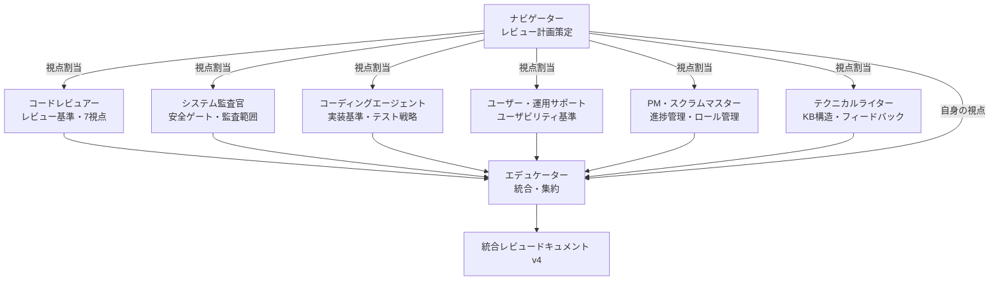
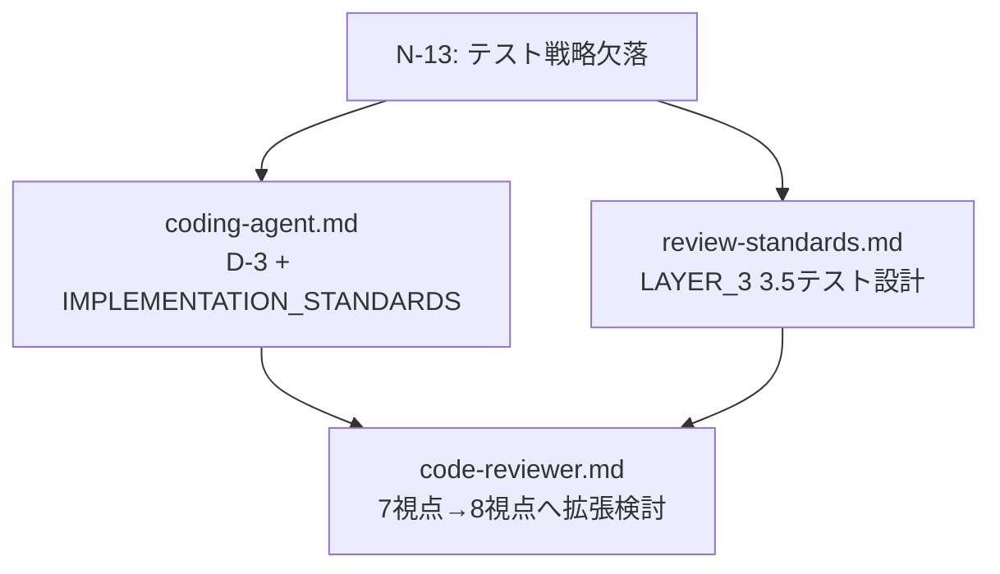
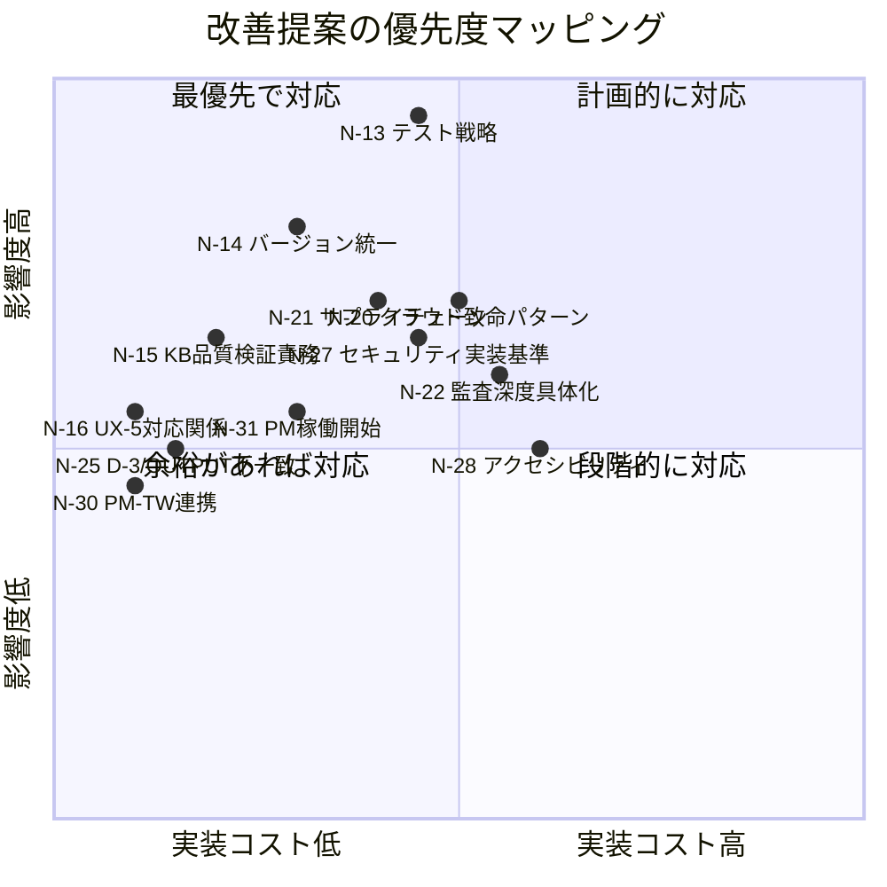

# 方法論評価レポート v4

> 本レポートは v3 評価レポート（v1.1.0対象）以降の大幅な改善（v1.5.0/v1.6.0）を踏まえ、ナビゲーターが7ロール（ナビゲーター含む）の視点を統合し、エデュケーターとして集約した包括的評価レポートである。

---

## 評価期間・対象

- **評価日:** 2026-03-12
- **対象:** AIネイティブ開発方法論 v1.5.0/v1.6.0（全ドキュメント）
- **前回レビュー:** v3（2026-03-09、v1.1.0対象）
- **評価プロセス:** ナビゲーターが全ロールにレビュー視点を割り当て、6ロール並行レビュー + ナビゲーター自身の視点で実施
- **評価者ロール:** コードレビュアー、システム監査官、コーディングエージェント、ユーザー・運用サポート、PM・スクラムマスター、テクニカルライター、ナビゲーター（計7ロール）

### レビュープロセス

---

## Part 1: v3 評価レポート残課題の対応状況

### v3 で検出された課題（v1.1.0対象）のトレース

| # | v3 課題 | 状況 | 備考 |
|---|---------|------|------|
| N-1 | 稼働プロジェクトからのフィードバック還元 | **継続（低）** | トレーニング用リポジトリの位置づけは変わらず |
| N-5 | pain-points 収集の運用化 | **継続（低）** | 収集トリガーの各ロール DUTIES への明記が未実施 |
| N-6 | 自動生成メカニズムの段階的実装 | **継続（低）** | 実践データに基づく優先度判断待ち |
| N-7 | オペレーターの認知負荷に対する構造的対策 | **部分対応** | SP-6（v1.2.0）とOUTPUT_FORMATの構造化で間接対策。PMロール定義への明示的な原則追記は未実施 |
| N-8 | Phase 6→7 の移行が断絶的 | **部分対応** | role-startup-guide.mdにロール段階投入パターンが存在。ただしPM稼働開始プロトコルとプロジェクトコンテキストサマリーは未実装 |
| N-9 | AIモデルの能力差に対する対策 | **継続（低）** | 対策なし |
| N-10 | 壁打ちフェーズの成果物粒度が粗い | **継続（低）** | 思考の転換点セクション追加は未実施 |
| N-11 | テスト戦略がユーザー・運用サポートに偏っている | **未対応** | coding-agent.md/review-standards.md のいずれにもテスト戦略は組み込まれていない。**今回6ロール中3ロールが最重要課題として再検出** |
| N-12 | 複数プロジェクト並行運用時の管理 | **継続（低）** | 対策なし |

### v1.1.0 → v1.5.0/v1.6.0 で追加・改善された項目

| バージョン | 主な変更 |
|-----------|---------|
| v1.2.0 | SP-6（選択肢ベースのインタラクション）追加 |
| v1.3.0 | ドメインコンテキスト機能追加 |
| v1.4.0 | テクニカルライターロール追加、KB構造定義 |
| v1.5.0 | 全ロールにMermaid図解ルール追加、バージョニングプロトコル定義 |
| v1.6.0 | USABILITY_STANDARDS新設、コードレビュアー7視点再構成、4層レビュー構造整合性確立 |

---

## Part 2: 有効性評価（現時点）

| # | 評価項目 | 判定 | 根拠 |
|---|---------|------|------|
| 1 | ロール分離と相互牽制 | **優秀** | CHECK_AND_BALANCEマップの牽制構造は健在。テクニカルライター追加により8ロール体制に拡充され、KB品質のフィードバックループが構造化された |
| 2 | 2層ゲートシステム | **優秀** | 静的+生成的チェックの構造は堅牢。過剰検出の抑制原則も有効 |
| 3 | スケーリング | **優秀** | Full/Medium/Minimal/Emergency の4パターンが網羅的 |
| 4 | 自己進化機構 | **実証済** | v1→v2→v3の3サイクルで改善が機能。VERSIONING_PROTOCOL(v1.5.0)で変更プロセスも形式化 |
| 5 | レビュー基準の体系性 | **有効（要補強）** | 4層×7視点が整合。RP-6のゲート間分担も明確化。ただしテスト視点の欠落は継続 |
| 6 | ユーザビリティ基準 | **有効（新設）** | USABILITY_STANDARDS（v1.6.0）により設計時/検証時の二層構造が確立。対応関係表に一部不完全な箇所あり |
| 7 | ナレッジベース構造 | **有効（新設）** | テクニカルライターの4カテゴリ構造、SUPPORT_LOG_FORMAT、段階的作成アプローチは実用的 |
| 8 | 進捗管理 | **有効** | 8セクション構成が「スナップショット」と「追記型ログ」を明確分離。技術的負債管理(D-6)の定量基準は実効的 |
| 9 | Mermaid図解ルール | **有効（新設）** | 全ロールに固有の活用場面が定義され、ドキュメント品質向上に寄与 |
| 10 | オペレーター負荷設計 | **要改善** | SP-6で間接対策されたが、PMロール定義への明示的原則追記が未完 |

---

## Part 3: 構造的な強み

### S-1: テクニカルライター追加によるナレッジベースフィードバックループの確立

v1.4.0で追加されたテクニカルライターは、単なるドキュメント作成者ではなく、サポートボットの回答品質を通じたフィードバックサイクル（SUPPORT_LOG_FORMAT → 4種レポート → KB改善）を構造化した。ユーザー・運用サポートとの双方向連携（品質検証依頼/フィードバック提供）により、ユーザー接点の知見がKBに還元される設計は、方法論の実用性を大きく高めている。

### S-2: USABILITY_STANDARDSによる設計時/検証時の一貫した品質管理

v1.6.0で新設されたUSABILITY_STANDARDSは、I/F設計（U-1〜U-4）からUX検証（UX-1〜UX-5）までの対応関係を明示し、フェーズ間のトレーサビリティを確保した。設計時に考慮した観点が検証時に漏れなく確認される構造は、ユーザビリティ品質の構造的保証として機能する。

### S-3: SP-6（選択肢ベースのインタラクション）によるオペレーター体験の標準化

v1.2.0で追加されたSP-6は、全ロールの応答フォーマットを標準化し、オペレーターの認知負荷を軽減する構造的対策として有効。特にナビゲーターのフェーズ別適用ガイドは具体的で実践的。

### S-4: 進捗管理テンプレートの「追記専用」設計

冪等性と状態保護（CLAUDE.md原則2）に忠実な設計。フェーズ遷移履歴と意思決定ログが追記専用であることにより、過去の判断経緯の追跡可能性が構造的に保証されている。

---

## Part 4: 横断的課題（複数ロールが検出した課題）

### N-13: テスト戦略の構造的欠落（N-11 再検出・エスカレーション）【CRITICAL】

**検出ロール:** コードレビュアー、コーディングエージェント、ナビゲーター（3ロール一致）

**これがないと具体的に何が困るか:**

v3で指摘されたN-11が依然として未対応であり、方法論の全ドキュメントにユニットテスト・インテグレーションテストの記述義務が存在しない。具体的な欠落箇所:
- `coding-agent.md` D-3: テストコード記述義務なし
- `coding-agent.md` OUTPUT_FORMAT: 自己チェックリストにテスト項目なし
- `review-standards.md` LAYER_3: テスト視点（3.5）なし
- `code-reviewer.md` 7視点: テストカバレッジ確認なし

Phase 8のフルスケール実装で機能追加のたびに既存機能が壊れるリグレッションリスクに対する構造的防御がない。

**提案:**

| # | 対象ドキュメント | 改善内容 | 優先度 | 波及範囲 |
|---|----------------|---------|--------|---------|
| 13-a | `coding-agent.md` | D-3に「対象機能のユニットテスト/インテグレーションテストが実装され、全テストがパスしていること」を追加。OUTPUT_FORMATの自己チェックにも反映 | **高** | coding-agent |
| 13-b | `coding-agent.md` | IMPLEMENTATION_STANDARDSに「テスト基準」セクションを新設 | **高** | coding-agent |
| 13-c | `review-standards.md` | LAYER_3に「3.5 テスト設計」を追加（テスト存在確認、網羅性、品質のデシジョンツリー） | **高** | code-reviewer |

---

### N-14: バージョン不整合（VERSIONING_PROTOCOL違反）【WARNING】

**検出ロール:** コードレビュアー、コーディングエージェント、テクニカルライター、PM・スクラムマスター、ナビゲーター（5ロール一致）

**これがないと具体的に何が困るか:**

VERSIONING_PROTOCOL（v1.5.0で定義）は「全ドキュメントのバージョンを統一する」と規定しているが、現状:
- **v1.6.0:** review-standards.md, phase-definitions.md, code-reviewer.md, user-ops-support.md, phase-gate-checklists.md
- **v1.5.0:** INDEX.md, core-principles.md, navigator.md, coding-agent.md, system-auditor.md, pm-scrum-master.md, technical-writer.md, educator.md, review-output-template.md, progress-management.md, role-startup-guide.md

v1.6.0で追加・変更された内容（USABILITY_STANDARDS、ゲート間分担の明確化等）が、v1.5.0のままのロール定義に反映されていない可能性がある。特にsystem-auditor.md（v1.5.0）がreview-standards.md（v1.6.0）に依存宣言しつつ、更新内容を取り込んでいない状態は、安全ゲートの判断基準にずれを生じさせうる。

**提案:**

| # | 対象ドキュメント | 改善内容 | 優先度 | 波及範囲 |
|---|----------------|---------|--------|---------|
| 14-a | 全ドキュメント | 全ドキュメントのフロントマターバージョンをv1.6.0（またはv1.7.0）に統一し、v1.6.0変更の影響を各ロール定義に反映 | **高** | 全ドキュメント |

---

### N-15: ユーザー・運用サポートのDUTIESにナレッジベース品質検証が未定義（片方向参照）【WARNING】

**検出ロール:** ユーザー・運用サポート、テクニカルライター（2ロール一致）

**これがないと具体的に何が困るか:**

Phase 8ゲート条件に「ユーザー・運用サポートによるナレッジベース品質検証パス」があり、テクニカルライター側のINTERACTION_RULESにも品質検証依頼が明記されている。しかし、user-ops-support.mdのDUTIES（D-1〜D-5）にはこの責務が含まれていない。責務の受け手側に定義がないため、ゲート条件が形骸化するリスクがある。

**提案:**

| # | 対象ドキュメント | 改善内容 | 優先度 | 波及範囲 |
|---|----------------|---------|--------|---------|
| 15-a | `user-ops-support.md` | D-6「ナレッジベース品質検証」を追加。INTERACTION_RULESにテクニカルライターとの連携を明記 | **中** | user-ops-support, technical-writer |

---

### N-16: USABILITY_STANDARDS対応関係表のUX-5（操作迷いリスク）の対応元が不完全【WARNING】

**検出ロール:** コードレビュアー、ユーザー・運用サポート（2ロール一致）

**これがないと具体的に何が困るか:**

UX-5の検証元がU-1（入力の最適化）のみに紐付けられているが、U-2（出力が不明瞭で次の操作がわからない）やU-3（フローが不自然で次のステップが予測できない）も操作迷いの原因となる。設計段階で操作迷いの原因を網羅的に潰せない。

**提案:**

| # | 対象ドキュメント | 改善内容 | 優先度 | 波及範囲 |
|---|----------------|---------|--------|---------|
| 16-a | `review-standards.md` | 対応関係表を修正: `U-2 → UX-3, UX-5`、`U-3 → UX-2, UX-5` | **中** | review-standards |

---

## Part 5: ロール固有の課題

### コードレビュアー視点

| # | 課題 | 重大度 | 改善案 |
|---|------|--------|--------|
| N-17 | AS-2（安定性）とRP-5（エラーハンドリング）の重複と矛盾時解決ルール未定義 | INFO | CONFLICT_RESOLUTIONに「品質ゲートと安全ゲートの判定矛盾時は安全ゲートを優先」を明記 |
| N-18 | RP-7（可読性）にドキュメント整合性の確認が未含 | INFO | RP-7に「コード変更に伴うドキュメント更新の整合性」を確認項目として追加 |
| N-19 | 非機能層パフォーマンスのバックエンド処理グレーゾーン | INFO | LAYER_4 4.1のゲート間分担に境界条件を追記 |

### システム監査官視点

| # | 課題 | 重大度 | 改善案 |
|---|------|--------|--------|
| N-20 | AS-4にクラウドネイティブ致命パターンが不足 | WARNING | シークレットハードコード、コンテナ特権実行、リソースリミット未設定、再帰的イベントトリガー、外部APIコール無制限リトライ等を追加 |
| N-21 | AS-1にサプライチェーンセキュリティの観点が欠如 | WARNING | 依存パッケージの既知脆弱性チェック、コンテナベースイメージの脆弱性スキャン等を追加 |
| N-22 | データ機密度別の監査深度における具体的チェック差分が未定義 | WARNING | 監査深度ごとの追加チェック項目マトリクスを作成 |
| N-23 | EMERGENCY_PATHにおける安全ゲートの監査スコープが未定義 | WARNING | 「修正差分とその影響範囲に限定。ただしAS-4は差分外でも報告」を明記 |
| N-24 | AS-3に観測可能性（Observability）の要件が欠如 | INFO | ヘルスチェック、メトリクス収集、アラート閾値、分散トレーシングを追加 |

### コーディングエージェント視点

| # | 課題 | 重大度 | 改善案 |
|---|------|--------|--------|
| N-25 | D-3のチェック項目とOUTPUT_FORMATの自己チェックリストの不一致 | WARNING | D-3とOUTPUT_FORMATを一致させる |
| N-26 | レビュー指摘への異議申し立てフローの未定義 | WARNING | D-4に根拠ベースの議論→オペレーターエスカレーションのパスを追加 |
| N-27 | IMPLEMENTATION_STANDARDSにセキュリティ実装基準がない | WARNING | 入力バリデーション・認証/認可チェック・秘匿情報非露出の義務を追加 |

### ユーザー・運用サポート視点

| # | 課題 | 重大度 | 改善案 |
|---|------|--------|--------|
| N-28 | アクセシビリティ観点の完全欠落 | WARNING | U-5/UX-6としてアクセシビリティ観点を追加（適用レベルはプロジェクト非機能要件で決定） |
| N-29 | D-4フィードバック収集の具体的手段が未定義 | INFO | 収集手段の例示とペルソナ選定基準を追記 |

### PM・スクラムマスター視点

| # | 課題 | 重大度 | 改善案 |
|---|------|--------|--------|
| N-30 | INTERACTION_RULESにテクニカルライターが欠落 | WARNING | テクニカルライター行を追加し、KB進捗トラッキングの関係を定義 |
| N-31 | Phase 7開始時のPM稼働開始プロトコルが未定義 | WARNING | Phase 0-6成果物確認、ダッシュボード初期作成等の手順を明記 |
| N-32 | S4のタスク管理とGitHub IssuesのSoT宣言が不在 | INFO | SoT宣言とIssue/PR番号列を追加 |

### テクニカルライター視点

| # | 課題 | 重大度 | 改善案 |
|---|------|--------|--------|
| N-33 | フロントマターID命名規則とカテゴリの不整合 | WARNING | `kb-{category_prefix}-{sequence}` に修正し、_index.mdの例と統一 |
| N-34 | フィードバックレポート生成頻度・運用サイクルが未定義 | WARNING | 定期レビュー or 閾値ベースアラートのトリガー条件を明記 |
| N-35 | 網羅性検証の合否判断基準が未定義 | INFO | user-guide/ops-guideは100%カバー、troubleshooting/faqは検証可能な基準を設定 |

### ナビゲーター視点

| # | 課題 | 重大度 | 改善案 |
|---|------|--------|--------|
| N-36 | ドメインコンテキスト参照がナビゲーターD-1に限定 | INFO | ユーザー・運用サポートのDUTIESにもドメインコンテキスト参照を追加 |
| N-37 | SP-6の他ロールへの浸透が不十分 | INFO | PM、コーディングエージェント等にSP-6適用ガイドを追加 |

---

## Part 6: 改善提案の優先順位

### 優先度グループ

| 優先度 | 課題 | 理由 |
|--------|------|------|
| **最優先（即時対応）** | N-13（テスト戦略）、N-14（バージョン統一） | N-13は3ロール一致のCRITICAL、v3から2回連続未対応。N-14は方法論自身のルール違反 |
| **高（次バージョンで対応）** | N-15（KB品質検証責務）、N-16（UX-5対応関係）、N-20/N-21（安全ゲート拡充）、N-22（監査深度）、N-23（緊急時監査スコープ）、N-25（D-3不一致）、N-27（セキュリティ実装基準） | 構造的な欠落・不整合であり、実プロジェクト適用時に顕在化する |
| **中（計画的に対応）** | N-26（異議フロー）、N-28（アクセシビリティ）、N-30/N-31（PM連携・稼働開始）、N-33/N-34（TW運用定義） | 有効な改善だが、対応なしでも運用は可能 |
| **低（余裕があれば対応）** | N-17〜N-19、N-24、N-29、N-32、N-35〜N-37 | INFO レベルの改善提案 |

---

## Part 7: 総合評価

本方法論は v1.1.0 → v1.5.0/v1.6.0 の進化を経て、以下の3つの構造的拡充を達成した:

1. **テクニカルライター追加**（v1.4.0）によるナレッジベースフィードバックループの確立
2. **USABILITY_STANDARDS新設**（v1.6.0）による設計時/検証時の一貫したユーザビリティ品質管理
3. **Mermaid図解ルール**（v1.5.0）とSP-6（v1.2.0）によるドキュメント品質とオペレーター体験の標準化

**最大の残課題:**

1. **テスト戦略の構造的欠落（N-13）** — v3（N-11）から2回連続未対応。今回3ロール一致でCRITICALとして再検出。方法論の品質保証の最も大きな穴であり、次バージョンでの対応を強く推奨。

2. **バージョン不整合（N-14）** — 方法論自身が定義したVERSIONING_PROTOCOLに違反している状態。自身のルールを自身が守れていないことは、方法論の信頼性に関わる。

**v3からの進化:**

v3の課題は「運用の洗練」フェーズだったが、v4では「拡充された構造（テクニカルライター、USABILITY_STANDARDS）に伴う連携定義の補完」と「現代的技術環境への適応（クラウドネイティブ、サプライチェーンセキュリティ）」という新たなフェーズに入っている。方法論の骨格は成熟しており、課題は主に「拡張部分の接合部」と「安全ゲートの現代化」に集中している。

---

## 付録: v1→v2→v3→v4 の進化トレース

| バージョン | 対象方法論ver | 検出課題数 | 対応済 | 残課題 | 特記事項 |
|-----------|-------------|----------|--------|--------|---------|
| v1 | 1.0.0 | 10 | 7 | 3 | 基盤構築。EMERGENCY_PATH等の重要機能追加 |
| v2 | 1.0.0+ | 6 | 3 | 3 | SoT宣言、HANDOFF_PROTOCOL、バージョン整合性解決 |
| v3 | 1.1.0 | 6 | — | 6 | オペレーター認知負荷、テスト戦略、Phase移行断絶を検出 |
| v4 | 1.5.0/1.6.0 | 25 | — | 25 | **7ロール並行レビュー。** テスト戦略再検出(CRITICAL)、バージョン不整合、安全ゲート現代化、拡張部分の連携補完 |

v4の課題数が増加しているのは、方法論の複雑度（8ロール、4層レビュー、9フェーズ）が上がったことに加え、今回初めて全ロール視点での網羅的レビューを実施したため。課題の性質はv3の「構造の穴」からv4の「接合部の補完」と「現代化」にシフトしており、方法論の成熟を示している。
