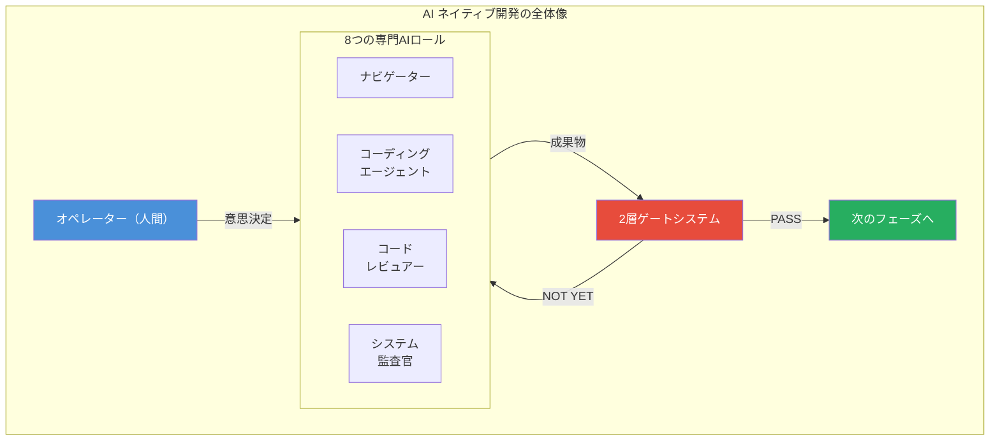
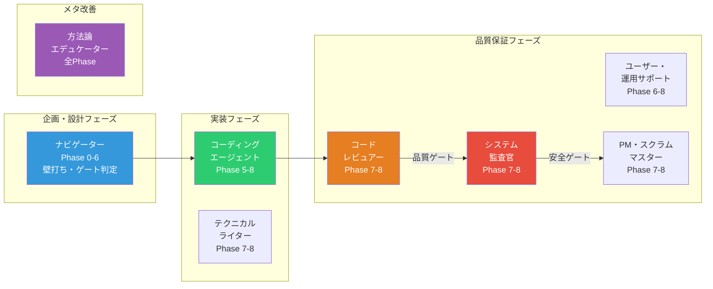
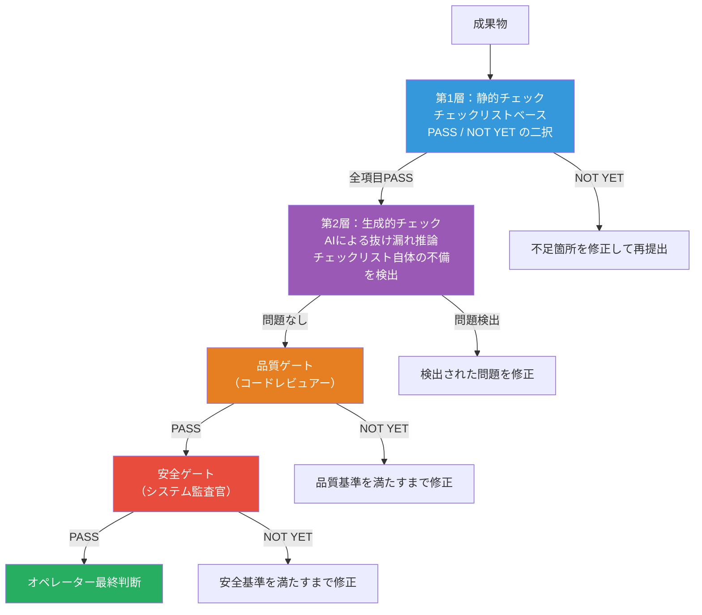

# AI ネイティブ開発方法論テンプレート

**「AIに丸投げ」から「AIと協働する開発」へ。**

8つの専門AIロールが相互に牽制し合い、品質を保証する開発方法論のテンプレート集です。

---

## このテンプレートが解決する問題

| よくある課題 | このテンプレートを使うと |
|---|---|
| AIに指示を出したが、出力の品質が安定しない | 専門ロールごとにAIの振る舞いを定義し、品質を構造的に担保 |
| レビューが「なんとなくOK」で通ってしまう | 静的チェック＋AI推論の2層ゲートで抜け漏れを検出 |
| 小さなバグ修正にも大げさなプロセスを踏んでしまう | スコープに応じた3つのフロー（Full / Medium / Minimal）で無駄を排除 |
| AIとの対話が発散して収束しない | フェーズごとに壁打ちの姿勢を切り替え、段階的に具体化 |
| 開発方法論が形骸化し、改善されない | メタロール（方法論エデュケーター）が方法論自体を継続的に評価・改善 |

---

## 核心コンセプト

本方法論の最上位原則はひとつだけです。

> **「ユーザーの意図を完遂させる」**

この原則のもと、AIロールの分業、フェーズ分割、ゲートシステムのすべてが設計されています。



**重要な前提：** オペレーター（人間）が意思決定者です。AIの出力を無条件に受け入れるのではなく、AIロール間の相互牽制の結果を踏まえて、人間が最終判断を下します。

---

## 8つのAIロール

単一のAIチャットにすべてを任せるのではなく、専門性を持つ8つのロールが分業します。ロールを統合しないことで、相互牽制による品質保証が機能します。



| ロール | 責務 |
|---|---|
| **ナビゲーター** | フェーズ進行の案内、壁打ち相手、ゲート判定 |
| **コーディングエージェント** | 設計に基づく実装の主体 |
| **コードレビュアー** | 7つの視点（データ設計、IF設計、冗長性排除、変更耐性、エラーハンドリング、パフォーマンス、可読性）で品質を検証 |
| **システム監査官** | 安全性・安定性・可用性の観点で独立監査 |
| **ユーザー・運用サポート** | エンドユーザーの代弁者としてUX検証 |
| **PM・スクラムマスター** | 進捗管理と要件整合性の確認 |
| **テクニカルライター** | サポートボット用ナレッジベースの構築 |
| **方法論エデュケーター** | 方法論自体の評価と継続改善（メタロール） |

---

## 9つの開発フェーズ

開発は9つのフェーズを段階的に進みます。Phase 0-2 では「総合ゲート」が設けられ、真の課題が言語化されるまで先に進めない仕組みです。

```mermaid
graph LR
    P0["Phase 0\n現状把握と\n目標設定"] --> P1["Phase 1\n真の課題の\n追求"]
    P1 --> P2["Phase 2\n業務と実運用の\n明確化"]
    P2 -->|総合ゲート\n課題言語化+\nユースケース3つ以上| P3["Phase 3\n要件定義"]
    P3 --> P4["Phase 4\n技術スタック\n確定"]
    P4 --> P5["Phase 5\n基本設計+\nプロトタイプ"]
    P5 --> P6["Phase 6\nプロトタイプ\nフィードバック"]
    P6 --> P7["Phase 7\nMVP構築"]
    P7 --> P8["Phase 8\nフルスケール\n実装"]

    style P0 fill:#3498db,color:#fff
    style P1 fill:#3498db,color:#fff
    style P2 fill:#3498db,color:#fff
    style P3 fill:#2ecc71,color:#fff
    style P4 fill:#2ecc71,color:#fff
    style P5 fill:#2ecc71,color:#fff
    style P6 fill:#e67e22,color:#fff
    style P7 fill:#e74c3c,color:#fff
    style P8 fill:#e74c3c,color:#fff
```



各フェーズでの壁打ちの姿勢も変化します。

| フェーズ | AIの姿勢 | 説明 |
|---|---|---|
| Phase 0-2 | **引き出す** | オペレーターの意図・ドメイン知識を深掘りする |
| Phase 3-5 | **提案する** | 技術選定や設計の選択肢を比較・提示する |
| Phase 6-8 | **整理・検証する** | 成果物の品質を検証し、フィードバックを構造化する |

---

## 2層ゲートシステム

「なんとなくOK」を構造的に排除する仕組みです。従来のチェックリストだけでは見逃す問題を、AIの推論力で補完します。



- **第1層（静的チェック）：** 事前に定義されたチェックリストに基づく機械的な検証
- **第2層（生成的チェック）：** AIがチェックリスト自体の不備や、リストにない問題を推論で発見

---

## クイックスタート

### 1. テンプレートをコピー

GitHub の「Use this template」ボタン、またはクローンでリポジトリを取得します。

```bash
git clone https://github.com/TSUNAGUBA/ai-native-dev-operation-template.git
cd ai-native-dev-operation-template
```

### 2. 方法論の全体像を把握

まず `.ai-native/methodology/INDEX.md` を開いて、ドキュメントの全体構成を確認します。

### 3. ナビゲーターロールでAIセッションを開始

AIエージェント（Claude など）に、ナビゲーターロールの定義を読み込ませてセッションを開始します。

```
あなたは「ナビゲーター」ロールです。
以下のファイルを読み込んで、そのロール定義に従って行動してください。
- .ai-native/methodology/common/core-principles.md
- .ai-native/methodology/common/phase-definitions.md
- .ai-native/methodology/roles/navigator.md
Phase 0 から開始します。
```

### 4. フェーズを進める

ナビゲーターの案内に従い、Phase 0（現状把握）から段階的に開発を進めます。各フェーズのゲートを通過することで、次のフェーズに進めます。

---

## ディレクトリ構造

```
.ai-native/
├── methodology/              # 方法論の正規定義（Source of Truth）
│   ├── INDEX.md              # ドキュメント索引（最初に読むファイル）
│   ├── common/               # 共通定義
│   │   ├── core-principles.md      # 最上位原則・構造原則
│   │   ├── phase-definitions.md    # 9つのフェーズ定義とゲート条件
│   │   └── review-standards.md     # レビュー基準（4層構造・7つの視点）
│   ├── roles/                # 8つのロール定義
│   │   ├── navigator.md            # ナビゲーター
│   │   ├── coding-agent.md         # コーディングエージェント
│   │   ├── code-reviewer.md        # コードレビュアー
│   │   ├── system-auditor.md       # システム監査官
│   │   ├── user-ops-support.md     # ユーザー・運用サポート
│   │   ├── pm-scrum-master.md      # PM・スクラムマスター
│   │   ├── technical-writer.md     # テクニカルライター
│   │   └── educator.md             # 方法論エデュケーター
│   └── templates/            # 運用テンプレート
│       ├── role-startup-guide.md         # ロール起動手順
│       ├── progress-management.md        # 進捗管理テンプレート
│       ├── review-output-template.md     # レビュー出力テンプレート
│       └── phase-gate-checklists.md      # フェーズゲートチェックリスト
├── guides/                   # 利用ガイド
├── domain-context/           # プロジェクト横断の参考資料
└── outputs/                  # プロジェクト成果物の出力先
```

`CLAUDE.md`（リポジトリルート）は Claude Code 環境固有の実装ルール（Push 前チェック、バグ修正手順など）を定義しています。

---

## スコープ別フロー

プロジェクトの規模や目的に応じて、最適なフローを選択できます。

| スコープ | 対象 | 通過フェーズ |
|---|---|---|
| **Full** | 新規プロジェクト、大規模開発 | Phase 0 - 8（全フェーズ） |
| **Medium** | 既存システムへの中規模機能追加 | Phase 3 - 5, 7 - 8（圧縮版） |
| **Minimal** | バグ修正、小規模変更 | 修正 → レビュー → 監査 → 承認 |
| **EMERGENCY_PATH** | 本番障害対応 | 緊急対応専用の最短パス |

小さなバグ修正に Full フローを強制しないため、チームの生産性を維持しながら品質を確保できます。

---

## もっと詳しく知りたい方へ

| 知りたいこと | 参照先 |
|---|---|
| 方法論の全体構成 | [`.ai-native/methodology/INDEX.md`](.ai-native/methodology/INDEX.md) |
| 最上位原則と構造原則 | [`.ai-native/methodology/common/core-principles.md`](.ai-native/methodology/common/core-principles.md) |
| 各フェーズの詳細定義 | [`.ai-native/methodology/common/phase-definitions.md`](.ai-native/methodology/common/phase-definitions.md) |
| レビュー基準（4層構造・7つの視点） | [`.ai-native/methodology/common/review-standards.md`](.ai-native/methodology/common/review-standards.md) |
| 各ロールの詳細定義 | [`.ai-native/methodology/roles/`](.ai-native/methodology/roles/) |
| 運用テンプレート | [`.ai-native/methodology/templates/`](.ai-native/methodology/templates/) |
| 利用ガイド | [`.ai-native/guides/`](.ai-native/guides/) |

---

## ライセンス

Apache License 2.0 - 詳細は [LICENSE](LICENSE) ファイルを参照してください。
