# AIネイティブ開発手法

**AI時代の開発品質を、個人の能力ではなく「構造」で担保する方法論**

---

## 1. AI活用開発の現状と課題

### 今、何が起きているか

AIコーディングツール（GitHub Copilot、Claude Code、Cursor等）の普及により、コード生成の速度は劇的に向上した。しかし、多くの現場で共通の課題が浮上している。

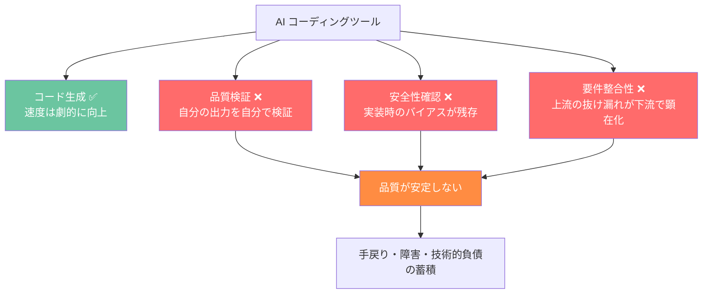

### 5つの構造的課題

現在のAI活用開発には、ツールの性能とは無関係に生じる**構造的な課題**がある。

#### 課題①: 自己レビューの限界

1体のAIにコードを書かせ、同じAIにレビューさせる。これは、1人の社員に企画・実装・テスト・リリースを全部やらせるのと構造的に同じだ。**自分の出力を自分で批判的に検証することは、人間でもAIでも構造的に困難**である。

#### 課題②: 上流工程の品質問題

「後になって要件が増えた」「今更仕様変更か」という問題の多くは、実は上流工程（要件定義・設計）のゲートで検出すべき抜け漏れが通過してしまったことに起因する。AIを使っても、**チェックリスト自体の不備は検出できない**。

#### 課題③: 品質と速度のトレードオフ

「AIで速くなった」と感じる反面、レビューや安全確認が省略され、品質が暗黙的に犠牲になっている。**速度と品質をトレードオフにしている限り、技術的負債は蓄積し続ける**。

#### 課題④: 属人化の再発

AI活用のノウハウが個人に閉じている。「あの人が使うとうまくいくが、他の人が使うと品質がばらつく」。AIツールの性能ではなく、**使い方のばらつきが品質のばらつき**を生んでいる。

#### 課題⑤: プロセスの硬直化 vs 無秩序

プロセスを定めると柔軟性がなくなり、定めないと無秩序になる。**構造と柔軟性の両立**ができていない。

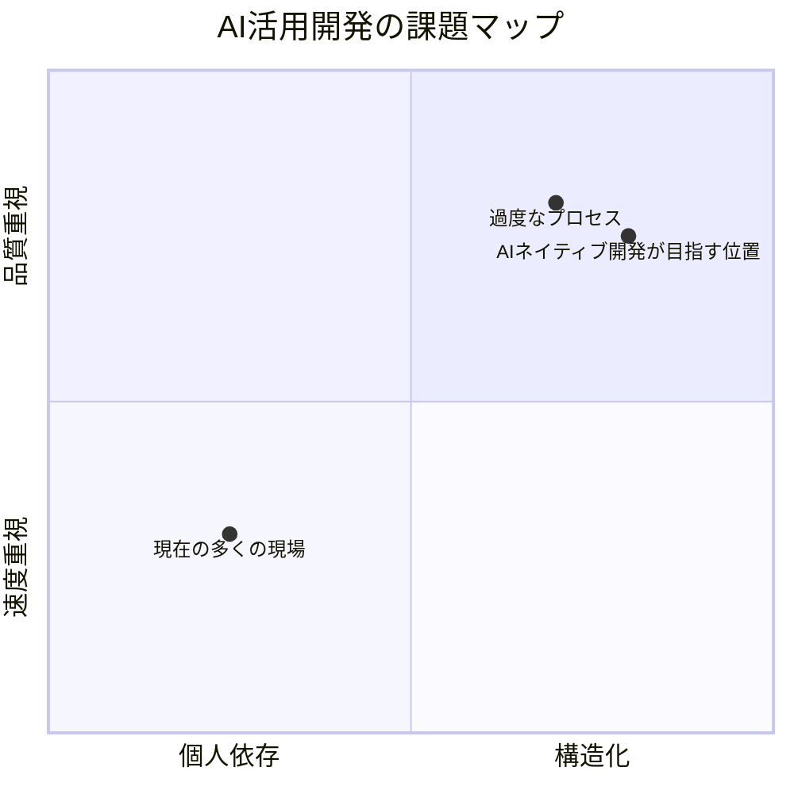

---

## 2. AIネイティブ開発手法のアプローチ

### 基本思想: AIを「使う」から「組織する」へ

AIネイティブ開発手法は、AIを単なるツールとしてではなく、**チームのメンバーとして組織する**ことで、上記の課題を構造的に解決する。

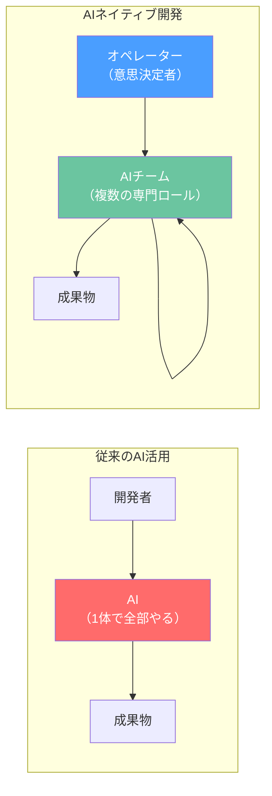

#### 課題①へのアプローチ: 役割分離と相互牽制

AIに複数の専門的な役割を持たせ、**書く人と検証する人を分離**する。異なる役割は異なる視点を持ち、互いに牽制し合う。1体のAIでは検出できない盲点を、構造的に捕捉する。

#### 課題②へのアプローチ: 多層的なゲートシステム

明文化されたチェック条件に加え、**AIが「チェックリスト自体の不備」を推論する**仕組みを導入する。静的なチェックと生成的なチェックの2層で、上流工程の抜け漏れを構造的に低減する。

#### 課題③へのアプローチ: 速度と品質の両立設計

品質と安全の検証を省略するのではなく、**実装の並行化と検証の自動化**で速度を確保する。品質のゲートは常に維持しつつ、実装工程を効率化する。

#### 課題④へのアプローチ: 方法論としての標準化

AI活用のノウハウを個人に依存させず、**再現可能な方法論**として体系化する。さらに、方法論自体を評価・改善するメカニズムを組み込むことで、チーム全体の能力が継続的に向上する。

#### 課題⑤へのアプローチ: 構造と柔軟性の両立

基本的なフレームワーク（フェーズ、ゲート、ロール分離）は堅固に維持しつつ、**状況に応じて必要なリソースを動的に配置**できる仕組みを設ける。

---

## 3. 導入による効果

### 直接的に解決する課題

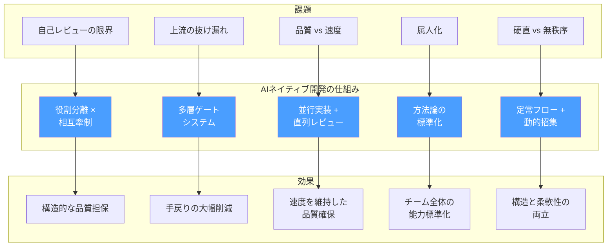

### 副次的なメリット

直接の課題解決に加え、以下の副次的効果が得られる。

| メリット | 説明 |
|---------|------|
| **意思決定の可視化** | AIチームの議論過程が記録として残り、「なぜこの判断をしたか」が追跡可能になる |
| **オンボーディングの加速** | 方法論が体系化されているため、新しいメンバーが開発プロセスを短期間で理解できる |
| **プロセスの継続的改善** | 方法論自体を評価・改善する仕組みが組み込まれており、チームが「毎週賢くなる」 |
| **スケーラビリティ** | 方法論は特定のプロジェクトに依存しないため、組織横断で適用できる |
| **ナレッジの資産化** | 開発過程で生成されるドキュメント・レビュー記録・判断ログが組織の知的資産になる |
| **セキュリティの構造的担保** | 安全性の検証が個人の注意力ではなく、プロセスとして保証される |

---

## 4. AIネイティブ開発手法の概要

### 全体構成

AIネイティブ開発手法は、3つの構造要素から成る。

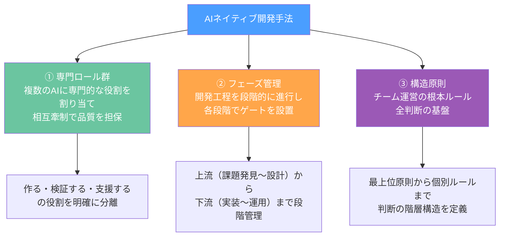

### ① 専門ロール群

AIに複数の専門的な役割を持たせ、人間の開発チームと同様の**チェック・アンド・バランス（相互牽制）** を実現する。

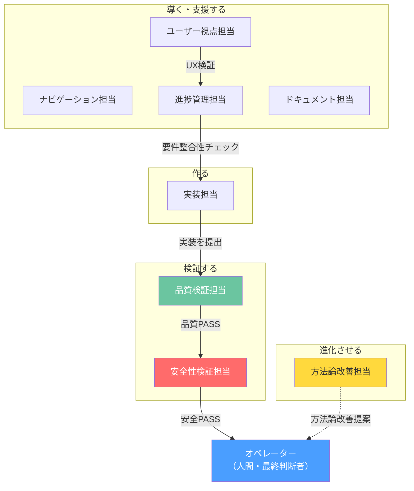

**重要な設計原則:**

- **役割は統合しない** — 「作る人」と「検証する人」が同一では、検証が形骸化する
- **人間は「作業者」ではなく「意思決定者」** — AIの出力を判断し、承認または差し戻しを行う
- **検証は直列で実施** — 品質の検証を通過した安定した状態に対して、安全性の検証を行う

### ② フェーズ管理

開発を段階的に進行させ、各段階にゲート（通過条件）を設けることで、**上流の問題を上流で検出する**。

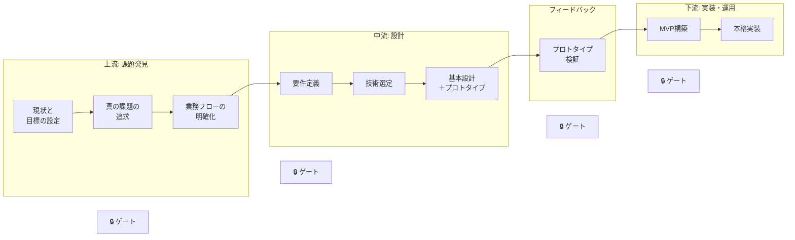

**ゲートシステムの特徴:**

- 各ゲートは**2層構造** — 明文化された条件の検証 + AIによる「条件自体の不備」の推論
- ゲートを通過しない限り、次の段階に進めない
- 問題を検知した場合は、**適切な段階まで差し戻す**仕組みがある

### ③ 構造原則

方法論全体を貫く原則群が、すべての判断の基盤となる。

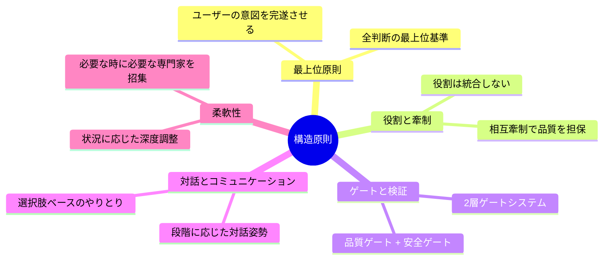

---

## 5. 実現・導入方法

### 導入のステップ

AIネイティブ開発手法の導入は、段階的に行うことを推奨する。

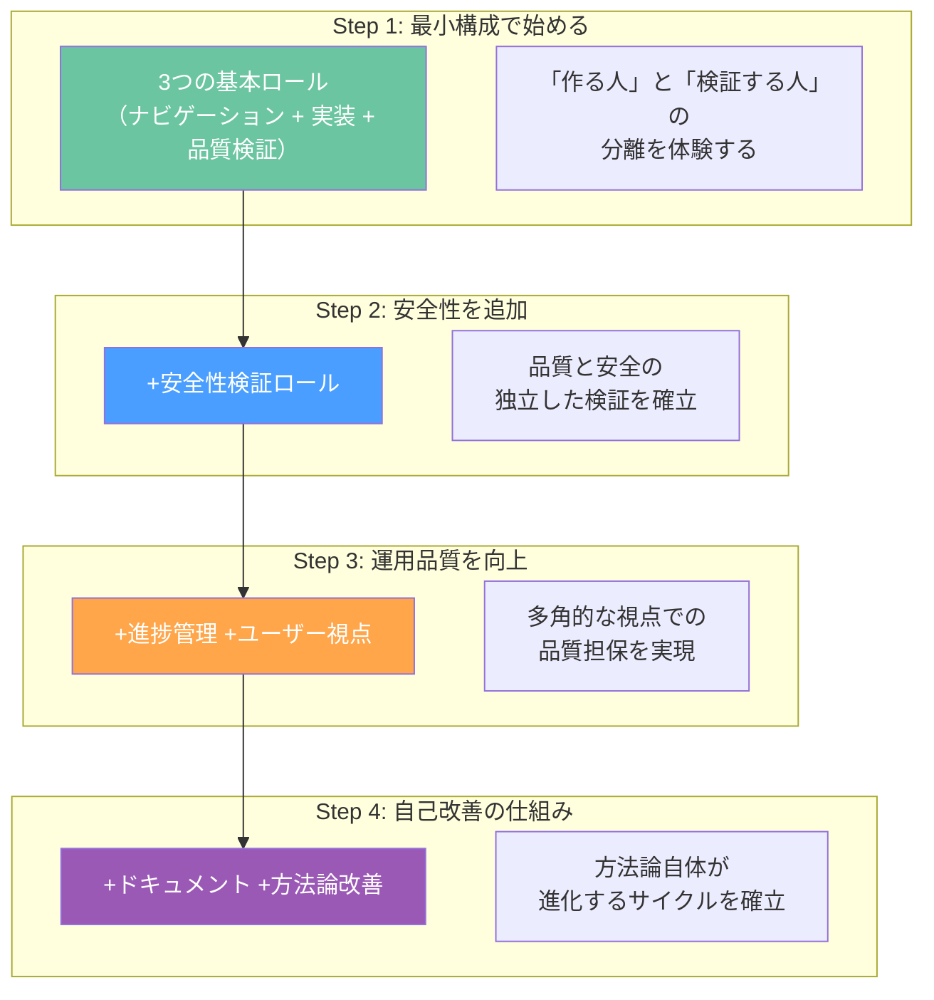

### 導入に必要なもの

| 必要なもの | 説明 |
|-----------|------|
| **AIコーディングツール** | Claude Code、Claude Projects 等、プロンプトを柔軟に設定できるAIツール |
| **方法論ドキュメント** | ロール定義、フェーズ定義、レビュー基準等の方法論文書一式 |
| **オペレーター** | エンジニア経験のある意思決定者（AIの出力の妥当性を判断できる能力が必要） |

### 方法論の適用パターン

プロジェクトの規模やフェーズに応じて、方法論の適用深度を調整できる。

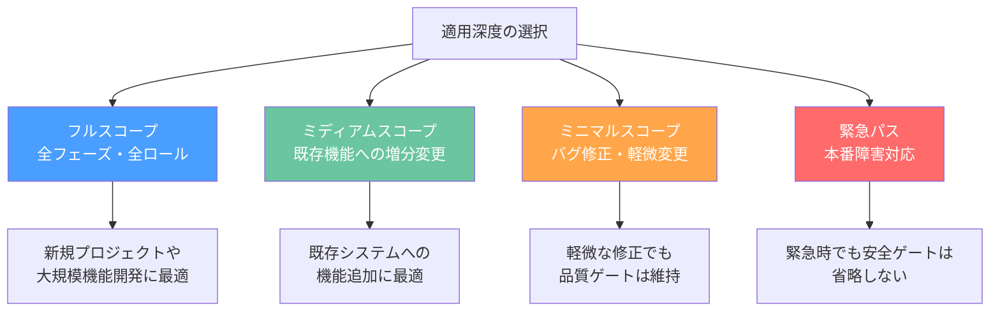

**重要:** どのスコープでも、品質と安全の検証ゲートは省略しない。スコープの選択は「深さの調整」であり、「品質の妥協」ではない。

### 実際の成果

この方法論は実際のプロジェクトで運用され、以下の成果を確認している:

- **方法論自体の自己改善:** v1.0からv1.9.0まで、継続的な評価サイクルで構造的改善を反映
- **品質の構造的担保:** 役割分離と2層ゲートにより、個人の注意力に依存しない品質保証を実現
- **柔軟な対応:** フルスコープから緊急パスまで、状況に応じた適用深度の切り替えが可能

---

## まとめ

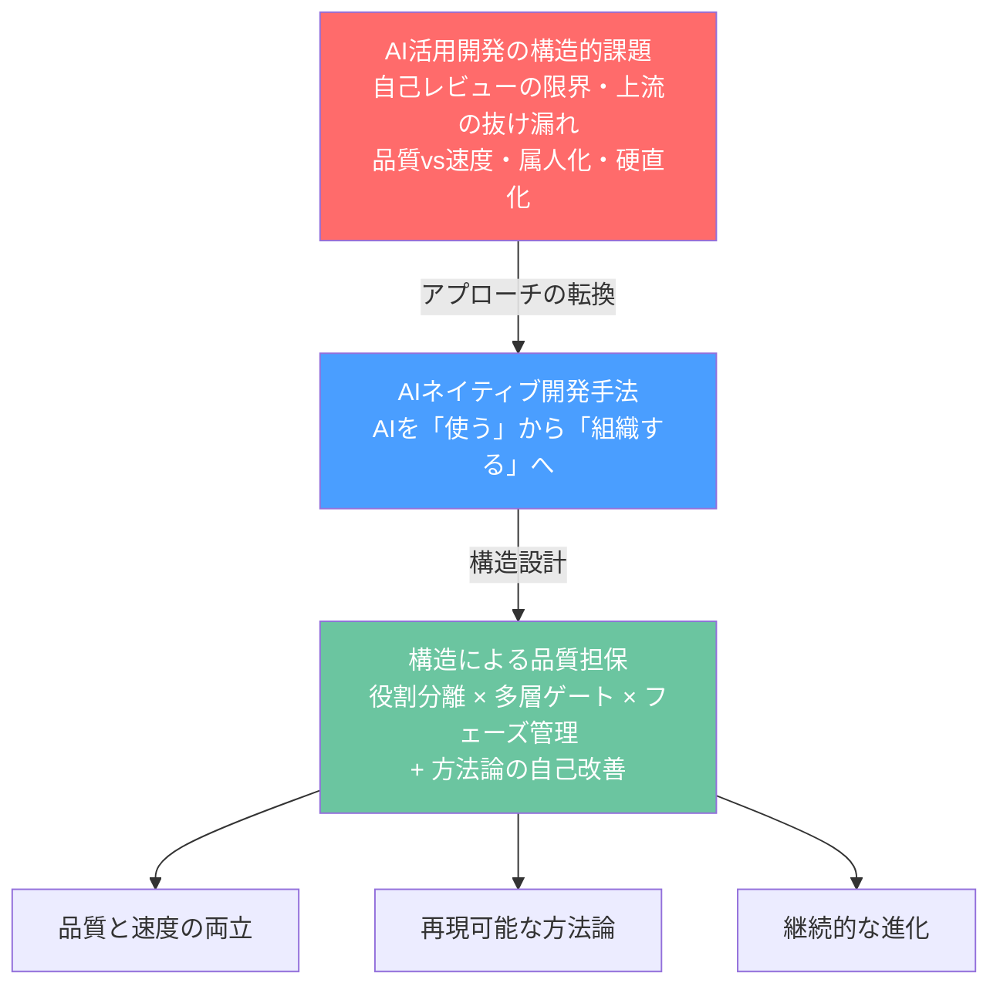

AIネイティブ開発手法は、AIの性能向上を待つのではなく、**今あるAIの能力を構造の力で最大化する**アプローチだ。

1体のAIをどれだけ賢くしても、レビュー不在・牽制不在の構造では品質は安定しない。逆に、適切に役割を分け、ゲートを設け、牽制関係を設計すれば、AIの出力品質は構造的に担保される。

**問題は技術ではなく、組織設計だったのだ。**

---

*AIネイティブ開発手法に関する詳細な技術情報については、お問い合わせください。*
