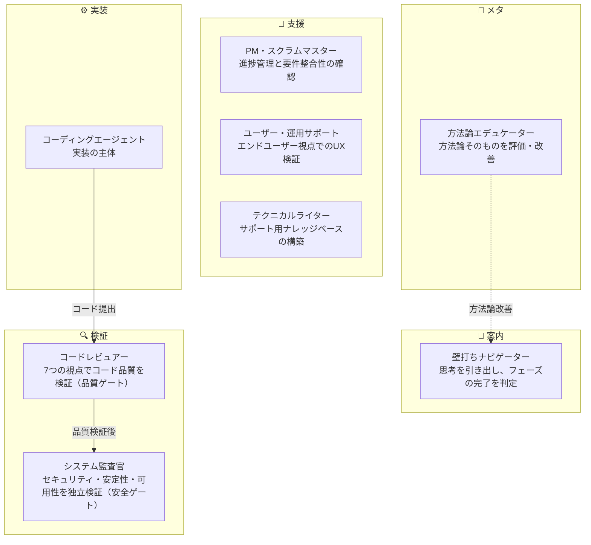

# AIに"チーム"を組ませたら、開発が壊れなくなった

## 1体のAIに全部やらせていた頃の話

私はCTOとして、CEOとして、チームを作ってきた。

人間のチームには当たり前に「役割分担」がある。コードを書く人、レビューする人、セキュリティを見る人、進捗を管理する人。それぞれが独立した視点を持ち、互いに牽制し合うことで、品質が保たれる。

ところがAI開発になった途端、私たちは1体のAIに全部やらせている。

コードを書かせて、同じAIにレビューさせて、同じAIにセキュリティチェックさせる。これは、1人の社員に企画・実装・テスト・リリースを全部やらせるワンマン体制と構造的に同じだ。

経営者なら誰でも知っている。そういう組織は、いつか壊れる。

---

## 2つの原体験が交差した瞬間

私がこの方法論に辿り着いたのは、2つの全く異なる経験が交差した瞬間だった。

**1つ目は、経営者として見てきた組織の失敗パターン。**

属人化。レビュー不在。品質のばらつき。優秀なエンジニアが1人で全部回している組織は、その人が抜けた瞬間に崩壊する。逆に、役割を分けて牽制関係を作った組織は、個人の能力に依存せず安定する。これは何度も目にしてきた事実だ。

**2つ目は、エンジニアとしてAIに全部任せたときの失敗。**

AIに「このアプリを作って」と指示する。コードが出てくる。一見動く。だが、自分で書いたコードを自分でレビューするAIは、構造的に自分の盲点を検出できない。セキュリティの見落とし、データ設計の不備、エラーハンドリングの甘さ — 人間のチームなら別の誰かが気づくことを、1体のAIは見逃し続ける。

この2つの体験が交差したとき、答えはシンプルだった。

**AIにも組織を作ればいい。**

---

## 8つのロールという設計

人間の開発組織に倣い、AIチームに8つの専門ロールを設けた。

ここで最も重要な設計原則がある。

**「AIロールは統合しない」**

これは効率のための分業ではない。相互牽制のための構造設計だ。

コーディングエージェントが書いたコードを、コードレビュアーが品質の視点で検証する。さらにシステム監査官が安全性の視点で独立に検証する。PMは「進捗を前に進める」圧力をかけ、レビュアーは「品質基準に達するまで止める」圧力をかける。この相反する力が働くからこそ、品質が保たれる。

1体のAIに統合した瞬間、この牽制関係は消滅する。自分で書いたコードを自分で批判できるAIは、構造的に存在しない。

---

## 方法論が方法論を改善する

8つ目のロール「方法論エデュケーター」は、他のロールとは性質が異なる。

このロールの仕事は、方法論そのものを評価し、改善を提案することだ。いわば「チームの振り返りを制度化した」存在で、開発プロセスだけでなく、プロセスを規定する方法論にもPDCAを回す。

実際に何が起きたか。

この方法論をv1.0として定義した後、エデュケーターロールに評価を依頼した。すると、第1回の評価レポートで「SoT(Source of Truth)の宣言がない」「バージョン管理プロトコルがない」「緊急時の対応パスが未定義」といった構造的な欠陥が指摘された。

修正してv1.1.0を出す。再評価。新たな課題が6件検出される。修正。再評価。

このサイクルを繰り返した結果、v1.0からv1.9.0まで進化を続けている。複数の評価レポートを通じて、構造原則の追加や品質管理の精緻化が積み重ねられている。

人間が1人で見直していたら、34件の構造的欠陥を4日で発見・修正することは不可能だっただろう。方法論自身が方法論を改善する仕組みを埋め込んだことで、進化速度が劇的に上がった。

---

## 見えてきたもの

この取り組みを通じて、1つの確信が生まれた。

**AIは「使う」ものではなく、「組織する」ものだ。**

私たちはAIの性能 — モデルの賢さ、トークン数、応答速度 — に注目しがちだ。だが、開発品質を決めるのは単体の性能ではない。構造の設計だ。

経営者が組織設計に時間をかけるのは、個人の能力に依存しない仕組みを作るためだ。同じことがAIにも言える。1体のAIをどれだけ賢くしても、レビュー不在・牽制不在の構造では品質は安定しない。

逆に、適切に役割を分けて牽制関係を設計すれば、AIの出力品質は構造的に担保される。

これは、CTO/CEOとして組織を作ってきた経験がなければ辿り着かなかった視点だと思う。技術の問題ではなく、組織設計の問題だったのだ。

---

## 次回予告

8つのロールは、最初から8つだったわけではない。

最初はナビゲーターとコーディングエージェントだけだった。使っていくうちに「ここにレビュアーが必要だ」「ここに監査が必要だ」と、役割が"生えてきた"。テクニカルライターが追加されたのはv1.4.0、ユーザビリティ基準が体系化されたのはv1.6.0だ。

次回は、この「役割が増えていく過程」を語ります。なぜその役割が必要になったのか、何がきっかけだったのか — 組織が有機的に成長する過程を、AIチームで再現した記録です。

---

`#AIネイティブ開発` `#AI開発` `#開発方法論` `#チーム設計` `#CTO` `#AIエージェント` `#組織設計` `#Claude`
