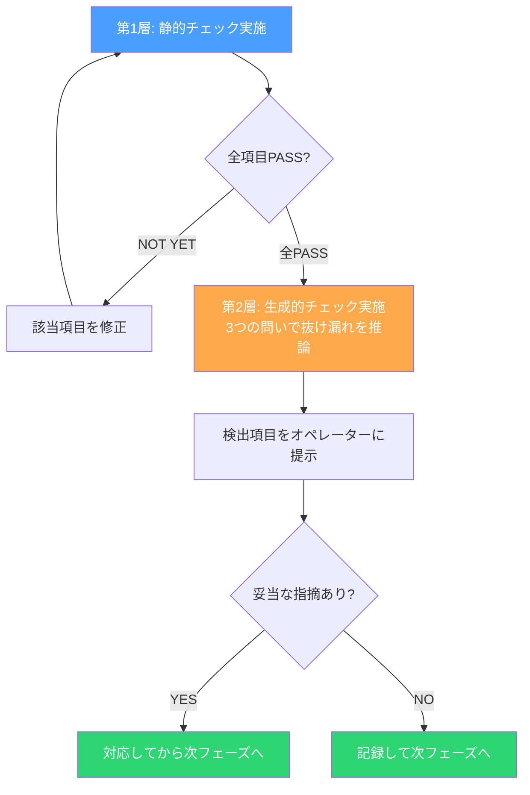

# 「全項目チェック済み」なのに品質が崩れる理由と、AIにその穴を塞がせた話

## チェックリストが全部埋まっているのに、なぜバグが出るのか

私は経営者として、いくつもの開発組織を見てきた。

どの組織にも「チェックリスト」がある。リリース前チェック、コードレビューチェック、セキュリティチェック。項目はびっしり並んでいて、担当者が一つひとつにチェックを入れていく。全項目にチェックが入る。「よし、全部OKだ。」

ところが、リリース後にバグが見つかる。要件が漏れている。ユーザーから「こんな基本的なことがなぜできていないのか」と問い合わせが来る。

全項目チェック済みなのに、品質が崩れる。

この現象を何度も見てきた。最初は「チェックが形骸化しているんだ」と思った。担当者が適当にチェックを入れているんだろう、と。だから「チェックの証跡を残せ」「ダブルチェック体制にしろ」と対策した。

改善はした。でも、完全には解決しなかった。

---

## 構造的な問題に気づいた瞬間

あるとき、プロジェクトの振り返りで気づいた。

「チェックリストの項目自体に漏れがあった」のだ。

つまり、チェックリストは「既知の項目」を漏れなく確認する道具であって、「チェックリスト自体の不備」は検出できない。項目が10個あって全部チェックしても、本来11個目が必要だったなら、その漏れは永久に見つからない。

これは構造的な限界だ。チェックリストをどれだけ精緻にしても、この問題は消えない。なぜなら「まだ項目に書かれていない問題」は、定義上チェックリストでは検出できないからだ。

エンジニアが感じる「後になって要件が増えた」「今更要件変更か」という問題の多くは、実はここに起因している。上流フェーズのゲートで検出すべき抜け漏れが、チェックリストをすり抜けてしまった結果だ。

---

## 仮説: 2層にすれば穴を塞げるのでは

経営者として組織を設計してきた経験から、1つの類推が浮かんだ。

監査の世界では「規定された手順の遵守確認」と「規定自体の妥当性評価」を分けて実施する。前者は内部監査、後者は外部監査に近い。片方だけでは不十分で、両方が必要だ。

チェックリストにも同じ構造を適用できないか。

- **第1層（静的チェック）:** あらかじめ決められた条件を1つずつ検証する。既知の条件を漏れなく確認するための層。
- **第2層（生成的チェック）:** チェックリストに書かれていない問題を推論で検出する層。

第1層は人間でもAIでもできる。問題は第2層だ。「まだ言語化されていない抜け漏れ」を検出するには、文脈を理解して推論する力が必要になる。ここにAIの出番がある。

---

## やってみた: 2層ゲートシステムの実装

実際に方法論に組み込んだのは、こういう仕組みだ。

まず第1層。各フェーズのゲート条件として定義された項目を、1つずつ検証する。例えば「顧客の真の課題が1文で言語化できているか」「ユースケースが3つ以上あるか」「非機能要件が数値で定義されているか」。これは静的なチェックリストだ。

第1層が全PASSした後に、第2層が動く。

第2層ではAIが3つの問いを立てる。

1. **次フェーズの前提条件:** 「次のフェーズを正常に開始するために、不足している情報はないか?」
2. **方法論整合性:** 「方法論全体と照合して、未反映の項目はないか?」
3. **実運用観点:** 「実運用の観点で必要だが、まだ決まっていない事項はないか?」

この3つの問いをAIが推論で検証する。チェックリストには書かれていないが、次に進むと困ることがないかを、AIが文脈から判断するのだ。

---

## 過剰検出との戦い

ただし、やってみてすぐに問題に気づいた。AIは「念のため」の指摘をしすぎる。

「このケースも考慮すべきでは」「この観点も検討すべきでは」と、あらゆる可能性を挙げてくる。理論的には正しいが、実務的には過剰だ。全部対応していたら永久にフェーズが進まない。

そこで1つのルールを設けた。

**「これがないと具体的に何が困るか」を説明できるもののみ挙げる。**

抽象的な「考慮すべき」ではなく、「これがないと次のフェーズで具体的にこういう問題が起きる」と説明できる項目だけを検出する。このフィルターを入れたことで、過剰検出は大幅に減った。

AIに「網羅的に指摘しろ」と言うと際限がなくなる。「具体的に困ることだけ言え」と言うと精度が上がる。人間の部下への指示と同じだ。

---

## 判定フローの全体像

最終的な判定フローはこうなった。

1. AIが第1層（静的チェック）を実施する。全項目をPASS/NOT YETで判定。
2. 第1層が全PASSしたら、第2層（生成的チェック）を実施する。3つの問いで抜け漏れを推論。
3. 第2層の検出項目をオペレーター（人間）に提示する。
4. オペレーターが各項目を「妥当」か「過剰」か判断する。
5. 妥当な指摘があれば対応してから次フェーズへ。過剰な指摘は記録だけして進む。

ここで重要なのは、最終判断は人間がするということだ。AIは検出と提示をするが、「これは本当に対応すべきか」の判断はオペレーターに委ねる。AIの推論力と人間のドメイン知識を組み合わせることで、精度が上がる。

AIに全部任せると過剰検出で止まる。人間だけだとチェックリストの限界にぶつかる。両方を組み合わせて初めて、実用的な品質ゲートになる。

---

## 学び: 既知と未知の問題は、別の仕組みで捕まえる

この取り組みで得た学びは明快だ。

**チェックリストは「既知の問題」しか防げない。「未知の問題」にはAIの推論力が必要だ。**

静的チェックと生成的チェックは、どちらが優れているという話ではない。役割が違う。既知の項目を漏れなく確認する精密さは静的チェックが勝る。まだ言語化されていない抜け漏れを文脈から見つける力は生成的チェックが勝る。

2つを組み合わせることで、チェックリスト文化の構造的限界を超えられる。

経営者として監査の仕組みを設計してきた経験が、ここに生きた。内部統制の世界では当たり前の「多層防御」の考え方を、AIを使って開発プロセスに持ち込んだだけだ。ただ、AIの登場によって「第2層」が現実的なコストで実装可能になった。これが大きい。

以前なら、第2層を担えるのは経験豊富なシニアエンジニアだけだった。しかしシニアエンジニアのリソースは有限で、全フェーズの全ゲートに張り付かせることは現実的ではなかった。AIがその役割を担えるようになったことで、「多層防御を全ゲートに適用する」という贅沢が、初めて実現可能になった。

---

## 次回予告

フェーズのゲートを2層にしたことで、品質の安定度は上がった。だが、もう1つ大きな課題が残っていた。

AIとの「対話の質」だ。

同じ内容を聞いても、聞き方を変えると返ってくる答えの質がまるで違う。これは部下との1on1でやっていたことと同じだった。新人には引き出す質問をし、ベテランには提案を求め、振り返りでは一緒に整理する。相手と状況で「聞き方」を変える。

次回は、AIへの「聞き方」を3段階で設計した話をします。

---

`#AIネイティブ開発` `#品質管理` `#チェックリスト` `#ゲートシステム` `#開発プロセス` `#CTO` `#AIエージェント`
