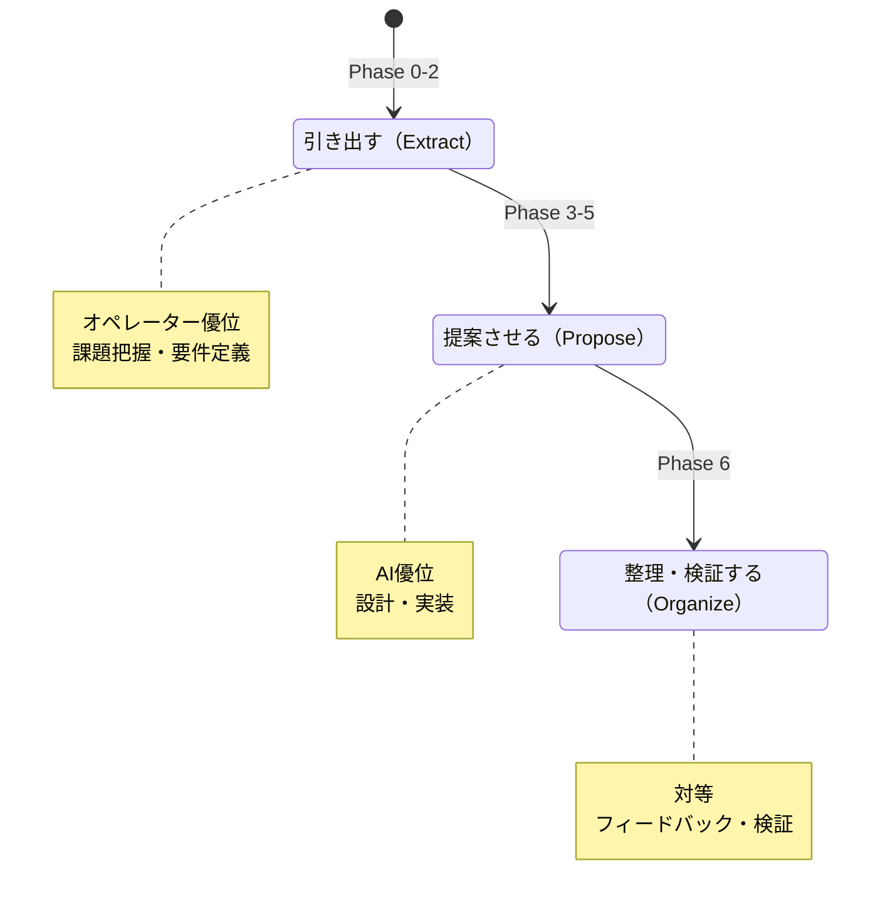

# AIへの「聞き方」を3段階で変えたら、要件の手戻りが消えた

## 1on1で当たり前にやっていたこと

経営者として、何百回と1on1をやってきた。

入社したばかりの新人との1on1では、こちらから問いを投げて考えを引き出す。「なぜそう思った?」「他にどんな選択肢があった?」。本人が自分の中にある答えに気づくよう、質問で誘導する。

ベテランエンジニアとの1on1は違う。こちらが課題を伝えて、解決策の提案を求める。「この技術的課題をどう解くべきか、選択肢を出してくれ」。経験と知見を持っている相手には、提案させたほうが良い答えが出る。

プロジェクトの振り返りでは、また違うモードになる。起きたことを一緒に整理し、何が良くて何が悪かったかを構造化する。引き出すでも提案させるでもなく、対等に「整理する」姿勢だ。

相手と状況に応じて「聞き方」を変える。マネジメントでは当たり前のことだ。

ところが、AIに対してはこれをやっていなかった。

---

## AIに同じ聞き方をし続けていた失敗

最初の頃、私はAIにいつも同じように聞いていた。「これをどう設計すべきか?」「この要件で問題はないか?」

要件定義のフェーズでも、実装のフェーズでも、振り返りのフェーズでも、同じトーンで同じように聞く。するとAIは律儀に毎回「答え」を出してくる。

問題は、要件定義の段階でAIに「答え」を出させていたことだ。

要件定義で大事なのは、オペレーター（私）の頭の中にあるドメイン知識を引き出すことだ。業界の慣習、既存システムの制約、実業務の癖 — これらはAIが持っていない情報であり、私の中にある。なのにAIに「答え」を求めると、一般的な正論が返ってくる。それを「まあそうだよね」と受け入れて先に進む。

すると後工程で手戻りが発生する。「いや、うちの業務ではこのケースは起きないんだよ」「この制約、最初に言えばよかった」と。

私のドメイン知識が引き出されないまま、AIの一般論で要件が固まってしまっていたのだ。

---

## 仮説: フェーズごとに「聞き方」を変えればいいのでは

1on1の経験から、答えは明白だった。

フェーズによってAIとの関係性は変わる。上流では私の方がドメイン知識を持っている。中流ではAIの方が技術的選択肢を持っている。下流では対等に整理する。この関係性の変化に応じて、「聞き方」を変えるべきだ。

3つの姿勢を定義した。



1on1で相手に合わせていたことを、開発フェーズに合わせて体系化しただけだ。

---

## Phase 0-2: 引き出す — AIは答えを出さない

上流フェーズでは、AIの仕事は「答えを出すこと」ではない。「オペレーターの中にある情報を引き出すこと」だ。

具体的にはこうなる。

AIが「なぜそれが問題なのか?」を繰り返す。いわゆる5 Whysだ。私が「受注管理を効率化したい」と言ったら、AIは「効率化とは具体的に何が改善されることですか?」と返す。「入力が面倒なんだ」と答えると「入力のどの部分が最も時間を取っていますか?」と掘る。

この過程で、私の中にあった暗黙知が言語化される。「ああ、本当の課題は入力作業そのものじゃなくて、同じ情報を3つのシステムに転記していることか」と、自分で気づく。

AIが最初から「受注管理の効率化にはこういうアプローチがあります」と答えていたら、この気づきは得られなかった。

新人との1on1と同じだ。答えを教えるのではなく、問いで引き出す。ただし、ここでの「新人」はAIではなく私の方だ。ドメイン知識は持っているが、まだ言語化できていない段階にいる。AIの問いが、その言語化を助ける。

---

## Phase 3-5: 提案させる — AIの知見を引き出す

中流フェーズに入ると、関係性が逆転する。

技術設計やアーキテクチャ選定では、AIの方が選択肢を多く持っている。ここでは私が「どうすべきか?」と聞くのではなく、AIに選択肢を番号付きで提示させる。

例えばこうだ。

```
この機能のデータストアとして適切なものはどれですか?

1. RDB（PostgreSQL） — 正規化された関係データに適する。結合クエリが頻繁な場合に有利
2. ドキュメントDB（Firestore） — スキーマレスで柔軟。リアルタイム同期が必要な場合に有利
3. オブジェクトストレージ（S3） — 大容量ファイルの保管に適する
4. その他（自由記述）
```

AIが選択肢を出し、それぞれのトレードオフを明示する。私はドメイン知識に基づいて判断する。「うちの場合、リアルタイム同期は必要ないけど、将来的にレポート機能でJOINが多用されるからRDBだな」と。

ここで重要なのは、AIが最終判断をしないことだ。選択肢とトレードオフを提示するところまでがAIの仕事で、判断は人間がする。ベテランエンジニアに「どう思う?」と聞くのと同じ構造だ。提案は受けるが、決めるのは私だ。

---

## Phase 6: 整理・検証する — 対等の関係で構造化する

下流フェーズでは、また姿勢が変わる。

フィードバックや検証の段階では、「引き出す」でも「提案させる」でもなく、集まった情報を一緒に構造化する。テストで見つかった問題、ユーザーからのフィードバック、レビューでの指摘 — これらをI/F設計への影響度で整理し、優先度をつける。

ここではAIも私も対等だ。AIはデータの構造化が得意で、私はビジネスインパクトの判断が得意。それぞれの強みを活かして、一緒に整理する。

プロジェクトの振り返りミーティングの構造と同じだ。ファシリテーターがいるのではなく、全員が対等に意見を出し合って構造化する。

---

## Guided Prompt: 認知負荷を下げる工夫

聞き方を変えるだけでなく、もう1つ工夫を入れた。

AIからオペレーターへの問いかけを「番号付き選択肢 + その他（自由記述）」の形式に統一した。これを「Guided Prompt」と呼んでいる。

なぜか。自由記述の質問は認知負荷が高い。「この機能の優先度をどう考えますか?」と聞かれると、何をどう答えればいいか考えるところから始まる。

これを選択肢にするとこうなる。

```
この機能の優先度をどう判断しますか?

1. 必須（これがないと業務が止まる）
2. 重要（あると業務効率が大幅に上がる）
3. あると良い（なくても業務は回る）
4. 不要（今回のスコープ外）
5. その他（自由記述）
```

「2番」と答えるだけでいい。思考の枠組みが提供されているから、判断に集中できる。ただし「5. その他」を必ず入れることで、選択肢に収まらない判断も受け入れる。

これも1on1の技術と同じだ。オープンクエスチョンばかりだと相手が疲れる。クローズドクエスチョンで枠を示しつつ、「それ以外もあれば教えて」と逃げ道を用意する。

---

## 学び: 「何を聞くか」より「どう聞くか」

この取り組みで最も重要な学びは、これだ。

**AIとの対話は「何を聞くか」より「どう聞くか」が品質を決める。**

同じ「要件を整理したい」でも、AIに「要件を整理して」と言うのと、AIに「私のドメイン知識を引き出す問いを投げてくれ」と言うのでは、出力の質がまるで違う。

フェーズごとに姿勢を変えることで、上流では私の暗黙知が引き出され、中流ではAIの技術的知見が活用され、下流では両者の強みが組み合わされる。手戻りが発生していたのは、全フェーズで同じ「答えを出させる」姿勢でAIに向き合っていたからだ。

プロンプトエンジニアリングという言葉が流行っているが、本質は「聞き方の設計」だ。そしてそれは、マネジメントの世界では昔からやっていたことに他ならない。

---

## 次回予告

聞き方を3段階に変えたことで、要件の精度が上がった。2層ゲートで品質が安定した。AIチームの構造も固まってきた。

だが、ここで根本的な問いが浮かんだ。

「この方法論自体は正しいのか?」

チェックリストの限界を2層ゲートで超えたように、方法論自体にも「書かれていない欠陥」があるはずだ。方法論を評価する仕組みがなければ、方法論そのものが陳腐化する。

次回は、「方法論を評価するメタロール」を設けて、4日間で34箇所の構造的欠陥を発見・修正した話をします。

---

`#AIネイティブ開発` `#プロンプト設計` `#壁打ち` `#要件定義` `#手戻り防止` `#1on1` `#CTO`
