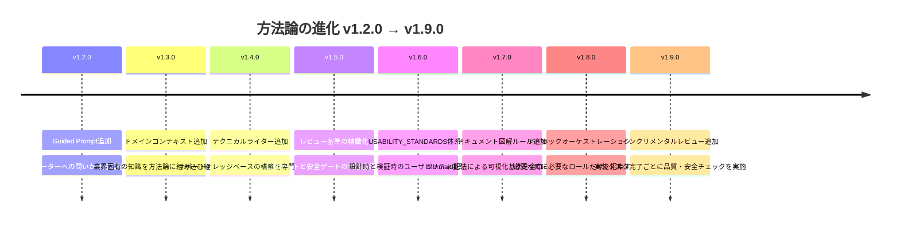

# 自分の開発プロセスをAIに評価させたら、4日で34箇所の欠陥が見つかった

## PDCAを回してきたつもりだった

経営者として、PDCAは体に染みついている。

プロダクトのPDCA、組織のPDCA、採用のPDCA。何かを始めたら、計画し、実行し、振り返り、改善する。このサイクルを回すことが経営の基本だと、何十年もやってきた。

開発プロセスにもPDCAを適用してきた。スプリントの振り返りで課題を洗い出し、次のスプリントで改善する。チームのベロシティが下がれば原因を分析し、対策を打つ。

だが、1つだけ盲点があった。

**「プロセスを定義しているドキュメントそのもの」にPDCAを回していなかった。**

開発プロセスの実行にはPDCAを回す。でも、プロセスを規定しているルール群 — ロール定義、フェーズ定義、レビュー基準 — 自体の妥当性は、誰がいつ検証するのか。答えは「特に決まっていない」だった。

気づいたときは苦笑した。PDCAの伝道師を自認していた私が、最も重要なレイヤーでPDCAを回していなかったのだ。

---

## メタロールという発想

AIネイティブ開発方法論を設計したとき、8つ目のロールとして「方法論エデュケーター」を置いた。これは他の7つのロールとは本質的に異なる存在だ。

ナビゲーターは開発を案内する。コーディングエージェントは実装する。レビュアーはコードを検証する。これらは全て「プロジェクトの中」で機能するロールだ。

方法論エデュケーターは違う。方法論そのものを評価し、改善を提案する。プロジェクトの「外」から、プロセスを定義しているルール群を俯瞰して検証する。いわばメタロール — ルールのルールを見る存在だ。

経営に例えるなら、事業部長が事業を回すのに対して、経営企画や内部監査が「事業の回し方自体」を検証する関係に近い。どんなに優秀な事業部長がいても、ガバナンスの仕組みがなければ組織は劣化する。同じことが開発方法論にも言える。

---

## エデュケーターの4つの責務

方法論エデュケーターには、4つの明確な責務を定義した。

**1. 有効性評価**

ゲート判定が実際に機能しているか。ロール間の牽制が形骸化していないか。フェーズ定義に構造的な問題がないか。これらを観察し、方法論の有効性を評価する。

「ゲートを通過したのに後続フェーズで問題が頻発する」なら、ゲート条件自体に不備がある。「レビュアーが常にPASSを出す」なら、牽制が機能していない。こうした構造的な問題を検出するのが最初の仕事だ。

**2. 改善提案の策定**

評価結果に基づいて、具体的な改善を提案する。ただし「過剰改善の抑制」というルールを設けている。「これがないと具体的に何が困るか」を説明できない改善は提案しない。理論的に美しくても実務に貢献しない改善は、方法論を肥大化させるだけだ。

**3. 教育・オンボーディング支援**

方法論は存在するだけでは意味がない。使う人が正しく理解して初めて機能する。新規メンバーやオペレーターが方法論を効果的に活用できるよう、解説やFAQ、アンチパターンの文書化を行う。

**4. プロジェクト横断の知見集約**

複数のプロジェクトにまたがる知見を集約する。あるプロジェクトでうまくいったパターン、別のプロジェクトで失敗したパターン。これらを方法論に還元する。個別プロジェクトの経験が、方法論を通じて全プロジェクトの品質向上に貢献する仕組みだ。

---

## 実録: v1.0からv1.9.0への進化

ここからは実際に何が起きたかの記録だ。

方法論のv1.0を書き上げた。ロール定義、フェーズ定義、レビュー基準、コア原則。一通り揃った。自分では「まあまあ良くできた」と思っていた。

エデュケーターロールに評価を依頼した。

**評価レポートv1 — 構造的欠陥の発見**

返ってきた評価レポートを読んで、冷水を浴びせられた気分になった。

- **SoT（Source of Truth）宣言がない。** 複数のドキュメントに同じ情報が書かれているが、どちらが正なのか宣言されていない。矛盾が生じたときの解決方法がない。
- **バージョン管理プロトコルがない。** 方法論自体のバージョン管理が未定義。進行中のプロジェクトに影響する変更をどう扱うかが決まっていない。
- **緊急対応パスがない。** 本番障害時に通常のフェーズを全部踏む余裕はないが、その圧縮フローが定義されていない。

どれも「言われてみれば当たり前」の欠陥だ。しかし自分1人で見直していたら、気づかなかっただろう。

v1.0 → v1.1.0へ修正。

**評価レポートv2 — 新たな課題6件**

v1.1.0を再評価。今度は6件の新規課題が検出された。修正によって新たに露出した問題もあれば、前回見落とされていた問題もある。

このサイクルを繰り返した。

**バージョン進化の軌跡:**

- **v1.2.0:** SP-6（Guided Prompt）を追加。オペレーターへの問いかけ方式を体系化。
- **v1.3.0:** ドメインコンテキストの仕組みを追加。業界固有の知識を方法論に組み込む経路を整備。
- **v1.4.0:** テクニカルライターロールを追加。サポートナレッジベースの構築を専門ロール化。
- **v1.5.0:** レビュー基準の精緻化。品質ゲートと安全ゲートの責務境界を明確化。
- **v1.6.0:** USABILITY_STANDARDSを体系化。設計時と検証時のユーザビリティ基準を統一。
- **v1.7.0:** ドキュメント図解ルールの追加。Mermaid記法による可視化基準を全ロールに適用。
- **v1.8.0:** アドホックロールオーケストレーション（SP-7）の追加。必要な時に必要なロールだけを招集する仕組みと、並行タスク実行の制度化。
- **v1.9.0:** インクリメンタルレビューパイプライン（SP-8）の追加。実装タスク完了ごとに品質チェック→安全チェックを実施し、ゲートレビュー前に品質を作り込む仕組み。コードレビュアーとシステム監査官がPhase 5から早期参加する設計に変更。

このサイクルは今も続いている。評価レポートを重ねるたびに、方法論は少しずつ精緻化されていく。

---

## 34件の欠陥は、なぜ1人では見つけられなかったのか

振り返ると、見つかった34件の欠陥には共通点がある。

**「自分の設計の前提を自分で疑えない」という認知的な限界。**

SoT宣言がないことに気づかなかったのは、自分の頭の中ではどのドキュメントが正かわかっていたからだ。バージョン管理が不要に思えたのは、変更するのが自分だけだったからだ。緊急パスが漏れたのは、「まあそのときは臨機応変に」と無意識に考えていたからだ。

全て「自分には見えているから問題ない」という認知バイアスだ。

これは組織でも同じだ。創業者が1人で作ったルールは、創業者にしか運用できない。暗黙の前提が多すぎて、第三者には理解できない。だから組織が成長するとき、ルールの言語化と構造化が必要になる。

方法論エデュケーターは、この「第三者の目」をAIで実現したものだ。AIは私の暗黙の前提を共有していないから、「ここが未定義です」「ここに矛盾があります」と指摘できる。自分で自分の盲点を見つけるのは構造的に困難だが、独立した視点を持つ存在なら検出できる。

---

## 「プロセスを改善するプロセス」の価値

この4日間で得た最大の学びは、技術的なことではない。

**「プロセスを改善するプロセス」を組み込むことの価値だ。**

多くの開発チームは、開発プロセスを「一度決めたら運用する」ものとして扱っている。たまに大きな問題が起きたら見直す。しかし、日常的に方法論自体をPDCAの対象にしているチームは稀だ。

方法論エデュケーターを設けたことで、方法論の改善が「たまにやること」から「仕組みとして回り続けること」に変わった。プロジェクトが1つ終わるたびに方法論が少しずつ良くなる。その改善が次のプロジェクトの品質を底上げする。複利のように効く。

経営でいえば、「事業を改善する」のは当たり前だが、「事業の改善方法を改善する」のはメタ認知が必要で、意識しないと実行されない。方法論エデュケーターは、このメタ認知を強制的にシステム化した装置だ。

人間が1人で34箇所の構造的欠陥を4日で見つけることは、おそらく不可能だ。しかしそれは人間が劣っているからではなく、自分の設計を自分で評価することの構造的限界による。AIという独立した評価者を組み込むことで、この限界を突破できた。

---

## 次回予告

方法論が自己改善する仕組みを手に入れたことで、AIチームの基盤は安定してきた。ロール構造、ゲートシステム、対話の設計、そして方法論自体の進化サイクル。

次回からは、この方法論を使って実際にプロジェクトを動かした記録に入っていきます。最初にぶつかったのは「スコープの膨張」という古典的な問題。AIは何でもできそうに見えるから、つい詰め込みすぎる。スコープをどう切り分け、何を捨てるか — 経営判断そのものをAIチームでどう扱ったかの話です。

---

`#AIネイティブ開発` `#開発プロセス改善` `#PDCA` `#メタ認知` `#エデュケーター` `#方法論` `#CTO`
