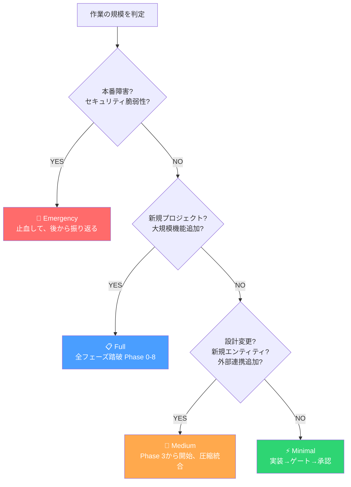

# 「全部やらなくていい」— AI開発プロセスに4段階のギアを入れた理由

## プロセスが現場を殺した日

私はかつて、全案件に同じプロセスを適用していた。

要件定義から設計、実装、レビュー、リリースまで、どんな案件でも同じ手順を踏ませる。小さなバグ修正にも、大規模な新機能開発と同じフォーマットの起票、同じ承認フロー、同じレビュー手順。「プロセスを守ることが品質を守ること」だと信じていた。

結果、何が起きたか。

ボタンの色を変える修正に3日かかった。本番障害の緊急対応で「要件定義書はどこですか」と聞かれた。エンジニアたちは「このプロセス、本当に必要ですか」と言わなくなった。言わなくなったのは納得したからではない。諦めたからだ。

経営者として、これは致命的な失敗だった。プロセスは品質を守るためにある。だが、プロセスそのものが生産性を殺し、現場のモチベーションを奪っていたら、それは品質を守っていることにならない。

---

## 仮説 — 解像度を変えるべきだ

AIチームに9フェーズのプロセスを導入して運用を続ける中で、同じ問題に直面した。

Phase 0の現状把握からPhase 8のフルスケール実装まで、全9フェーズ。新規プロジェクトにはこの粒度が必要だ。だが、既存システムのバグ修正に「Phase 0: 現状把握と目標設定」から始めるのは明らかにおかしい。

人間の組織でも同じことをしていた。新規事業の立ち上げと、既存サービスの軽微な改修に同じ稟議フローを適用して、現場が疲弊していた。あのときの学びがここで活きた。

仮説はシンプルだった。作業の規模に応じて、プロセスの「解像度」を変えるべきだ。

---

## 4段階のスコープ分類

そこで、すべての作業を4つのスコープに分類するルールを作った。

### Full — 全フェーズ踏破

新規プロジェクト、または既存システムの大規模機能追加。Phase 0からPhase 8まで、全フェーズを順に踏む。8つのAIロールがフェーズに応じて段階的に稼働する。

これは従来通りだ。省略してはいけない作業には、省略しないプロセスを適用する。

### Medium — Phase 3から開始、圧縮して統合

既存システムへの中規模機能追加。Phase 0-2の成果物（ユースケース、真の課題）が既に存在することが前提で、Phase 3の要件定義から開始する。Phase 5の設計は既存設計への増分としてレビューし、Phase 7-8は統合して実装からリリースまで一気に走る。

「全く新しいものを作る」のではなく「既にあるものに足す」作業だ。ゼロからの壁打ちは不要だが、設計への影響は確認しなければならない。

### Minimal — 実装して、ゲートを通して、承認

バグ修正、小規模変更、設定変更。コーディングエージェントが修正を実装し、コードレビュアーが品質ゲートを、システム監査官が安全ゲートを確認し、オペレーターが承認する。それだけだ。

ただし、Minimalを適用するには3つの条件を全て満たす必要がある。

1. 既存の設計・アーキテクチャを変更しない
2. 新しいデータエンティティを追加しない
3. 新しい外部システム連携を追加しない

1つでも該当したら、それはMinimalではない。Mediumに格上げする。この判定基準が曖昧だと、「Minimalのつもりで始めたら設計変更が必要になり、手戻りが発生する」という最悪のパターンにはまる。

### Emergency — 止血して、後から振り返る

セキュリティ脆弱性、サービス停止、データ損失リスク。本番環境で今まさに起きている緊急事態への対応パス。

トリアージ → 最小スコープ修正 → 二重ゲートレビュー（品質と安全を並行実施） → デプロイ。ここまでを最速で駆け抜ける。そして48時間以内にポストモーテムを実施する。

通常フローでは品質ゲートと安全ゲートは直列で実施するが、Emergencyでは並行実施を許可する。これが「例外」であることを明示しているからこそ、通常時の直列実施が「ルール」として機能する。

---

## 判定は誰がするのか

スコープの判定はオペレーター（人間）が行い、意思決定ログに記録する。

ここが重要だ。AIに判定させない。なぜなら、スコープの判定には「この変更が既存設計にどう影響するか」というコンテキストが必要で、それはプロジェクトの歴史を知っているオペレーターにしか判断できないからだ。

判定を誤ることもある。Minimalで始めたら設計変更が必要になった、というケースだ。その場合は、適切なスコープにエスカレーションする。恥ずかしいことではない。判定を誤ったこと自体が「この作業は見た目より複雑だった」という情報であり、次回の判定精度を上げる材料になる。

---

## 学び — プロセスは「守るもの」ではなく「使い分けるもの」

かつての私は、プロセスを「守るもの」だと思っていた。全員が同じ手順を踏むことが規律であり、品質の証だと。

違った。プロセスは道具だ。道具は目的に合わせて選ぶものであり、すべての釘にハンマーを使う必要はない。ネジにはドライバーを使えばいい。

4段階のスコープ分類を導入してから、AIチームの動きが明らかに変わった。バグ修正が数時間で完了するようになった。一方で、新規機能の追加には以前と同じ丁寧さが維持されている。重要なのは「プロセスを減らした」のではなく「プロセスを適切に選んでいる」ということだ。

プロセスの重さに苦しんでいる組織があるなら、問うべきは「プロセスが多すぎるか」ではなく「すべての作業に同じプロセスを適用していないか」だと思う。

---

## 次回予告

8つのAIロールで回していたこの方法論に、実はもう1つ足りないものがあった。

実装は完璧。レビューも通った。監査もパスした。でも、ユーザーが使い方をわからない。サポートに問い合わせが殺到する。「作る側」の品質は高いのに、「伝える側」が欠落していた。

次回は、8番目の専門職 — テクニカルライターをAIチームに追加した話です。

---

`#AIネイティブ開発` `#開発プロセス` `#スコープ管理` `#アジャイル` `#緊急対応` `#CTO` `#判断基準`
