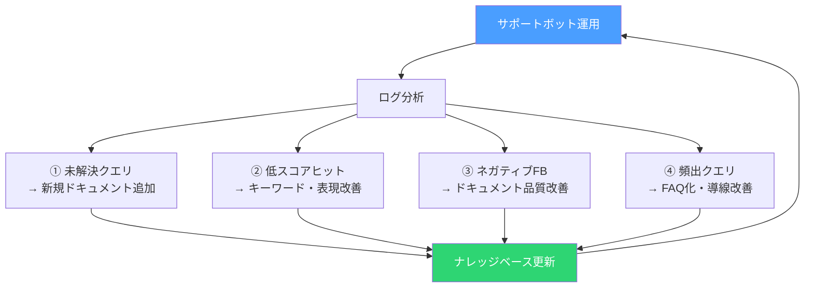

# AIチームに「ドキュメント担当」を追加したら、サポート工数が激減した

## 「作ったのに使われない」問題

7つのロールでAIチームを回していた頃の話だ。

ナビゲーターが壁打ちで要件を引き出し、コーディングエージェントが実装し、コードレビュアーが品質を検証し、システム監査官がセキュリティを監査する。PMが進捗を管理し、ユーザー・運用サポートがUXを検証する。方法論エデュケーターがプロセスそのものを改善する。7ロールの連携は順調だった。

ところが、リリース後にサポートへの問い合わせが殺到した。

「ログインの仕方がわかりません」「この画面で何ができるんですか」「エラーが出たんですが、どうすればいいですか」。実装は完璧だ。レビューも通った。監査もパスした。でも、ユーザーが使い方をわからない。

経営者として、これは痛いほど見覚えのある景色だった。

---

## 製品が良くても、伝わらなければ意味がない

私はこれまで何度も、良い製品がサポートの問題で失敗するのを見てきた。

機能は優れている。技術的にも堅牢だ。だがユーザーが自力で使いこなせない。問い合わせが増え、サポートチームが疲弊し、ユーザーの満足度が下がり、解約率が上がる。製品の問題ではなく「伝え方」の問題で顧客が離れていく。

「作る側」と「伝える側」は別の専門性だ。これは組織設計の基本原則だが、AIチームの設計でそれを見落としていた。

7ロールの中に、「ユーザーに伝えるためのドキュメントを書く」責務を持つロールがいなかった。ユーザー・運用サポートはUXの検証やテストシナリオの策定が仕事であり、ナレッジベースを体系的に構築する役割ではない。コーディングエージェントは実装のプロだが、エンドユーザー向けの説明文を書くのは守備範囲外だ。

サポートボット用のナレッジベースが、誰の責務にもなっていなかった。

---

## 8番目のロール — テクニカルライター

そこで、v1.4.0のアップデートでテクニカルライターロールを追加した。

このロールの責務は明確だ。実装された機能を、エンドユーザーと運用管理者の両方が理解・活用できるドキュメントとして構造化する。具体的には、サポートボットがRAG（検索拡張生成）で参照するナレッジベースの構築だ。

テクニカルライターの稼働タイミングは2つある。

**Phase 7（MVP構築）** では、主要機能のナレッジベース初版を作成する。設計ドキュメント、要件定義、テストシナリオを入力として、ユーザーが実際に読んで使える形に変換する。MVPリリース時点で、少なくとも主要機能の使い方がナレッジベースでカバーされている状態を作る。

**Phase 8（フルスケール実装）** では、網羅性を検証する。Phase 3の機能要件一覧と照合して、全機能がナレッジベースでカバーされていることを確認する。テストシナリオからユーザーが遭遇しうるエラーをトラブルシューティングとして文書化し、フィードバックログからFAQを作成する。

---

## 「書く人」と「検証する人」を分ける

テクニカルライターの設計で最も意識したのは、ユーザー・運用サポートとの牽制関係だ。

テクニカルライターがナレッジベースを作る。ユーザー・運用サポートが「このドキュメントでユーザーが自己解決できるか」を検証する。書く人と検証する人が別であることで、品質が担保される。

これはコーディングエージェントとコードレビュアーの関係と同じ構造だ。書く側は「自分が知っていること」を前提にしてしまう。検証する側は「ユーザーの目線」で読み、前提知識なしで理解できるかを判断する。

コードだけでなくドキュメントにも、「書く人」と「検証する人」の分離が必要だ。1体のAIに書かせて、同じAIに検証させたら、コードレビューと同じ構造的な問題が発生する。

---

## サポートボットフィードバックの反映サイクル

ナレッジベースは作って終わりではない。サポートボットの運用データから継続的に改善する仕組みを設計した。

サポートボットのログには、ユーザーの質問、検索にヒットしたドキュメント、検索スコア、解決したかどうか、ユーザーのフィードバックが記録される。テクニカルライターはこのログを分析し、4つの切り口で改善を行う。

1. **未解決クエリ** — ユーザーが質問したがサポートボットが回答できなかったケース。ナレッジベースにそのトピック自体が欠落している。新規ドキュメントを追加する。

2. **低スコアヒット** — 検索スコアが低いまま無理やり回答したケース。ドキュメントは存在するが、ユーザーが使う言葉とドキュメントの表現がずれている。キーワードや表現を改善する。

3. **ネガティブフィードバック** — ユーザーが「役に立たなかった」と評価したケース。ドキュメントの内容自体に問題がある。品質を改善する。

4. **頻出クエリ** — 同じ質問が繰り返されるケース。FAQとして独立させ、導線を改善する。

このサイクルが回ることで、ナレッジベースはリリース後も進化し続ける。

---

## 1ファイル=1トピックという設計原則

RAGでの検索精度を高めるために、ナレッジベースには「1ファイル=1トピック」の粒度ルールを設けた。

1つのMarkdownファイルが、サポートボットにとっての1つの検索チャンクになる。ファイルの中に複数のトピックが混在していると、検索時にノイズが混じる。逆にトピックが細かすぎると、文脈が切れて回答の質が下がる。

さらに、エンドユーザー向け（`user-guide/`）と運用管理者向け（`ops-guide/`）を明確に分離した。サポートボットがユーザーの質問に対して管理者向けの手順を返してしまう事故を防ぐためだ。ユーザーに「サーバーのコンソールにログインして設定を変更してください」と案内するサポートボットは、誰も幸せにしない。

---

## 学び — ドキュメントも「チーム」で作る

この取り組みで得た学びはこうだ。

**「書く人」と「検証する人」の分離は、コードだけでなくドキュメントにも必要だ。**

テクニカルライターを追加する前、ナレッジベースは「誰かが片手間で書くもの」だった。結果として、誰も書かなかった。専門のロールを設け、責務を明確にし、品質検証の仕組みを作ったことで、ナレッジベースが「プロダクトの一部」として機能するようになった。

経営者として何度も経験してきたことだが、「誰の責務でもないタスク」は実行されない。責務を明示的に割り当てることが、実行を保証する唯一の方法だ。それはAIチームでも人間のチームでも変わらない。

---

## 次回予告

テクニカルライターの追加でサポート品質は改善した。だが、もう1つ根本的な課題が残っていた。

AIとの壁打ちでPhase 0-2を進めるとき、AIは業界の商慣習や規制を知らない。「この業界では請求書の発行タイミングにこういうルールがある」「この規制があるから、このデータの保持期間は最低7年」。こういった業界固有の知識は、壁打ちだけでは引き出せない。

次回は、AIに業界知識を事前に渡す「ドメインコンテキスト」という仕組みを作った話です。

---

`#AIネイティブ開発` `#テクニカルライティング` `#ナレッジベース` `#RAG` `#サポートボット` `#CTO` `#組織設計`
