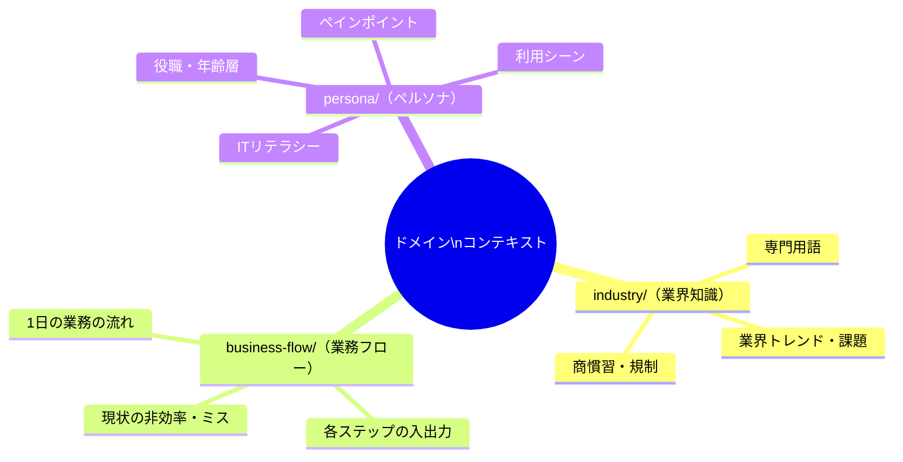

# AIに業界知識を食わせてから壁打ちしたら、手戻りが半分になった

## 壁打ちの限界に気づいた瞬間

Phase 0からPhase 2の壁打ちには自信があった。

壁打ちナビゲーターが「なぜそう判断したのか」を繰り返し問い、真の課題に到達するまで妥協しない。2層ゲートシステムで抜け漏れを検出する。プロセスとしては機能していた。

だが、ある業界特化のプロジェクトで壁にぶつかった。

物流業界向けのシステムを設計していたとき、AIが「配送ルートの最適化」を提案してきた。技術的には正しい。だが、この業界では配送ルートはドライバーの経験と顧客との関係性で決まっていて、アルゴリズムで最適化できるような単純な問題ではなかった。「この荷主は朝イチでないと受け取れない」「この道は時間帯によっては大型車が通れない」という暗黙知が膨大にある。

AIはそれを知らない。知らないまま壁打ちに入るから、表面的な提案しかできない。オペレーターが「いや、この業界ではそうじゃなくて...」と毎回説明する。壁打ちのはずが、業界説明会になっていた。

---

## 新メンバーに業界資料を渡すのと同じことだ

経営者として、新しいメンバーをプロジェクトにアサインするとき、私はいつも事前に業界資料を渡していた。

「この業界はこういう商慣習がある」「この規制があるから、こういうことはできない」「ユーザーはこういう人たちで、ITリテラシーはこのくらい」。プロジェクトに入る前に最低限のドメイン知識を持っていれば、キックオフミーティングの議論の質が格段に上がる。ゼロから説明する必要がなくなるからだ。

AIにも同じことをすればいい。

壁打ちを始める前に、業界知識を読み込ませる。ユーザーの業務フローを読み込ませる。ペルソナを読み込ませる。そうすれば、AIは「この業界ではこういう制約がありますよね」という前提の上で壁打ちに入れる。

この発想自体はシンプルだ。だが、実際にやるには「何を」「どういう構造で」「いつ」読み込ませるかを設計する必要があった。

---

## 3つのカテゴリで整理する

ドメインコンテキストを3つのカテゴリに分けた。

### industry/ — 業界知識

対象業界の商慣習、規制、専門用語、業界特有の課題やトレンド。

例えば物流業界なら、「運送約款の基本構造」「配車計画の実務フロー」「ドライバーの拘束時間規制」「荷主との商慣習（付帯作業の暗黙的な期待）」といった情報だ。医療業界なら、「診療報酬制度の基本」「電子カルテの標準規格」「個人情報保護法の医療データに関する特則」になる。

これは業界に所属している人にとっては「当たり前」の知識だが、AIにとっては持っていない情報だ。持っていない情報に基づく推論はできない。

### business-flow/ — 業務フロー

ユーザーの実際の業務フローだ。1日の流れ、各業務ステップの入出力、現状発生している非効率やミス。

「倉庫管理者の朝は入荷検品から始まる。検品は紙の伝票と現物を目視で照合する。1件あたり平均3分。1日の入荷は約50件。つまり検品だけで2時間半かかっている」。こういう具体的な業務の流れを書く。

業務フローがわかっていると、AIは「この業務ステップをシステム化すると、1日あたり2時間半の削減が見込めますね」という定量的な議論ができるようになる。

### persona/ — ペルソナ

システムの利用者像だ。役職、年齢層、ITリテラシー、利用シーン、ペインポイント。

「主な利用者は40-50代の倉庫管理者。PCは日常的に使うがスマートフォンアプリの操作は不慣れ。現場ではバーコードリーダー付きのハンディターミナルを使っている。細かい文字は見えにくいため、UI上の文字サイズは最低14pt以上が必要」。

ペルソナがわかっていると、AIは「このユーザー層にはドラッグ&ドロップのUIは適切でしょうか」という問いを自ら立てられるようになる。ペルソナなしでは、技術的に最適なUIを提案してしまい、実際のユーザーには使えないものが出来上がるリスクがある。

---

## 読み込ませるタイミングと方法

ドメインコンテキストの読み込みタイミングはPhase 0の開始前だ。壁打ちが始まる前に、AIセッションにドメイン知識を持たせておく。

Phase 0のゲート条件にも「該当するドメインコンテキストがあれば読み込み済みであること」を追加した。ドメインコンテキストの存在を忘れたままPhase 1に進んでしまうことを防ぐためだ。

読み込ませる方法は、使うAIツールによって異なる。Claude ProjectsならProject Knowledgeにアップロードする。Claude Codeならセッション開始時にファイルパスを指定する。ChatGPTやGeminiならセッション開始時にファイル内容を貼り付ける。どのツールでも、やることは同じだ。「壁打ち開始前に、業界知識を渡す」。

---

## プロジェクト横断で使い回せる

ドメインコンテキストの大きな利点は、プロジェクトを横断して再利用できることだ。

物流業界の業界知識は、物流業界向けのプロジェクトであれば毎回使える。配車管理システムを作るときも、倉庫管理システムを作るときも、同じ業界知識がベースになる。プロジェクト固有の要件はPhase 0-2の壁打ちで引き出すが、業界の基盤知識は使い回せる。

一度書けば、同じ業界の別プロジェクトで再利用できる。経営者的に言えば、ナレッジの資産化だ。プロジェクトが終わるたびに知識がゼロに戻るのではなく、ドメインコンテキストとして蓄積されていく。新しいプロジェクトを始めるたびに、AIのスタート地点が高くなる。

---

## 壁打ちの代替ではない

1つだけ注意点がある。

ドメインコンテキストは参考資料であって、壁打ちの代替ではない。業界知識を読み込ませたからといって、Phase 0-2の壁打ちを省略してはいけない。

ドメインコンテキストが提供するのは「業界の一般的な知識」だ。だが、プロジェクトで解決すべき課題は、その業界のその顧客の、固有の文脈にある。一般的な業界知識だけでは、その固有の文脈には辿り着けない。

ドメインコンテキストを読み込んだ上で、オペレーターとの壁打ちを通じて理解を深める。これが正しい使い方だ。業界知識という土台の上に、プロジェクト固有の知識を壁打ちで積み上げていくイメージだ。

土台がないまま積み上げようとするから、壁打ちが業界説明会になっていた。土台があれば、壁打ちは最初から本質的な議論に入れる。

---

## 学び — AIの性能ではなく「AIに何を知らせるか」が質を決める

v1.3.0でドメインコンテキストを導入してから、壁打ちの精度は明らかに変わった。

AIが投げてくる質問の解像度が上がった。「業務を効率化したいですか」ではなく「入荷検品の照合作業を自動化するのか、それとも検品フローそのものを再設計するのか、どちらを目指しますか」と聞いてくるようになった。業界の文脈を知っているからこそ、具体的な問いが立てられる。

この経験で確信したことがある。

AIの性能 — モデルの賢さ、推論能力 — は重要だ。だが、壁打ちの質を決めるのはそれだけではない。「AIに何を知らせておくか」が、出力の質を根本から変える。同じモデルでも、ドメインコンテキストを渡すか渡さないかで、壁打ちの深さがまるで違う。

これは人間のチームでも同じだ。優秀なコンサルタントでも、業界知識ゼロの状態でキックオフに入れば、最初の数週間は学習期間になる。事前に業界資料を渡しておけば、初日から価値のある議論ができる。

AIの性能を追い求めるのも大事だが、「AIに渡す情報の質」を設計することは、同じくらい重要だ。むしろ、コストパフォーマンスで言えば、モデルのアップグレードよりドメインコンテキストの整備の方が投資対効果が高いかもしれない。

---

## このシリーズは続く

ここまで7回にわたって、AIネイティブ開発方法論の中核を語ってきた。

8つのロールによる相互牽制（第1回）、2層ゲートシステム（第2回）、スコープ分類（第5回）、テクニカルライター（第6回）、ドメインコンテキスト（第7回）。これらは全て、v1.0からv1.9.0に至るまでの進化の記録だ。方法論エデュケーターが指摘し、修正し、再評価し、また指摘する。そのサイクルの中で生まれてきた仕組みたちだ。

だが、方法論は完成しない。v1.9.0はスナップショットに過ぎない。新しいプロジェクトに適用するたびに、新しい課題が見つかり、新しい改善が生まれる。

このシリーズもまた、方法論と同じように、続いていく。

---

`#AIネイティブ開発` `#ドメイン知識` `#壁打ち` `#要件定義` `#ナレッジマネジメント` `#CTO` `#AIエージェント`
