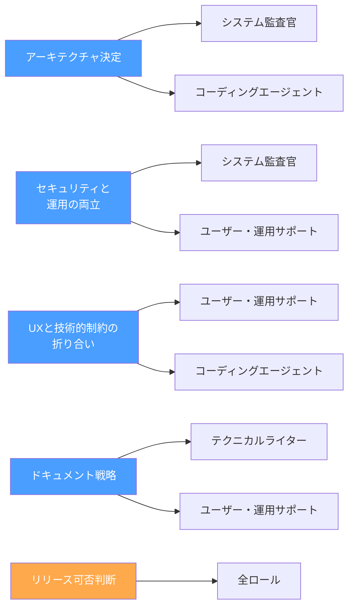
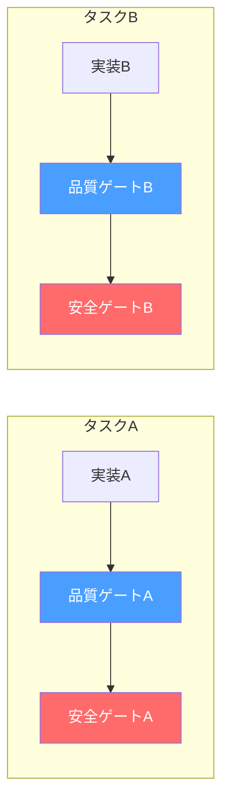

# 「全員集合」じゃなくていい — 必要な時に必要なAIロールを呼ぶ仕組み

## フェーズ通りに進まない瞬間

第1回で、8つのAIロールの設計思想を語った。第2回以降で、2層ゲート、壁打ち姿勢、スコープ分類、テクニカルライター、ドメインコンテキストと、各ピースを紹介してきた。

しかし、実際にプロジェクトを回していると、**フェーズの順番通りに物事が進まない瞬間**がある。

Phase 3（要件定義）の途中で「このアーキテクチャ、本当にセキュリティ的に大丈夫か？」という疑問が湧く。Phase 5（基本設計）で「このUI設計、エンドユーザーの運用フローと矛盾していないか？」と気になる。

こういうとき、フェーズの順番を守って「Phase 7-8になったらシステム監査官に聞きます」では遅い。だが、かといって全ロールを常時起動しておくのはコンテキストの無駄遣いだ。

必要なのは、**必要な時に必要なロールだけを呼べる仕組み**だった。

---

## 会議室に全員を呼ぶ必要はない

経営の現場を思い出してほしい。

定例会議に全部門のマネージャーを毎回呼ぶ会社がある。議題は「サーバー移行の技術検討」なのに、営業、人事、経理まで全員座っている。発言するのは2人だけ。残りは1時間、関係ない話を聞いている。

逆に、うまく回っている組織はどうか。

「この件はインフラとセキュリティだけ、30分で結論を出そう」と、**テーマに応じて必要な人だけを招集する**。判断が終わったら解散。定例には結論だけ共有する。

AIチームでも、同じことをやればいい。

---

## アドホック招集という設計（v1.8.0）

この発想を制度化したのが、v1.8.0で追加した**SP-7: アドホックロールオーケストレーション**だ。

仕組みはシンプルだ。

1. オペレーターが検討テーマを提示する
2. ナビゲーターが「このテーマならこのロールが必要」と招集案を出す
3. オペレーターが承認する
4. 招集されたロールが、それぞれの専門視点でテーマを検討する
5. 結果を集約してオペレーターに報告する

ポイントは、**フェーズの流れとは独立している**こと。Phase 3にいながらシステム監査官の見解を聞ける。Phase 5にいながらユーザー・運用サポートの視点を得られる。

ただし、これはあくまで「意思決定支援」であって、正式なゲート判定の代替にはならない。アーキテクチャの相談をしたからといって、Phase 7-8の安全ゲートが免除されるわけではない。

**相談と審査は別物だ。** これは経営でも同じ。事前に法務に相談したからといって、取締役会の承認が不要にはならない。

---

## どのロールを呼ぶか

招集するロールは、テーマの性質で決まる。

注目してほしいのは、**呼ぶロールの数が2〜3で済むケースがほとんど**だということだ。「全員集合」が必要なのは、リリース判断のような包括的な検討だけ。日常の意思決定は、2人の専門家の見解で十分なことが多い。

---

## 並行タスク実行 — もう1つのSP-7

アドホック招集にはもう1つの側面がある。**並行タスク実行**だ。

Phase 7-8（MVP構築・本格実装）では、独立した実装タスクが複数発生する。ユーザー管理機能と商品カタログ機能に依存関係がなければ、順番に作る理由はない。

ナビゲーターがタスクの依存関係を分析し、独立したタスクをコーディングエージェントに並行で分配する。

ここで重要なのは、**並行できるのは実装だけで、レビューは直列のまま**ということだ。

AとBの実装は同時に走れるが、それぞれのレビューはコードレビュアー→システム監査官の直列パイプラインを通る。ここを並行にしてしまうと、第5回で話したスコープ分類の「品質と安全のゲートは省略しない」という原則が崩れる。

**速度のために品質を犠牲にしない。** 並行化で速くするのは実装だけ。検証は直列で確実にやる。

---

## 透明性の2層構造

アドホック協議の結果は、2層構造で報告する。

**サマリー層** — 結論、推奨事項、オペレーターが判断すべき事項。忙しいときはここだけ読めばいい。

**詳細層** — 各ロールの見解、ロール間で意見が分かれた論点、議論の経緯。判断の根拠を確認したいときや、後から「なぜこの決定をしたか」を追跡するときに参照する。

これは経営の意思決定と同じ構造だ。取締役会の議事録には「結論」と「議論の経緯」がある。結論だけでは判断の妥当性を検証できないし、経緯だけでは何が決まったのかわからない。

詳細層にはもう1つの役割がある。方法論エデュケーター（第4回参照）の改善データとして機能する。「この種のテーマではいつもロール間の見解が割れる」というパターンが蓄積されれば、方法論自体の改善につながる。

---

## v1.8.0で変わったこと、変わらないこと

### 変わったこと

- ナビゲーターに2つの新しい責務が追加された（D-5: アドホック招集、D-6: 並行タスクコーディネーション）
- コーディングエージェントが並行タスクを受領できるようになった（D-5: 並行実装の受容）
- Phase 7-8ではPM・スクラムマスターがアドホック招集の責務を引き継ぐ
- 協議結果の報告フォーマットが2層構成（サマリー＋詳細）に

### 変わらないこと

- 8ロールの役割分離（SP-2）は一切変更なし
- 品質ゲート→安全ゲートの直列パイプライン（SP-4）は維持
- ゲート判定は2層ゲートシステム（SP-3）で実施。アドホック協議の結論でゲートは代替できない
- オペレーターが最終判断者（SP-1）

つまりSP-7は、**既存の構造を壊さずに柔軟性を追加した**設計だ。

---

## この仕組みが教えてくれたこと

アドホック招集を導入してわかったことがある。

**「いつ誰を呼ぶか」の判断力が、ナビゲーターの質を決める。**

フェーズ通りにロールを順番に起動するだけなら、ルールに従えばいい。だが、「今このタイミングでシステム監査官の見解を聞くべきだ」と判断するには、テーマの性質を理解し、各ロールの専門領域を把握し、それがフェーズの進行にどう影響するかを見通す必要がある。

これは、経営者がスタッフミーティングで「この件は法務とインフラに30分もらう」と判断するのと同じ能力だ。形式的にフェーズを回すのではなく、**状況に応じて最適なリソースを動的に配置する。**

組織論の言葉で言えば、フェーズフローは「組織の定常業務」、アドホック招集は「プロジェクトベースの横断チーム」。どちらか片方だけでは組織は回らない。両方あって初めて、構造と柔軟性が両立する。

---

## 次回以降について

ここまで8回にわたって、AIネイティブ開発方法論の各ピースを語ってきた。

1. 8ロールアーキテクチャ
2. 2層ゲートシステム
3. 壁打ち姿勢の3段階
4. 方法論の自己改善（エデュケーター）
5. スコープ分類
6. テクニカルライター
7. ドメインコンテキスト
8. アドホック招集と並行タスク実行 ← 今回

次回は、この方法論のもう1つの進化について語ります。ゲートレビューだけでは品質問題の検出が遅すぎた。実装のたびにレビュアーと監査官がチェックする仕組み — インクリメンタルレビューパイプライン（SP-8）が、なぜ必要になり、どう設計したかの話です。

---

`#AIネイティブ開発` `#AI開発` `#開発方法論` `#チーム設計` `#CTO` `#AIエージェント` `#組織設計` `#Claude`
