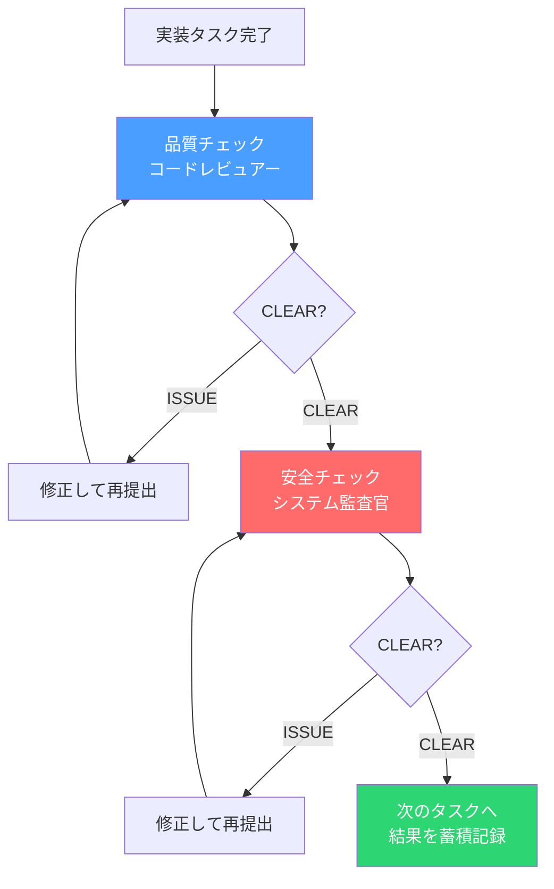

# 実装のたびに品質チェックを入れたら、ゲートレビューの手戻りが激減した

## ゲートレビューで「今さら言うなよ」が起きていた

第1回でAIチームの8ロール設計を語り、第2回で2層ゲートシステムを紹介した。品質ゲート（コードレビュアー）と安全ゲート（システム監査官）の直列パイプラインだ。

仕組みとしては正しかった。だが、運用してみると1つの問題が浮上した。

**ゲートレビューのタイミングが遅すぎる。**

Phase 7（MVP構築）で複数の実装タスクを完了させ、フェーズ末のゲートレビューに出す。するとコードレビュアーから「この設計、Layer 2（インターフェース設計）で問題があります」と指摘される。修正する。再レビュー。今度はシステム監査官から「この修正によって新たなセキュリティリスクが生まれています」。

1つの指摘が連鎖して、フェーズの終盤で大きな手戻りが発生する。実装した本人（コーディングエージェント）はとっくに次のタスクの文脈に移っているから、修正コストも高い。

これは経営者なら馴染みのある問題だ。

---

## 月次決算で問題を見つけるか、日次で確認するか

財務管理に例えると、ゲートレビューは「月次決算」に相当する。月末にまとめて帳簿を精査し、問題があれば遡って修正する。

一方、日次で経費精算をチェックし、入力ミスや不正をその場で指摘する仕組みもある。日次チェックがあると、月次決算の精度は格段に上がる。「入力時点で直せたはずのミス」が月末まで蓄積されないからだ。

**ゲートレビューだけに頼るのは、月次決算だけで品質を管理しようとしているのと同じだ。**

実装のたびに — つまり日次で — 品質チェックを入れれば、ゲートレビューの負荷は下がり、手戻りも最小化できるはずだ。

---

## でも、セルフチェックでは意味がなかった

「ならコーディングエージェントに自己チェックさせればいい」と最初は考えた。CLAUDE.mdにPush前チェックリストを書いて、実装完了ごとに自分でチェックさせる。

やってみた。結果は予想通りだった。

**自分で書いたコードを自分でチェックしても、構造的な問題は見つからない。**

これは第1回で語った「自己レビューの限界」と全く同じ問題だ。1体のAIに実装とチェックを兼ねさせると、自身の判断バイアスが残ったまま検証される。SP-2（AIロールは統合しない）の原則が、実装レベルでも守られていなかった。

セルフチェックは「明示的な条件の確認」には使えるが、「設計判断の妥当性」や「見落としの検出」には構造的に不向きだ。

必要なのは、実装のたびに**独立したレビュアーと監査官**が変更範囲をチェックする仕組みだった。

---

## SP-8: インクリメンタルレビューパイプライン（v1.9.0）

この課題を解決するために、v1.9.0で**SP-8: インクリメンタルレビューパイプライン**を導入した。

仕組みはシンプルだ。

**実装タスクが1つ完了するたびに、コードレビュアーが品質チェックを行い、続いてシステム監査官が安全チェックを行う。** 両方がCLEAR（問題なし）になるまで、コーディングエージェントは修正→再提出を繰り返す。

ゲートレビュー（フェーズ末の正式な PASS/FAIL 判定）は別途実施する。インクリメンタルレビューは「タスク単位の品質確認」であり、ゲートの代替ではない。

経営に例えるなら、日次チェックと月次決算の関係だ。日次チェックがあるからといって月次決算が不要になるわけではないが、月次決算で見つかる問題は劇的に減る。

---

## CLEAR / ISSUEという軽い判定

インクリメンタルレビューの判定値は、ゲートレビューの PASS/FAIL とは意図的に区別した。

**インクリメンタルレビュー** — 判定値: CLEAR/ISSUE、スコープ: 変更範囲のみ、承認: 不要（蓄積のみ）、目的: 品質の早期確保

**ゲートレビュー** — 判定値: PASS/FAIL、スコープ: 全コードベース、承認: オペレーター承認必須、目的: リリース判定

CLEARは「この変更範囲に問題はない」、ISSUEは「この点を修正してほしい」。それだけだ。

重い判定にしなかった理由がある。タスク完了ごとにオペレーターの承認を求めていたら、開発のリズムが崩れる。インクリメンタルレビューはAIロール間で完結し、結果を蓄積するだけ。オペレーターはゲートレビューの時点でまとめて確認すればいい。

**日常のチェックは軽く、正式な審査は重く。** この使い分けが、速度と品質の両立を可能にする。

---

## レビュアーと監査官が早く来るようになった

SP-8の導入に伴い、コードレビュアーとシステム監査官の稼働開始フェーズを変更した。

**Before（v1.8.0まで）:** Phase 7-8（MVP構築・本格実装）から参加
**After（v1.9.0）:** Phase 5-8（基本設計・プロトタイプから参加）

ただし、Phase 5-6でのレビューはインクリメンタルモード — つまり軽量版だ。

Phase 5-6では、品質チェックはデータ設計とインターフェース設計に集中する。安全チェックは致命的パターン（メモリリーク、無限ループ、デッドロック等）のみ。設計段階で全視点のフルレビューをしても、コードがまだ流動的なので非効率だからだ。

Phase 7-8になると、インクリメンタルレビューもフルビジョン — 7つの品質視点と4つの安全ドメインすべてを適用する。加えて、フェーズ末にはゲートレビューで全コードベースを正式に審査する。

**設計段階は軽く広く、実装段階は深く厳しく。** フェーズに応じてレビューの深度を変える設計だ。

---

## 蓄積されるデータが次の改善を生む

インクリメンタルレビューには、品質確認以外にもう1つの価値がある。

**レビュー記録の蓄積だ。**

タスクごとに「何が指摘され、どう修正されたか」が記録される。この記録は3つの用途で活用される。

1つ目は、ゲートレビュアーへの入力。ゲートレビュー時に「このタスクはインクリメンタルで既にCLEAR」とわかっていれば、レビュアーは未検査の領域に集中できる。

2つ目は、繰り返しパターンの可視化。同じ種類のISSUEが複数のタスクで繰り返されるなら、それはコーディング規約に反映すべきシグナルだ。

3つ目は、方法論エデュケーター（第4回参照）の改善データ。v1.9.0ではエデュケーターに新たな責務 **D-6: インクリメンタルレビュー記録の分析** が追加された。繰り返し指摘されるパターンを抽出し、コーディング規約やレビュー基準の改善に還元する。

これは経営でいう「日次チェックの記録を使って、月次の経理ルールを改善する」サイクルと同じだ。データが改善を生み、改善がデータの質を上げる。

---

## v1.9.0で変わったこと、変わらないこと

### 変わったこと

- コードレビュアーとシステム監査官がPhase 5から早期参加する
- 実装タスク完了ごとにインクリメンタルレビューが走る
- 蓄積されたレビュー記録をエデュケーターが分析し、コーディング規約に還元する（D-6）
- トリビアルな変更（コメントやフォーマットのみ）はスキップできる

### 変わらないこと

- 8ロールの役割分離（SP-2）は一切変更なし
- 品質ゲート→安全ゲートの直列パイプライン（SP-4）は維持
- ゲートレビューの2層ゲートシステム（SP-3）は維持
- オペレーターが最終判断者（SP-1）
- アドホック招集と並行タスク実行（SP-7）も維持

つまりSP-8は、**既存の構造を壊さずに、品質の左シフト（早期検出）を追加した**設計だ。

---

## 品質は「検査する」のではなく「作り込む」

この取り組みで得た最大の学びは、製造業では何十年も前から常識になっていることだった。

**品質は最終検査で確保するものではなく、工程の中で作り込むものだ。**

トヨタ生産方式の「自工程完結」と本質的に同じ考え方だ。各工程で品質を確認し、問題があればその場で止めて直す。最終検査は「確認」であって「発見」ではない。

ゲートレビューだけに頼る開発は、出荷前の最終検査だけで品質を保証しようとする工場と同じだ。検査で不良品が見つかったら、ラインを遡って原因を調査し、修正し、再検査する。コストが高い。

インクリメンタルレビューは、各工程にインラインの品質チェックを組み込んだ状態だ。問題はその場で検出され、その場で修正される。ゲートレビューに到達する時点で、大半の品質問題は既に解消されている。

---

## 次回以降について

ここまで9回にわたって、AIネイティブ開発方法論の各ピースを語ってきた。

1. 8ロールアーキテクチャ
2. 2層ゲートシステム
3. 壁打ち姿勢の3段階
4. 方法論の自己改善（エデュケーター）
5. スコープ分類
6. テクニカルライター
7. ドメインコンテキスト
8. アドホック招集と並行タスク実行
9. インクリメンタルレビューパイプライン ← 今回

個々のピースを紹介してきたが、これらがどう組み合わさって1つの方法論として機能するのか。そして、この方法論を実際のプロジェクトに適用したときに何が起きるのか — その全体像は、引き続き記録していきたいと思う。

---

`#AIネイティブ開発` `#AI開発` `#開発方法論` `#品質管理` `#CTO` `#AIエージェント` `#コードレビュー` `#Claude`
