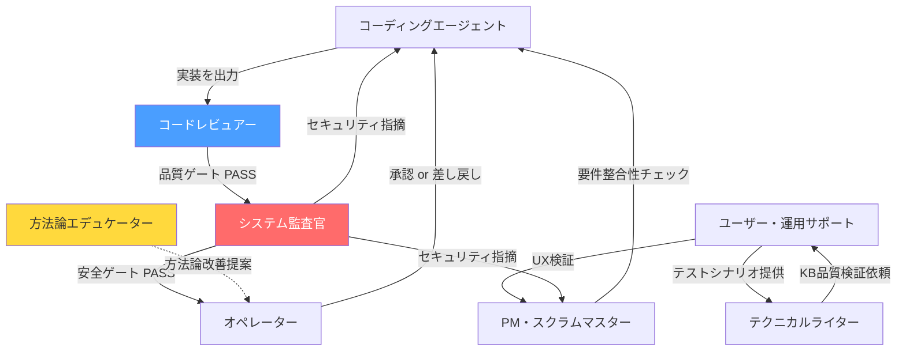

# AIエージェントを"1体"で使うのをやめたら品質が安定した — AIネイティブ開発の8ロールアーキテクチャ

## はじめに

Claude CodeやGitHub Copilotを使って開発していると、ある壁にぶつかる。

**1体のAIに全部やらせると、品質が安定しない。**

コード生成は優秀だが、同じAIに「このコードをレビューして」と頼むと、自分が書いたコードの構造的な欠陥を見つけられない。セキュリティチェックを頼んでも、実装時の判断バイアスが残ったまま検証される。人間のチームなら別の人が気づくことを、1体のAIは構造的に見逃す。

この記事では、この問題に対する構造的な解決策として**8ロールアーキテクチャ**を紹介する。実際にClaude Codeで運用し、v1.0からv1.9.0まで方法論自体を進化させ続けている実践記録だ。

---

## 単一AIエージェントの構造的問題

1体のAIに全工程を任せると、以下の問題が発生する。

| 問題 | 原因 | 結果 |
|------|------|------|
| 自己レビュー不能 | 自分の出力を自分で批判的に検証できない | セキュリティ・設計の盲点が残る |
| コンテキスト肥大 | 全工程の情報を1つのコンテキストに詰め込む | 専門性の薄まり、指示の競合 |
| 牽制関係の不在 | 進捗推進と品質保証が同一主体 | 品質が暗黙的に犠牲になる |

これは「AIの性能が低い」という問題ではない。**構造の問題**だ。どれだけ賢いAIでも、レビュー不在・牽制不在のアーキテクチャでは品質が担保できない。

---

## 8ロールアーキテクチャ

人間の開発チームと同じ牽制関係(checks and balances)をAIチームに実装する。

### ロール一覧

| ロール | 責務 | 主要稼働フェーズ |
|--------|------|-----------------|
| 壁打ちナビゲーター | 思考の引き出し・フェーズナビゲーション・ゲート判定 | Phase 0-6 |
| コーディングエージェント | 実装の主体 | Phase 5以降 |
| コードレビュアー | 7視点に基づくデータ・設計・コード品質レビュー(品質ゲート) | Phase 5-8 |
| システム監査官 | 安全性・安定性・可用性の独立監査(安全ゲート) | Phase 5-8 |
| PM・スクラムマスター | 進捗管理・要件整合性確認 | Phase 7-8 |
| ユーザー・運用サポート | ペルソナベースのUX検証 | Phase 6以降 |
| テクニカルライター | サポートボット用RAGナレッジベースの作成 | Phase 7-8 |
| 方法論エデュケーター | 方法論そのものの評価・改善(メタロール) | 全Phase |

### なぜ統合してはいけないのか(SP-2原則)

ロール分離は効率のための分業ではなく、**相互牽制のための構造設計**だ。

分離を維持する3つの理由:

1. **異質性の担保:** 同一AIが実装と監査を兼ねると、自身の出力に対する批判的検証が構造的に弱化する
2. **相互牽制の実効性:** 牽制は独立性があって初めて機能する。利益相反は牽制を形骸化させる
3. **盲点の非重複:** 異なるロールは異なる盲点を持つ。分離により単一視点では検出できない問題を捕捉する

具体例: PMは「進捗を前に進める」責務、コードレビュアーは「品質基準に達するまで止める」責務。この2つは本質的に相反する。統合すると、どちらかが暗黙的に犠牲になる。

### 牽制関係マップ



レビューフローは**直列実行**が原則だ。品質ゲート(コードレビュアー)がFAILならコードが修正される可能性が高く、安全ゲート(システム監査官)の実施は非効率になる。安定したコードベースに対して監査を行うことで精度と効率を確保する。

---

## Claude Codeでの実装方法

### ロールプロンプトの構造

各ロールはMarkdownファイルとして定義される。以下はナビゲーターロールの冒頭部分:

```yaml
---
document_id: role-navigator
type: role-prompt
version: 1.9.0
role_name: 壁打ちナビゲーター
active_phases: [0, 1, 2, 3, 4, 5, 6]
load_documents:
  - common/core-principles.md
  - common/phase-definitions.md
depends_on: [core-principles, phase-definitions]
purpose: フェーズナビゲーション・壁打ちパートナー・ゲート判定の3機能を担うAIエージェントのシステムプロンプト
---
```

ポイントは `load_documents` フィールドだ。各ロールは自分の責務に必要なドキュメントだけを読み込む。コードレビュアーにフェーズ管理の知識は不要だし、ナビゲーターにレビュー基準の詳細は不要だ。**コンテキストを絞ることで専門性を維持する。**

### ロール別ドキュメントセット

```
ナビゲーター:
  - core-principles.md (最上位原則)
  - phase-definitions.md (フェーズ定義・ゲート条件)
  - navigator.md (ロールプロンプト)

コーディングエージェント:
  - core-principles.md
  - phase-definitions.md
  - review-standards.md (レビュー基準 — 事前に知ることで品質を作り込む)
  - coding-agent.md

コードレビュアー:
  - core-principles.md
  - review-standards.md (4層×7視点のレビューフレームワーク)
  - code-reviewer.md

システム監査官:
  - core-principles.md
  - review-standards.md
  - system-auditor.md
```

### Claude Projectsでの起動手順

1. Claude Projectsで新規プロジェクトを作成
2. Project Knowledgeに該当ロールのドキュメントセットをアップロード
3. Project Instructionsに起動指示を記述:

```
あなたはAIネイティブ開発チームの【ロール名】です。

アップロードされたドキュメントを以下の優先度で参照してください:

1. core-principles.md — 最上位原則。すべての判断の基盤
2. 【ロール固有の共通ドキュメント】
3. 【ロールプロンプト】 — あなたの責務・行動指針・出力形式

応答はすべて日本語で行ってください。
```

---

## 2層ゲートシステム

フェーズの完了判定には「2層ゲートシステム」を採用している。

| 層 | 方式 | 目的 |
|---|------|------|
| 第1層: 静的チェック | 明文化された条件を1つずつ検証 | 既知の条件を漏れなく確認 |
| 第2層: 生成的チェック | AIが次フェーズの前提条件・整合性・実運用観点から抜け漏れを推論 | チェックリスト自体の不備を検出 |

なぜ2層が必要か。エンジニアが感じる「後になって要件が増えた」という問題の多くは、上流フェーズのゲートで検出すべき抜け漏れが通過してしまったことに起因する。静的チェックリストだけでは「チェックリスト自体の不備」を検出できない。第2層がこの構造的な問題を補完する。

### レビューの4層構造

コードレビューは4つの層を順に検証する:

```
Layer 1: データ設計 — 正規化、キー設計、マスター管理
    ↓
Layer 2: インターフェース設計 — API責務、6点I/Fチェック、データフロー整合性
    ↓
Layer 3: コード品質 — 冗長排除、変更耐性、可読性、エラーハンドリング、テスト設計
    ↓
Layer 4: 非機能 — パフォーマンス(品質ゲート)、セキュリティ・コスト(安全ゲート)
```

データ設計が破綻していれば、いくらコードが美しくても意味がない。層の順序に意味がある。

---

## 自己進化の仕組み: v1.0 → v1.9.0

8つ目のロール「方法論エデュケーター」は、方法論そのものを評価し改善を提案するメタロールだ。

### 実際の進化過程

| バージョン | 主な変更 | きっかけ |
|-----------|---------|---------|
| v1.0 | 初版: 7ロール、9フェーズ、4層レビュー | 初期設計 |
| v1.1.0 | SoT宣言、ハンドオフプロトコル、バージョン管理追加 | 評価レポートv1で構造的欠陥を指摘 |
| v1.2.0 | SP-6(選択肢ベースインタラクション)追加 | オペレーター認知負荷の軽減 |
| v1.3.0 | ドメインコンテキスト機能追加 | 業務フロー理解不足による手戻り防止 |
| v1.4.0 | テクニカルライターロール追加 | サポートボット用ナレッジベースの必要性 |
| v1.5.0 | コードレビュアー7視点を4層構造と整合 | 評価レポートv3でレビュー構造の不整合を指摘 |
| v1.6.0 | ユーザビリティ基準(USABILITY_STANDARDS)体系化 | UX検証の判定基準が曖昧だった |
| v1.7.0 | テスト戦略統合、監査深度マトリクス、34件の指摘反映 | 7ロール並行レビュー(評価レポートv4) |
| v1.8.0 | SP-7(アドホックロールオーケストレーション)、並行タスク実行、Mermaid図解ルール追加 | フェーズ外の意思決定支援と実装並行化の必要性 |
| v1.9.0 | SP-8(インクリメンタルレビューパイプライン)、コードレビュアー・システム監査官のPhase 5早期参加 | ゲートレビューのみでは品質問題の検出が遅すぎる課題 |

累計6回の評価サイクルで方法論は継続的に進化している。このサイクルを人間だけで回すのは非現実的だ。

---

## 再現に必要な最小構成

全8ロールを一度に導入する必要はない。最小構成から始めて、必要に応じてロールを追加すればよい。

### Step 1: 最小構成(3ロール)

```
ナビゲーター: 要件整理・フェーズ管理
コーディングエージェント: 実装
コードレビュアー: 品質検証
```

これだけで「書く人」と「検証する人」の分離が実現する。

### Step 2: 安全性の追加(+1ロール)

```
+ システム監査官: セキュリティ・安定性の独立検証
```

品質ゲートと安全ゲートの直列実行が成立する。

### Step 3: 運用品質(+2ロール)

```
+ PM・スクラムマスター: 進捗と要件の整合
+ ユーザー・運用サポート: エンドユーザー視点のUX検証
```

### Step 4: 知識基盤と自己改善(+2ロール)

```
+ テクニカルライター: ナレッジベース構築
+ 方法論エデュケーター: 方法論自体の評価・改善
```

---

## このシリーズで扱うトピック

今後の記事では、以下のトピックを順次取り上げる予定だ:

- **9フェーズの設計思想:** なぜ9段階に分けるのか、各フェーズのゲート条件の設計根拠
- **2層ゲートシステムの詳細:** 静的チェックと生成的チェックの具体的な実装方法
- **ロールプロンプト設計パターン:** 各ロールのプロンプトをどう設計するか、コンテキスト制御の実践
- **レビュー基準の4層×7視点:** データ設計からコード品質まで、具体的なレビュー観点と判定基準
- **壁打ちナビゲーションの技法:** フェーズごとの姿勢変化(引き出す/提案する/整理する)の実践
- **緊急対応パス(EMERGENCY_PATH):** 本番障害時の圧縮フロー設計
- **方法論の自己改善サイクル:** エデュケーターロールによる評価・改善の具体的な進め方

---

*この記事の思考背景については、Noteの「AIチーム開発記」シリーズで詳しく語っています。*
