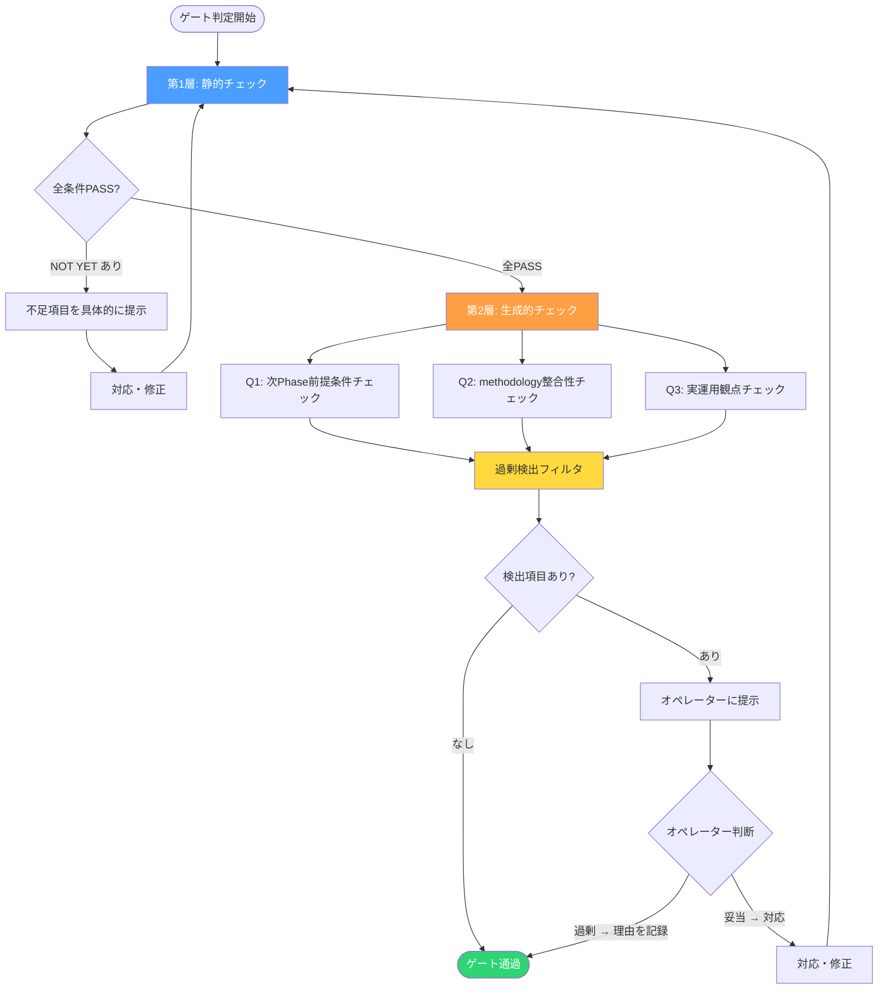

# 静的チェック+生成的チェックの2層ゲートで「チェックリスト自体の不備」を検出する

## 静的チェックリストの構造的限界

フェーズゲートにチェックリストを使っている開発チームは多い。「要件定義の完了条件」「設計レビューの観点」「リリース前チェック」。項目を並べ、1つずつ検証し、全PASSで次フェーズへ進む。

この仕組みには構造的な限界がある。**チェックリストは「既知の項目」しか検出できない。**

項目が10個あって全部PASSしても、本来11個目が必要だったなら、その漏れは検出されない。これはチェックリストの精度の問題ではなく、静的リストという形式が持つ本質的な制約だ。

エンジニアが経験する「後になって要件が増えた」「今更設計変更か」という問題の多くは、上流フェーズのゲートで検出すべき抜け漏れが通過してしまったことに起因する。チェックリストを精緻にしても、この問題は構造的に解消しない。

---

## 2層ゲートシステムの設計

この構造的限界に対して、AIネイティブ開発方法論では「2層ゲートシステム」を導入している。

| 層 | 方式 | 検出対象 |
|---|------|---------|
| 第1層: 静的チェック | 明文化されたゲート条件を1つずつ検証 | 既知の必須条件 |
| 第2層: 生成的チェック | AIが文脈から抜け漏れを推論 | チェックリスト自体の不備 |

第1層は従来のチェックリスト。第2層がAIの推論力で「リストに書かれていないが、次に進むと困ること」を検出する層だ。

### 判定フロー



重要な設計判断が2つある。第1層が全PASSしてから第2層を実行する点と、第2層の最終判断は人間が行う点だ。第1層が未達の状態で第2層を実行しても、既知の不備と未知の不備が混在してノイズが増える。順序を守ることで、第2層は「既知の条件はすべて満たした上で、まだ見落としがないか」という検証に集中できる。

---

## 第1層: 静的チェックの実装

各フェーズのゲート条件をPASS / NOT YETの二択で判定する。「だいたいOK」は許可しない。

具体例として、Phase 3（要件定義）のゲート条件:

```
- [ ] 業務要件が機能一覧として整理されている
- [ ] 各機能の入出力が定義されている
- [ ] 非機能要件が数値または基準として定義されている
- [ ] 扱うデータの機密度が特定されている
```

各条件に対して以下の形式で判定する:

```markdown
## 第1層: 静的チェック結果

| # | ゲート条件 | 判定 | 根拠 |
|---|-----------|------|------|
| 1 | 業務要件が機能一覧として整理されている | PASS | functional-requirements.md に12機能を定義済み |
| 2 | 各機能の入出力が定義されている | NOT YET | 機能#7, #11の出力形式が未定義 |
| 3 | 非機能要件が数値または基準として定義されている | PASS | レスポンス200ms以下、同時接続50等を定義済み |
| 4 | 扱うデータの機密度が特定されている | PASS | 個人情報を含む旨を明記、暗号化方針を記載 |

**判定: NOT YET（1件未達）**
→ 機能#7, #11の出力形式を定義してから再判定
```

NOT YETの場合は「何が不足しているか」を具体的に示す。抽象的な「もう少し詰めてください」は禁止だ。

---

## 第2層: 生成的チェックの実装

第1層が全PASSした後に、AIが3つの問いで抜け漏れを推論する。

### 3つの問い

**Q1: 次Phase前提条件チェック**

> Phase {N+1} が正常に開始できるために、Phase {N} の成果物に不足している情報はないか?

次フェーズの入力として何が必要かを逆算し、現フェーズの成果物にそれがあるかを検証する。例えばPhase 3（要件定義）からPhase 4（技術スタック確定）への遷移であれば、「データの機密度が特定されていないと、インフラ構成の選定根拠が作れない」といった依存関係を検出する。

**Q2: methodology整合性チェック**

> methodology全体の定義・原則と照合して、定義されているが成果物に反映されていない項目はないか?

方法論ドキュメント全体をスキャンし、該当フェーズに関連する定義が成果物に反映されているかを照合する。例えば「データ設計原則に正規化が定義されているが、データ設計書に正規化の判断根拠が記載されていない」といった不整合を検出する。

**Q3: 実運用観点チェック**

> 実運用の観点から、明記されていないが本来必要な決定事項はないか?

チェックリストにもmethodologyにも書かれていないが、実運用で必要になる決定事項を推論する。「バッチ処理の実行タイミングが未定義」「障害時の切り戻し手順が未検討」など、運用経験から導かれる観点だ。

### プロンプトテンプレート

第2層の実行時に使用するプロンプトの構造:

```markdown
## 生成的チェック指示

以下の成果物に対して、3つの観点から抜け漏れを検出せよ。

### 入力
- 対象Phase: Phase {N}
- 成果物: {成果物ファイル一覧}
- 次Phase: Phase {N+1}（目的: {次Phaseの目的}）
- methodology参照: phase-definitions.md, core-principles.md

### 検証観点
1. Phase {N+1} を正常に開始するために不足している情報はないか
2. methodology全体の定義と照合して未反映の項目はないか
3. 実運用の観点で必要だが未決定の事項はないか

### 出力制約
- 「これがないと具体的に何が困るか」を説明できる項目のみ挙げよ
- 推測や「あると良い」レベルの指摘は含めない
- 各指摘に「影響」フィールドを付与し、具体的な問題シナリオを記述せよ
```

---

## 過剰検出の抑制

第2層の最大の課題は過剰検出だ。AIに「抜け漏れを探せ」と指示すると、あらゆる可能性を網羅的に挙げてくる。理論的には正しくても、実務的には対応不要な指摘が大量に混ざる。

抑制のための設計は以下の2段階で行う。

**段階1: プロンプトレベルの制約**

出力制約に「具体的に何が困るか説明できるもののみ」を明記する。これだけで抽象的な指摘の大半が消える。

**段階2: オペレーターによるフィルタ**

それでも残る過剰検出は、オペレーターが判断する。「妥当」と判断した項目は対応し、「過剰」と判断した項目は理由を記録してゲートを通過させる。この記録が重要だ。なぜ過剰と判断したかを残すことで、将来同じ指摘が出た際の判断基準になる。

```markdown
## 第2層: 生成的チェック結果

| # | 観点 | 指摘内容 | 影響 | オペレーター判断 |
|---|------|---------|------|----------------|
| 1 | Q1 | 外部API連携のレート制限が未定義 | Phase 5でAPI設計時にリトライ戦略を決められない | 妥当 → 対応 |
| 2 | Q3 | 多言語対応の要否が未検討 | 将来の国際展開時に設計変更が必要になる可能性 | 過剰: 現時点で国内市場のみ。スコープ外として記録 |
```

---

## 2層ゲートが解決する問題の構造

従来の静的チェックリストだけでは、以下の構造的問題が残る。

1. **チェックリスト自体の不備:** 項目に書かれていない問題は永久に検出されない
2. **フェーズ間の依存関係の見落とし:** 現フェーズの成果物が次フェーズの前提を満たしているかの検証が人間の経験に依存する
3. **暗黙知の未言語化:** 運用経験から「当然やるべき」ことが、チェックリストに反映されていない

第2層の生成的チェックは、これら3つの問題に対してAIの推論力で補完する。ただし万能ではない。AIが検出できるのは「文脈から推論可能な抜け漏れ」であり、ドメイン固有の業務知識に基づく判断はオペレーターにしかできない。だからこそ、最終判断を人間に委ねる設計にしている。

---

## まとめ

- 静的チェックリストは「既知の条件」を漏れなく確認する道具であり、リスト自体の不備は検出できない
- 第2層の生成的チェックがこの構造的限界を補完する
- 過剰検出はプロンプト制約とオペレーター判断の2段階で抑制する
- 最終判断は常に人間が行う

方法論の詳細は `.ai-native/methodology/common/phase-definitions.md` の `§TWO_LAYER_GATE_SYSTEM` を参照。

---

*この記事の背景にある経営視点については、Noteの「AIチーム開発記」シリーズで詳しく語っています。*
