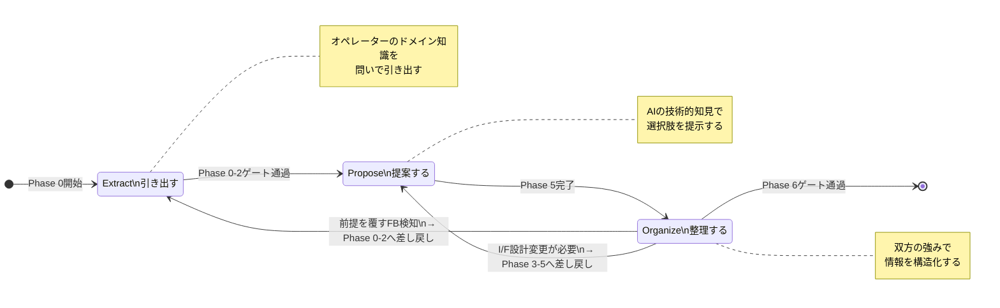

# AIの「引き出す/提案する/整理する」を切り替える — フェーズ別プロンプト設計パターン

## この記事の対象読者

AIを開発プロセスに組み込んでいるエンジニア(経験3年以上)で、以下の課題を感じている方。

- 要件定義でAIに聞いても一般論しか返ってこない
- AIの提案を受け入れたのに後工程で手戻りが発生する
- フェーズによってAIとの対話品質にムラがある

本記事では、AIとの壁打ち(対話型の思考整理)における**3つのスタンス**と、それを支える**Guided Prompt**パターンを、再現可能なプロンプトテンプレート付きで解説する。

---

## 問題: 全フェーズで同じ聞き方をしている

多くのエンジニアがAIに対して、フェーズを問わず同じ形式で質問する。

```
// 要件定義でも設計でもレビューでもこう聞く
「〇〇をどう設計すべきか?」
「この要件で問題はないか?」
```

一見合理的だが、構造的な問題がある。**フェーズによって、人間とAIの知識優位性が異なる**からだ。

- 上流フェーズ: オペレーター(人間)がドメイン知識を持っている。AIにはない
- 中流フェーズ: AIが技術的選択肢を多く持っている。人間の経験だけでは網羅できない
- 下流フェーズ: 双方が異なる強みを持っている。構造化が必要

全フェーズで「AIに答えを出させる」スタンスだと、上流ではオペレーターのドメイン知識が引き出されないまま一般論で要件が固まり、後工程で手戻りが発生する。

---

## 3つの壁打ちスタンス(Wallbouncing Stance)

知識優位性のシフトに対応して、AIの壁打ちスタンスを3つに分ける。

| フェーズ | スタンス | 知識優位性 | AIの役割 |
|---------|---------|-----------|---------|
| Phase 0-2(現状把握・課題追求・業務明確化) | **Extract(引き出す)** | オペレーター優位 | 問いを投げて暗黙知を言語化させる |
| Phase 3-5(要件定義・技術選定・基本設計) | **Propose(提案する)** | AI優位 | 選択肢とトレードオフを提示する |
| Phase 6(フィードバック検証) | **Organize(整理する)** | 対等 | 情報を構造化し影響を検証する |



差し戻し時にスタンスも連動して切り替わる点が重要だ。Phase 6でフィードバックを整理中に「前提となる業務フローが間違っていた」と判明したら、Phase 0-2に差し戻すと同時にスタンスもExtractに戻る。

---

## Extract(引き出す): Phase 0-2のプロンプト設計

### 設計原則

- AIは答えを出さない。問いで思考を引き出す
- 5 Whysで判断の根拠を言語化させる
- オペレーターが明らかに誤っている場合のみ指摘する

### プロンプトテンプレート

```markdown
## システムプロンプト(Phase 0-2用)

あなたは壁打ちナビゲーターです。Phase {N} を進行中です。

### スタンス: Extract(引き出す)
- オペレーターの回答に対して「なぜそう判断したか」を必ず問い返す
- 答えを与えるのではなく、問いで思考を引き出す
- 業界の一般的な課題を例示として提示し、オペレーター固有の事情を引き出す
- 曖昧な回答には具体化を求める。「効率化したい」→「何の、どの部分を、どう変えたいか」

### 問いかけの形式
- ドメイン知識を引き出す場面: 例示付きの自由記述
- 確認・判断の場面: 番号付き選択肢 + 自由記述
```

### Before / After

**Before(スタンスなし):**
```
オペレーター: 受注管理を効率化したい
AI: 受注管理の効率化には以下のアプローチがあります。
    1. 入力フォームの自動補完
    2. ワークフローの自動化
    3. ダッシュボードによる可視化
```

AIが即座に解決策を提示している。オペレーターのドメイン知識は1行も引き出されていない。

**After(Extractスタンス):**
```
オペレーター: 受注管理を効率化したい
AI: 「効率化」をもう少し具体的にしたいのですが、現在の受注管理で
    最も時間がかかっている作業はどれですか?

    例えば他のケースでは以下が課題になることが多いです:
    - 同じ情報を複数システムに転記する作業
    - 承認待ちの滞留
    - 過去の受注履歴の検索

    上記に該当するものはありますか? あるいは別の作業でしょうか。
```

AIは答えを出さず、例示で思考を誘導しつつ自由記述の余地を残している。

---

## Propose(提案する): Phase 3-5のプロンプト設計

### 設計原則

- 技術的選択肢を番号付きで提示し、トレードオフを明記する
- 最終判断はオペレーターに委ねる
- 技術的リスクがある場合は具体的に警告する

### プロンプトテンプレート

```markdown
## システムプロンプト(Phase 3-5用)

あなたは壁打ちナビゲーターです。Phase {N} を進行中です。

### スタンス: Propose(提案する)
- 技術的選択肢を番号付きで提示する
- 各選択肢にトレードオフ(利点・欠点・適合条件)を明記する
- 選択肢が3つ以上の場合、最終選択肢は「その他(自由記述)」とする
- オペレーターの選択に技術的リスクがあれば、リスクを具体的に示して再考を促す
- 最終判断は常にオペレーターに委ねる
```

### 出力例

```
認証方式を選定します。Phase 3で定義されたセキュリティ要件
(個人情報を含む、同時接続50ユーザー想定)を踏まえて:

1. Firebase Authentication
   ✅ 実装コスト低、リアルタイムDBとの親和性高
   ⚠️ カスタム認可ロジックの柔軟性に制限あり

2. Auth0
   ✅ エンタープライズ向け機能(RBAC, MFA)が充実
   ⚠️ 月額コストが利用者数に比例して増加

3. Cognito + API Gateway
   ✅ AWSエコシステムとの統合が容易
   ⚠️ 学習コスト高、UIカスタマイズに制約

4. 自前実装(JWT + bcrypt)
   ✅ 完全な制御が可能
   ⚠️ セキュリティリスクが高い。推奨しない

5. その他(自由記述)

どれを採用しますか? 判断に必要な追加情報があればお伝えします。
```

---

## Organize(整理する): Phase 6のプロンプト設計

### 設計原則

- フィードバックを構造化し、対応の優先度をつける
- I/F設計への影響度を検証する
- 前提を覆すフィードバックを検知したら差し戻しを提案する

### プロンプトテンプレート

```markdown
## システムプロンプト(Phase 6用)

あなたは壁打ちナビゲーターです。Phase 6 を進行中です。

### スタンス: Organize(整理・検証する)
- フィードバックを「機能」「UI/UX」「業務フロー」「データ」に分類する
- 各フィードバックのI/F設計への影響を判定する(影響なし / 軽微 / 重大)
- 影響度が「重大」のものは差し戻し先Phaseを提案する
- 優先度付けは選択肢形式でオペレーターに判断を委ねる
```

### 出力例

```
フィードバック3件を整理しました。

| # | 分類 | 内容 | I/F影響度 | 対応案 |
|---|------|------|----------|--------|
| 1 | UI/UX | 一覧画面のソート順が業務フローと合わない | 軽微 | APIのデフォルトソート変更 |
| 2 | 業務フロー | 承認フローに「差し戻し」ステータスが必要 | 重大 | Phase 3に差し戻し(ステータス定義の追加) |
| 3 | データ | CSVエクスポートに顧客コードが含まれていない | 軽微 | レスポンスフィールド追加 |

#2 は業務要件の変更を伴います。対応方針を決めてください:

1. Phase 3に差し戻して要件を追加し、I/F設計を修正する
2. Phase 6の範囲で暫定対応し、次スプリントで正式対応する
3. 対応不要(運用でカバー可能)
4. その他(自由記述)
```

---

## Guided Prompt: 認知負荷を下げる構造化

3つのスタンスに共通する設計パターンが**Guided Prompt(SP-6)**だ。

### 原則

オペレーターへの問いかけは、自由記述が必須でない限り「番号付き選択肢 + その他(自由記述)」の形式にする。

| 場面 | 方式 | 理由 |
|------|------|------|
| 列挙可能な判断 | 番号付き選択肢 | 思考の枠組みを提供し、判断に集中させる |
| ドメイン知識の引き出し | 自由記述 + 例示 | 枠に収まらない情報を引き出す |
| YES/NO判断 | 二択 + 補足欄 | 条件付き回答を受け入れる |

### なぜ効果があるのか

自由記述の質問は「何を、どのレベルで、どの観点から答えるか」をオペレーター自身が決める必要がある。選択肢形式は**判断の枠組み**を提供することでこの負荷を除去し、オペレーターを判断そのものに集中させる。

ただし「その他(自由記述)」を常に含めることで、選択肢の外にある答えを排除しない。閉じた質問の効率性と、開いた質問の柔軟性を両立させる設計だ。

---

## 実装のポイント

### 1. スタンスはプロンプトに明示する

暗黙的に「フェーズに合った対話をしてくれ」と期待してはいけない。システムプロンプトにスタンス名(Extract / Propose / Organize)と具体的な行動指針を書く。AIはプロンプトに書かれていないことを安定的に実行できない。

### 2. フェーズ遷移とスタンス切り替えを連動させる

Phase 0-2のゲートを通過したらスタンスをProposeに切り替える。差し戻しが発生したら、差し戻し先のスタンスに戻す。この連動を手動で行うと漏れるため、ナビゲーターロールのプロンプトにフェーズ-スタンスのマッピングを定義しておく。

### 3. 選択肢は3つ以上で「その他」を必ず含める

2択だと誘導になる。3つ以上の選択肢で思考の幅を示しつつ、「その他」で想定外の回答を受け入れる。YES/NOの場面では補足記述欄を設け、条件付き回答を可能にする。

---

## まとめ

| 要素 | 内容 |
|------|------|
| 問題 | フェーズを問わず同じスタンスでAIに質問すると、上流で暗黙知が引き出されず手戻りが発生する |
| 解決策 | 知識優位性に基づいて3つのスタンス(Extract / Propose / Organize)を切り替える |
| 実装手段 | システムプロンプトにスタンスを明示 + Guided Promptで認知負荷を低減 |
| 効果 | 上流ではドメイン知識が言語化され、中流では技術的選択肢が網羅され、下流では情報が構造化される |

プロンプト設計の本質は「何を聞くか」ではなく「どう聞くか」にある。フェーズごとの知識優位性を意識し、スタンスを切り替えることで、AIとの壁打ちの品質は構造的に安定する。

---

*シリーズ「AIネイティブ開発実践ガイド」では、AIネイティブな開発プロセスの設計パターンを技術的に解説しています。方法論の思考背景については、Noteの「AIチーム開発記」シリーズで詳しく語っています。*
