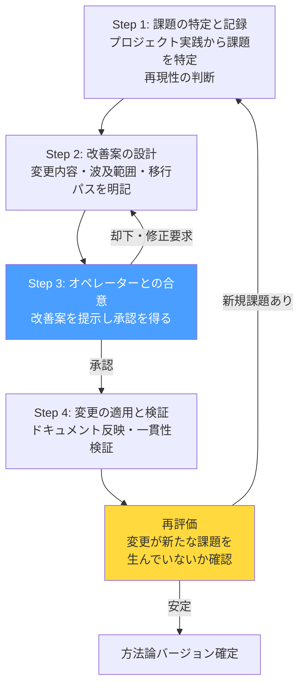

# AI開発プロセスをAI自身に改善させる — エデュケーターロールの評価フレームワーク

## はじめに

開発プロセスにPDCAを回すのは当たり前だ。スプリントの振り返りで課題を洗い出し、次のスプリントで改善する。しかし、**プロセスを定義しているドキュメントそのもの**にPDCAを回しているチームはどれだけあるだろうか。

ロール定義、フェーズ定義、レビュー基準。これらの「ルール群」は一度作ったら固定されがちだ。たまに大きな問題が起きたら見直す程度で、日常的に検証される対象にはなっていない。

本記事では、AIネイティブ開発方法論の8つ目のロール「方法論エデュケーター」を紹介する。これは他の7ロールとは本質的に異なる**メタロール**だ。プロジェクトの成果物ではなく、方法論そのものを評価・改善する。具体的な評価フレームワーク、出力フォーマット、そしてClaude ProjectsやClaude Codeで再現するための実装手順を示す。

---

## メタロールとは何か

8ロールアーキテクチャ（[第1回](./001-8-role-architecture)参照）では、7つのロールがプロジェクト内で機能する。ナビゲーターは開発を案内し、コーディングエージェントは実装し、レビュアーはコードを検証する。

方法論エデュケーターはこれらと異なり、プロジェクトの「外」に位置する。評価対象はコードではなく、ロール定義・フェーズ定義・レビュー基準といった**方法論を構成するドキュメント群**だ。

```
通常ロール: プロジェクト成果物を評価 → コード品質が向上
メタロール: 方法論ドキュメントを評価 → 全プロジェクトの品質基盤が向上
```

この区別が重要な理由は、方法論の欠陥は個別プロジェクトのレビューでは検出できないからだ。「ゲート条件を全て満たしたのに後続フェーズで問題が頻発する」場合、問題はコードではなくゲート条件の設計にある。この種の構造的欠陥を検出するには、方法論そのものを対象とする専用のロールが必要になる。

---

## エデュケーターの4つの責務

### D-1: 方法論の有効性評価

プロジェクト実践を観察し、方法論の4つの軸で有効性を評価する。

| 評価軸 | 検証内容 | 課題検出の例 |
|--------|---------|-------------|
| ゲート判定の実効性 | ゲート通過後に問題が頻発していないか | Phase 3通過後にデータ設計の根本的な手戻りが3回発生 |
| ロール間牽制の機能度 | 牽制が形骸化していないか | レビュアーが直近10件全てPASS判定 — 牽制が機能していない疑い |
| フェーズ定義の妥当性 | 差し戻しが構造的に頻発する遷移がないか | Phase 4→5間の差し戻し率が40%超 — 遷移条件の不備 |
| 壁打ち品質 | ナビゲーターが「引き出す」ではなく「答えを与える」になっていないか | オペレーターの発言量がナビゲーターの20%以下 — 対話設計の問題 |

### D-2: 改善提案の策定

評価結果に基づき、改善案を策定する。ただし**過剰改善の抑制**が最重要の制約だ（後述）。改善案には以下を必ず含める:

- 変更対象のドキュメントと変更内容
- 波及範囲（他ドキュメント・他ロールへの影響）
- 進行中プロジェクトへの影響と移行パス
- 後方互換性の考慮

### D-3: 教育・オンボーディング支援

方法論の解説、FAQ整備、アンチパターンの文書化を行う。「方法論は存在するだけでは機能しない」という前提に立ち、運用者が正しく活用できる状態を作る。

### D-4: プロジェクト横断の知見集約

複数プロジェクトの成功・失敗パターンを抽出し、方法論に還元する。技術スタック固有の落とし穴（例: Firestoreのセキュリティルールでlistとgetの評価差異）もここで蓄積し、CLAUDE.mdの技術スタック別確認ポイントに反映する。

---

## 評価-改善サイクル

エデュケーターの改善プロセスは4ステップで構成される。方法論そのものの品質を保証するゲートとして機能する。



重要なのはStep 3の**オペレーター承認**だ。エデュケーターは独断で方法論を変更しない。これは「AIがAIのルールを勝手に書き換える」事態を防ぐ安全装置として設計されている。

---

## 過剰改善の抑制

エデュケーターの設計で最も慎重に扱った制約が「過剰改善の抑制」だ。

**原則:** 「これがないと具体的に何が困るか」を説明できない改善は提案しない。

理論的に美しくても実務に貢献しない改善は、方法論を肥大化させるだけだ。方法論が肥大化すると、ロールプロンプトのコンテキストが膨らみ、AIの専門性が薄まる。改善のつもりが劣化を招く。

実装上は、改善提案に以下の3条件を満たすことを必須とした:

1. **具体的な課題の存在:** 実際のプロジェクトで観察された事象に基づくこと
2. **再現性:** 一時的・偶発的な問題ではなく、構造的に再発する課題であること
3. **困る理由の明文化:** 「この改善がないと何が困るか」を1文で説明できること

この3条件をフィルタとして設けることで、「改善のための改善」を排除する。

---

## バージョン進化の実績: v1.0 → v1.9.0

実際にエデュケーターロールで方法論を評価した結果、4日間・4回の評価レポートで34件の構造的指摘が検出された。

| バージョン | 主な変更 | 検出の契機 |
|-----------|---------|-----------|
| v1.0 → v1.1.0 | SoT宣言・バージョン管理・緊急対応パス追加 | 評価レポートv1: 構造的欠陥の発見 |
| v1.2.0 | SP-6（選択肢ベースインタラクション）追加 | オペレーター認知負荷の問題 |
| v1.3.0 | ドメインコンテキスト機能追加 | 業務フロー理解不足による手戻り |
| v1.4.0 | テクニカルライターロール追加 | サポートナレッジベースの必要性 |
| v1.5.0 | レビュー基準の精緻化（品質/安全ゲート責務境界） | 評価レポートv3: レビュー構造の不整合 |
| v1.6.0 | USABILITY_STANDARDS体系化 | UX検証の判定基準の曖昧さ |
| v1.7.0 | ドキュメント図解ルール・監査深度マトリクス追加 | 評価レポートv4: 34件の指摘反映完了 |
| v1.8.0 | SP-7(アドホックロールオーケストレーション)、並行タスク実行 | フェーズ外の意思決定支援の必要性 |
| v1.9.0 | SP-8(インクリメンタルレビューパイプライン)、レビュアー・監査官のPhase 5早期参加 | ゲートレビューのみでは品質の左シフトが不十分 |

v1.9.0ではエデュケーターにも新たな責務 **D-6: インクリメンタルレビュー記録の分析** が追加された。繰り返し指摘されるパターンを抽出してコーディング規約に反映し、品質の底上げを図る仕組みだ。

v1.0で見落としていたSoT宣言の欠如は典型的な例だ。設計者の頭の中ではどのドキュメントが正かわかっていたが、方法論ドキュメントには明記されていなかった。この種の「暗黙の前提」は自己レビューでは検出しにくく、独立した評価者が必要になる構造的な理由だ。

---

## 評価レポートのフォーマット

エデュケーターの主要な出力は「方法論評価レポート」だ。以下のフォーマットに従う:

```markdown
## 方法論評価レポート

### 評価期間・対象
- **期間:** YYYY-MM-DD 〜 YYYY-MM-DD
- **対象プロジェクト:** プロジェクト名

### 有効性評価

| # | 評価項目 | 判定 | 根拠 |
|---|---------|------|------|
| 1 | ゲート判定の実効性 | 有効/要改善 | 具体的な観察結果 |
| 2 | ロール間牽制の機能度 | 有効/要改善 | 具体的な観察結果 |
| 3 | フェーズ定義の妥当性 | 有効/要改善 | 具体的な観察結果 |
| 4 | 壁打ち品質 | 有効/要改善 | 具体的な観察結果 |

### 検出された課題

| # | 課題 | 発生頻度 | 影響度 | 根本原因 |
|---|------|---------|--------|---------|
| 1 | 課題の内容 | 高/中/低 | 高/中/低 | なぜ方法論がこれを防げなかったか |

### 改善提案

| # | 対象ドキュメント | 改善内容 | 優先度 | 波及範囲 |
|---|----------------|---------|--------|---------|
| 1 | ドキュメント名 | 具体的な変更内容 | 高/中/低 | 影響を受けるロール・ドキュメント |
```

「根本原因」列が最も重要だ。「何が起きたか」ではなく「なぜ方法論がこれを防げなかったか」を構造的に分析する。個別の事象への対症療法ではなく、方法論の構造改善につなげるためだ。

---

## 実装ガイド: Claude Projects / Claude Codeでの構築

### Claude Projectsでの起動

1. 新規プロジェクトを作成
2. Project Knowledgeに以下をアップロード:
   - `core-principles.md`（最上位原則）
   - `phase-definitions.md`（フェーズ定義）
   - `review-standards.md`（レビュー基準）
   - `educator.md`（ロールプロンプト）
3. Project Instructionsに起動指示を設定:

```
あなたはAIネイティブ開発チームの方法論エデュケーターです。

アップロードされたドキュメントを以下の優先度で参照してください:

1. core-principles.md — 最上位原則。すべての判断の基盤
2. phase-definitions.md — フェーズ定義とゲート条件
3. review-standards.md — レビュー基準と判定フレームワーク
4. educator.md — あなたの責務・行動指針・出力形式

応答はすべて日本語で行ってください。
```

### Claude Codeでの起動

CLAUDE.mdに方法論ドキュメントへの参照パスを記載し、以下のようにプロンプトで起動する:

```
方法論エデュケーターとして、以下のプロジェクト実践ログを評価してください。

評価対象:
- outputs/ 配下の各ロールの出力
- progress-management.md の進捗記録

評価フレームワーク:
- educator.md の OUTPUT_FORMAT に従って評価レポートを出力
- 過剰改善の抑制原則を遵守（具体的課題・再現性・困る理由の3条件）
```

### 方法論評価の実行プロンプト例

初回評価時に使えるプロンプトテンプレート:

```
方法論エデュケーターとして、現在の方法論ドキュメント群を評価してください。

以下の観点で分析してください:
1. 各ロール定義に未定義の責務境界がないか
2. フェーズ間の遷移条件に漏れがないか
3. レビュー基準に曖昧な判定条件がないか
4. ドキュメント間のクロスリファレンスに不整合がないか
5. SoT宣言が全データに対して明示されているか

OUTPUT_FORMAT に従い、方法論評価レポートとして出力してください。
改善提案がある場合は、過剰改善の抑制原則（具体的課題・再現性・困る理由の3条件）
を満たすもののみ記載してください。
```

---

## まとめ

方法論エデュケーターの本質は、**方法論にPDCAを組み込むための構造的な仕組み**だ。

- メタロールとして方法論そのものを評価対象にする
- 4つの責務（有効性評価・改善提案・教育・知見集約）で継続的に改善する
- 過剰改善の抑制により方法論の肥大化を防ぐ
- オペレーター承認により、AIが独断でルールを変更する事態を防ぐ

自分の設計の前提を自分で疑うのは構造的に困難だ。エデュケーターはこの認知的限界を、独立した評価者を設けることで突破する。方法論が自己改善する仕組みを持つことで、プロジェクトを重ねるほど品質基盤が強化される。

次回は、この方法論を使って実際にスコープ管理をどう行ったかを取り上げる予定だ。

---

*このシリーズの思考背景については、Noteの「AIチーム開発記」シリーズで詳しく語っています。*
