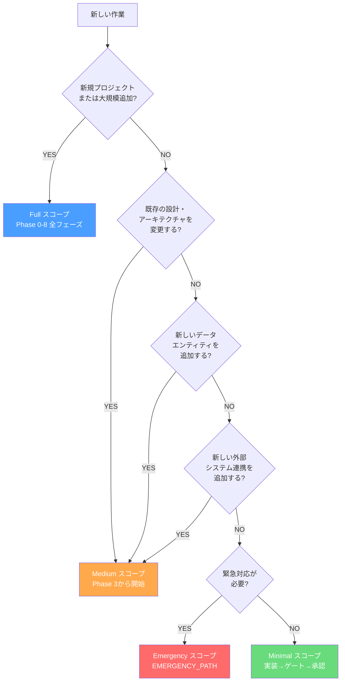
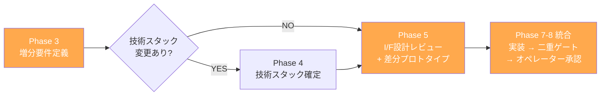
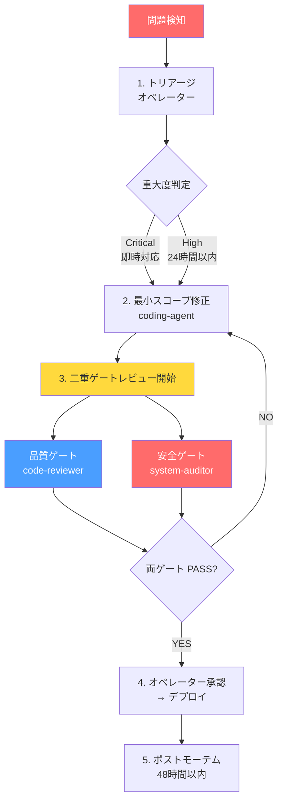
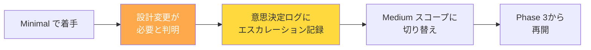

# 全作業に同じフローを適用しない — 4段階スコープ分類と判定フローの設計

## はじめに

AIネイティブ開発方法論(v1.9.0)はPhase 0からPhase 8までの9フェーズで構成される。新規プロジェクトを立ち上げるときには、この9フェーズが「設計の漏れを構造的に防ぐ仕組み」として機能する。

しかし、現実の開発ではこんな場面が頻繁に起きる。

- 本番環境でバグが見つかった。修正は3行。でもフルフローを回すと着手から完了まで数日かかる
- 既存システムに中規模の機能を追加したい。Phase 0の「現状把握」は済んでいるのに、また最初からやり直すのか
- セキュリティ脆弱性が報告された。48時間以内に対応しなければならない

**全タスクに同じフローを適用すると、プロセスが品質の足かせになる。** かといってプロセスを場当たり的に省略すると、品質ゲートや安全ゲートが形骸化する。

この記事では、作業スコープに応じてフローを構造的に選択する**4段階スコープ分類(SCOPE_CLASSIFICATION)**と、緊急時の圧縮フロー**EMERGENCY_PATH**の設計を解説する。

---

## 4段階スコープ分類

すべての作業を開始する前に、まずスコープを判定する。判定はオペレーターが行い、意思決定ログに記録する。

| スコープ | 定義 | フロー | 必要ロール |
|---------|------|--------|-----------|
| **Full** | 新規プロジェクト、大規模機能追加 | Phase 0-8 全フェーズ | 全ロール(フェーズに応じて段階的に投入) |
| **Medium** | 既存システムへの中規模機能追加 | Phase 3開始、Phase 5圧縮、Phase 7-8統合 | coding-agent + code-reviewer + system-auditor + オペレーター |
| **Minimal** | バグ修正、小規模変更、設定変更 | 実装 → 二重ゲートレビュー → オペレーター承認 | coding-agent + code-reviewer + system-auditor + オペレーター |
| **Emergency** | セキュリティ脆弱性、サービス停止、データ損失 | トリアージ → 最小修正 → 並行ゲート → デプロイ → ポストモーテム | coding-agent + code-reviewer + system-auditor + オペレーター |

ポイントは、**どのスコープでも品質ゲート(コードレビュアー)と安全ゲート(システム監査官)を省略しない**ことだ。省略するのはフェーズであり、ゲートではない。

---

## スコープ判定フロー

作業の性質に応じて、どのスコープを適用するかを決定木で判定する。



判定の核心は3つの条件だ。

1. **設計変更が必要か** -- 既存のアーキテクチャ・データ設計を変えるなら、要件定義(Phase 3)からやり直す必要がある
2. **新しいエンティティや外部連携を追加するか** -- これらはI/F設計への影響が大きく、Minimalでは対応できない
3. **緊急性があるか** -- セキュリティ脆弱性・サービス停止・データ損失リスクのいずれかに該当するか

この3条件のいずれにも該当しなければ、Minimalスコープで十分だ。

---

## Mediumスコープの詳細フロー

Mediumスコープは「既存の土台の上に増築する」ケースだ。Phase 0-2の成果物(現状把握、真の課題、ユースケース)は既に存在する前提で、Phase 3から開始する。



### 各フェーズの圧縮内容

**Phase 3(圧縮版):**
- 既存要件への**増分**として要件を定義する。フルスクラッチの要件定義ではない
- 既存の非機能要件・データ機密度は継承する。変更がある場合のみ再定義

**Phase 4(条件付きスキップ):**
- 技術スタックが変わらない場合はスキップ可能
- 新しいライブラリの導入、DB種別の変更などがある場合のみ実施

**Phase 5(圧縮版):**
- 既存設計への増分としてI/F設計をレビューする
- プロトタイプは変更箇所の動作確認のみ。全体を再ビルドする必要はない
- I/Fファースト設計6視点のチェックは必須(省略不可)

**Phase 7-8(統合):**
- 通常はPhase 7(MVP)とPhase 8(フルスケール)を分けるが、Mediumでは統合して実施
- 二重ゲートレビュー(品質ゲート → 安全ゲート)は通常フローと同じ直列実行

### Mediumスコープの判断基準

Mediumスコープを適用する際に確認すべきこと:

```
前提条件チェック:
 [x] Phase 0-2の既存成果物(ユースケース、真の課題)が存在する
 [x] 既存のアーキテクチャ設計ドキュメントが存在する
 [x] 増分する変更の影響範囲が特定できている
```

これらが1つでも欠けている場合は、Fullスコープの適用を検討する。

---

## Minimalスコープの詳細フロー

Minimalスコープは最も頻度が高い。バグ修正、小規模な変更、設定変更などに適用する。

```
1. coding-agent: 修正を実装
2. code-reviewer: 品質ゲート(変更差分に関連する視点に絞って実施)
3. system-auditor: 安全ゲート(セキュリティ・安定性への影響がある場合のみフル監査)
4. オペレーター: 承認
```

### Minimalスコープの適用条件(3つ全てを満たすこと)

| # | 条件 | 理由 |
|---|------|------|
| M-1 | 既存の設計・アーキテクチャを変更しない | 設計変更は影響範囲が広く、Minimalでは検証しきれない |
| M-2 | 新しいデータエンティティを追加しない | エンティティ追加はデータ層の設計に影響する |
| M-3 | 新しい外部システム連携を追加しない | 外部連携はI/F設計の見直しが必要 |

いずれかに該当する場合は**即座にMedium以上にエスカレーション**する。「Minimalで始めたが、やっていくうちに設計変更が必要になった」というケースは意外と多い。判定を誤ったと気づいた時点でエスカレーションし、意思決定ログに記録する。

---

## EMERGENCY_PATH -- 緊急対応パスの設計

本番環境で重大な問題が発生した場合の圧縮フローだ。通常フローとの最大の違いは、**品質ゲートと安全ゲートを並行実施できる**点にある。

### 適用条件(いずれか1つに該当)

- **セキュリティ脆弱性:** 本番環境で悪用可能な脆弱性が発見された
- **サービス停止:** ユーザーがシステムを利用できない状態
- **データ損失リスク:** データの破損・消失が進行中または差し迫っている

### 緊急対応フロー



通常フローでは品質ゲート → 安全ゲートの直列実行が原則だ。品質ゲートがFAILならコードが修正される可能性が高く、その状態で安全ゲートを実施しても無駄になるからだ。しかし緊急時は**修正スコープが限定的**であるため、この前提が緩和され並行実施が許可される。

### ゲート条件(全て省略不可)

| # | 条件 | 省略可否 |
|---|------|---------|
| E-1 | 修正が問題を解決する(検証済み) | **省略不可** |
| E-2 | 修正が新たなセキュリティリスクを生まない(安全ゲート) | **省略不可** |
| E-3 | 修正の技術的妥当性が確認されている(品質ゲート) | **省略不可** |
| E-4 | 修正の影響範囲が明示されている | **省略不可** |
| E-5 | ポストモーテムが計画されている | **省略不可** |

緊急時であっても**5つのゲート条件は1つも省略できない。** これが「プロセスを省略して品質が崩れる」問題への構造的な回答だ。省略するのは上流フェーズ(Phase 0-6)であり、安全を守るゲートではない。

### ポストモーテム(48時間以内)

緊急対応は「修正して終わり」ではない。48時間以内に以下を実施する。

1. **なぜ発生したか** -- 根本原因分析(RCA)
2. **なぜ通常フローで防げなかったか** -- ゲート条件やレビュー基準の不備を検証
3. **恒久対応が必要か** -- 必要ならFullまたはMediumスコープでIssueを起票

ポストモーテムの結果は `outputs/emergency/postmortem-YYYY-MM-DD.md` に記録する。方法論エデュケーターがこの記録を評価対象とし、方法論自体の改善に反映する。

---

## スコープ判定の記録と運用

### 記録の重要性

スコープ判定は意思決定ログに記録する。記録すべき項目:

```yaml
# 意思決定ログ記録例
decision_id: SD-2026-0312-001
date: 2026-03-12
type: scope_classification
task: "注文一覧画面のソート機能追加"
scope: Medium
rationale: "既存のデータエンティティは変更しないが、API設計に新しいソートパラメータを追加するためI/F設計の見直しが必要"
decided_by: オペレーター
```

### 誤判定時のエスカレーション

Minimalで着手したが設計変更が必要になった -- このケースは頻繁に起きる。重要なのは、**誤判定を隠さず即座にエスカレーションする**ことだ。



---

## 検証結果: スコープ分類の効果

方法論v1.1.0でSCOPE_CLASSIFICATIONを導入した後の変化:

| 指標 | 導入前 | 導入後 |
|------|--------|--------|
| バグ修正の平均リードタイム | フルフローと同等(数日) | 実装+レビューのみ(数時間) |
| 品質ゲート省略率 | 急ぎの修正で暗黙的に省略 | 0%(全スコープで必須) |
| 安全ゲート省略率 | 同上 | 0%(全スコープで必須) |
| スコープ誤判定率 | N/A(判定基準なし) | エスカレーションとして追跡可能 |

最大の効果は**品質ゲートと安全ゲートの省略がなくなった**ことだ。「急ぎだからレビュー省略」が構造的に排除され、代わりに「急ぎだからMinimalスコープ」という正しい選択肢が生まれた。

---

## 応用ポイント

### 自チームへの導入

1. **まずMinimalから始める。** バグ修正のフローを「実装 → コードレビュー → 承認」に定型化するだけで効果がある
2. **Minimalの適用条件を明文化する。** 「設計変更なし、エンティティ追加なし、外部連携追加なし」の3条件を判定基準にする
3. **判定を記録する習慣をつける。** スコープ判定をIssueやチケットに1行書くだけでよい
4. **緊急対応パスは事前に合意しておく。** 障害発生後に「今回はゲート省略で」という議論を避けるため

### 注意点

- スコープ分類はあくまで**フロー選択**の仕組みであり、品質基準を下げる仕組みではない
- Emergencyパスの乱用は品質劣化を招く。適用条件(セキュリティ脆弱性/サービス停止/データ損失)を厳守する
- 判定に迷ったら、上位スコープを選択する。MediumかMinimalか迷ったらMediumにする

---

*この記事の思考背景については、Noteの「AIチーム開発記」シリーズで詳しく語っています。*
