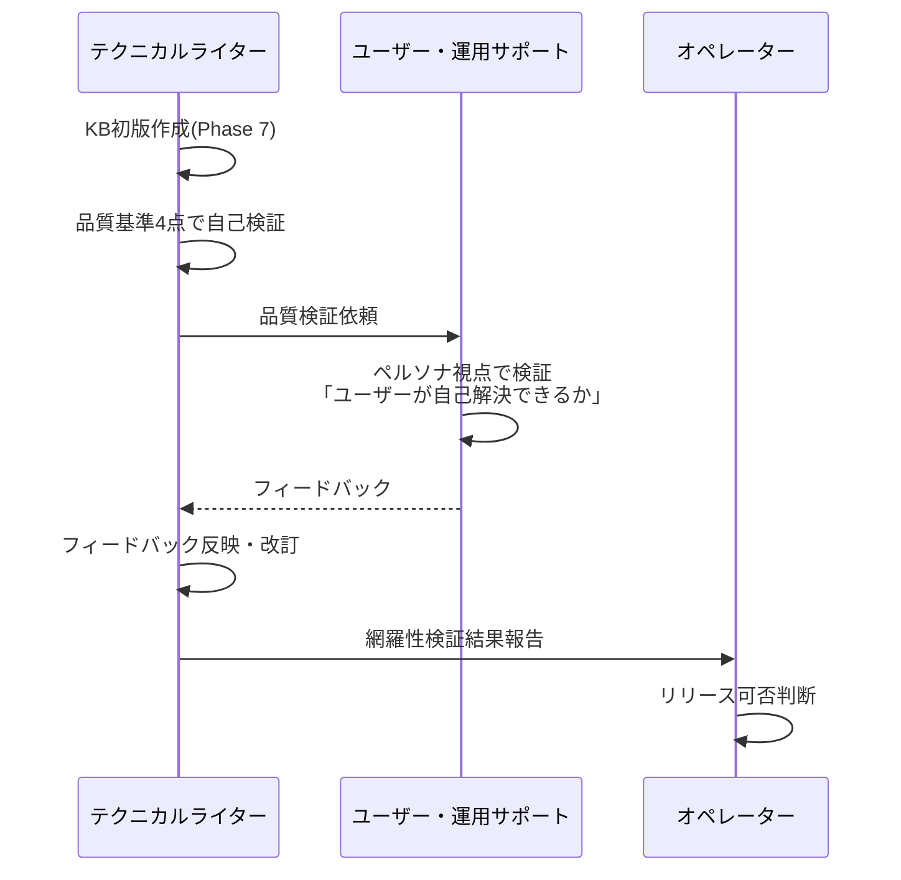
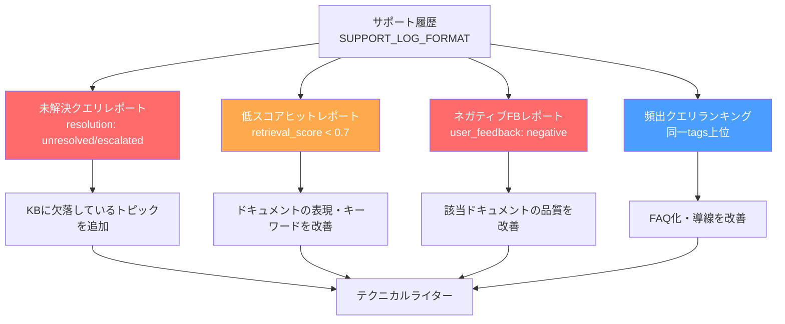

# 実装と同時にRAGナレッジベースを構築する — テクニカルライターロール実装ガイド

## はじめに

実装が完璧でも、ユーザーが使い方を理解できなければ価値はゼロだ。

多くのプロジェクトでは、ドキュメントは「開発の後に書くもの」として扱われ、リリース直前に急いで書くか、そもそも書かれないまま終わる。サポートボット用のナレッジベースとなるとなおさらだ。「誰が、いつ、どういう基準で作るのか」が決まっていないから、いつまでも後回しになる。

AIネイティブ開発方法論(v1.9.0)では、この問題を**テクニカルライターロール**として構造化した。v1.4.0で追加された8番目のAIロールだ。この記事では、テクニカルライターロールの設計と、RAG検索用ナレッジベースの構築パイプラインを解説する。

---

## テクニカルライターロールの設計

### ロールプロンプトのフロントマター

```yaml
---
document_id: role-technical-writer
type: role-prompt
version: 1.7.0
role_name: テクニカルライター
active_phases: [7, 8]
load_documents:
  - common/core-principles.md
  - common/phase-definitions.md
  - roles/user-ops-support.md    # 品質検証の依頼先
depends_on: [core-principles, phase-definitions, role-user-ops-support]
purpose: サポートボット用RAGナレッジベースの作成・維持を担うAIエージェントのシステムプロンプト
---
```

注目すべきは `load_documents` にユーザー・運用サポート(`user-ops-support.md`)が含まれている点だ。テクニカルライターは作成したドキュメントの品質検証をユーザー・運用サポートに依頼する。「ユーザーが自己解決できるか」の判断は、ユーザー視点を持つ別ロールに委ねることで、書き手のバイアスを排除する。

### 稼働タイミング

```mermaid
gantt
    title テクニカルライターの稼働タイミング
    dateFormat X
    axisFormat %s

    section Phase 7 MVP構築
    初版作成(主要機能)       :active, tw7, 0, 3
    UOS品質検証             :crit, uos7, 3, 4

    section Phase 8 フルスケール
    全機能網羅              :active, tw8, 4, 7
    UOS品質検証             :crit, uos8, 7, 8
    フィードバック反映       :tw8f, 8, 10
```



- **Phase 7:** 主要機能のナレッジベースドキュメント初版を作成する。Phase 7のゲート条件に「テクニカルライターによる主要機能のナレッジベースドキュメント(初版)が作成されている」が含まれている
- **Phase 8:** 全機能をカバーする網羅性検証を行い、ユーザー・運用サポートの品質検証を経てリリースする。Phase 8のゲート条件は「テクニカルライターによるナレッジベースの網羅性検証済み(全機能カバー)」だ

---

## ナレッジベースの構造

### ディレクトリツリー

```
outputs/knowledge-base/
├── _index.md              # 全ドキュメントの目次・統計(自動生成)
├── user-guide/            # エンドユーザー向け操作ガイド
│   ├── login.md
│   ├── order-create.md
│   └── ...
├── ops-guide/             # 運用管理者向けガイド
│   ├── user-management.md
│   ├── monitoring.md
│   └── ...
├── troubleshooting/       # トラブルシューティング
│   ├── login-failed.md
│   ├── data-not-displayed.md
│   └── ...
└── faq/                   # よくある質問
    ├── password-reset.md
    ├── browser-support.md
    └── ...
```

4つのカテゴリを明確に分離する設計だ。

| カテゴリ | 対象読者 | 内容 |
|---------|---------|------|
| `user-guide` | エンドユーザー | 機能の使い方、画面の説明 |
| `ops-guide` | 運用管理者 | 設定変更、監視、障害対応手順 |
| `troubleshooting` | 両方 | エラー発生時の対処法(症状 → 原因 → 対処) |
| `faq` | 両方 | よくある質問と回答 |

---

## KB_DOCUMENT_FORMAT -- ドキュメント形式の標準化

RAG検索の精度はドキュメントの構造化品質に直結する。全ナレッジベースドキュメントに統一フロントマターを付与する。

### フロントマター定義

```yaml
---
id: kb-ug-001               # カテゴリプレフィックス + 連番
                             # ug=user-guide, og=ops-guide, ts=troubleshooting, faq=faq
category: user-guide         # user-guide | ops-guide | troubleshooting | faq
audience: end-user           # end-user | ops-admin | both
feature: ログイン機能         # 対応する機能名
phase_created: 7             # 作成時のフェーズ
version: 1.0.0               # ドキュメントバージョン
last_updated: 2026-03-12
related: [kb-ts-001, kb-faq-003]  # 関連ドキュメントID
---
```

`id` はRAGシステムが各ドキュメントを一意に識別するために使う。`related` フィールドは、サポートボットが「関連する情報」を提示する際の導線として機能する。

### カテゴリ別の本文構成パターン

カテゴリごとに本文の構成パターンを標準化する。これによりテクニカルライター(AI)の出力が安定し、サポートボットの回答精度も向上する。

**user-guide / ops-guide:**

```markdown
# {タイトル}

## 概要
(この機能が何を実現するかを1-2文で)

## 前提条件
(必要な権限、事前設定など)

## 手順
1. ...
2. ...

## 補足
(注意点、制限事項など)
```

**troubleshooting:**

```markdown
# {エラー/症状のタイトル}

## 症状
(ユーザーが目にする具体的な状態)

## 原因
(考えられる原因を列挙)

## 対処手順
1. ...
2. ...

## それでも解決しない場合
(エスカレーション先、問い合わせ方法)
```

**faq:**

```markdown
# {質問文}

## 回答
(簡潔な回答)

## 詳細
(必要に応じて補足説明、関連ドキュメントへのリンク)
```

---

## 品質基準 -- 4つの観点

テクニカルライターは作成したドキュメントを提出前に自己検証する。基準は4つ。

| # | 観点 | 判定基準 |
|---|------|---------|
| Q-1 | 正確性 | 実装の振る舞いと記述が一致している。スクリーンショットやAPI仕様と照合可能 |
| Q-2 | 完結性 | 1ファイルで1トピックが完結し、前提知識なしで理解できる。**1ファイル = 1トピック = 1 RAGチャンク** |
| Q-3 | 検索適合性 | ユーザーが使いそうな言葉・表現がドキュメント内に含まれている。技術用語だけでなく日常語も |
| Q-4 | 手順の具体性 | 操作手順は「注文一覧画面の『新規作成』ボタンをクリック」レベルの具体性 |

特に重要なのは**Q-2の完結性**だ。RAGシステムはドキュメントをチャンク単位で検索・取得する。1ファイルに複数トピックが混在していると、検索精度が低下し、無関係な情報がノイズとして回答に混入する。「1ファイル = 1トピック」を厳守する。

---

## 牽制関係 -- テクニカルライターとユーザー・運用サポート

テクニカルライターとユーザー・運用サポート(UOS)は相互牽制の関係にある。



UOSの検証観点は「このドキュメントでユーザーが自己解決できるか」だ。テクニカルライターは技術的な正確性に偏りがちだが、UOSはユーザーのペルソナ(スキルレベル、ITリテラシー)を踏まえて「実際に使えるか」を検証する。

この牽制がなければ、技術的には正確だがユーザーには理解できないドキュメントが量産される。

---

## フィードバック反映サイクル

リリース後、サポートボットの運用データからナレッジベースを継続的に改善する。サポート履歴はSUPPORT_LOG_FORMATで構造化されている。

```yaml
# サポート履歴の1レコード例
- timestamp: "2026-03-12T14:30:00Z"
  session_id: "sup-20260312-042"
  query: "パスワードを変更したいが方法がわからない"
  retrieved_docs: ["kb-ug-005", "kb-faq-003"]
  retrieval_scores: [0.92, 0.71]
  answer_generated: true
  resolution: resolved
  user_feedback: positive
  tags: ["password", "account"]
```

この履歴を4つのレポートに変換し、テクニカルライターが対応する。



### レポート生成条件

レポートは2つの条件で生成される。

| トリガー | 条件 |
|---------|------|
| 定期レビュー | イテレーション境界(Phase 8)または週次 |
| 閾値ベースアラート | 未解決クエリが5件以上蓄積、またはネガティブFBが同一ドキュメントに3件以上集中 |

閾値ベースアラートにより、問題が蓄積する前に対応できる。

---

## 実装例: ナレッジベースのカバレッジ検証

Phase 3の機能要件一覧とナレッジベースの突合は、以下のような進捗レポートで管理する。

```markdown
## ナレッジベース作成進捗レポート

### カバレッジ

| カテゴリ | 作成済み | 対象機能数 | カバー率 |
|---------|---------|-----------|---------|
| user-guide | 12件 | 15件 | 80% |
| ops-guide | 5件 | 7件 | 71% |
| troubleshooting | 8件 | -- | -- |
| faq | 6件 | -- | -- |

### 未カバーの機能

| # | 機能名 | 理由 | 対応予定 |
|---|--------|------|---------|
| 1 | レポート出力機能 | 実装未完了 | Phase 8で対応 |
| 2 | 一括インポート機能 | 情報不足(coding-agentに確認中) | Phase 8で対応 |
| 3 | 監査ログ閲覧 | 実装未完了 | Phase 8で対応 |

### 品質検証状況

| # | 検証項目 | 結果 |
|---|---------|------|
| 1 | 全ドキュメントのフロントマターが正しい | OK |
| 2 | 1ファイル1トピックの粒度が守られている | OK |
| 3 | ユーザー・運用サポートの品質検証をパスした | 未実施(Phase 8で実施予定) |
```

Phase 7時点ではカバー率100%は必須ではない。Phase 8のゲート条件で「全機能カバー」が求められる。

---

## 応用ポイント

### 既存プロジェクトへの導入

テクニカルライターロールを既存プロジェクトに導入する最小ステップ:

1. `outputs/knowledge-base/` ディレクトリ構造を作成する
2. 主要機能(利用頻度TOP5)のuser-guideを作成する
3. 過去のサポート問い合わせから頻出TOP5をFAQ化する
4. UOS役(チーム内の別メンバーまたは別AIセッション)に品質検証を依頼する

### RAGシステムとの接続

ナレッジベースのMarkdownファイルは、以下の方法でRAGシステムに取り込める。

- **Vertex AI Embeddings:** フロントマターのメタデータをフィルタリング条件に、本文をベクトル化
- **OpenAI Embeddings:** 同様にフロントマター + 本文の構造を維持したままチャンク化
- **ローカルLLM:** Markdown構造をそのままパーサーで解析し、セクション単位でインデックス

`_index.md` はAI読み取り用の構造化インデックスとして機能し、ナレッジベース全体の俯瞰に使える。

---

*この記事の思考背景については、Noteの「AIチーム開発記」シリーズで詳しく語っています。*
