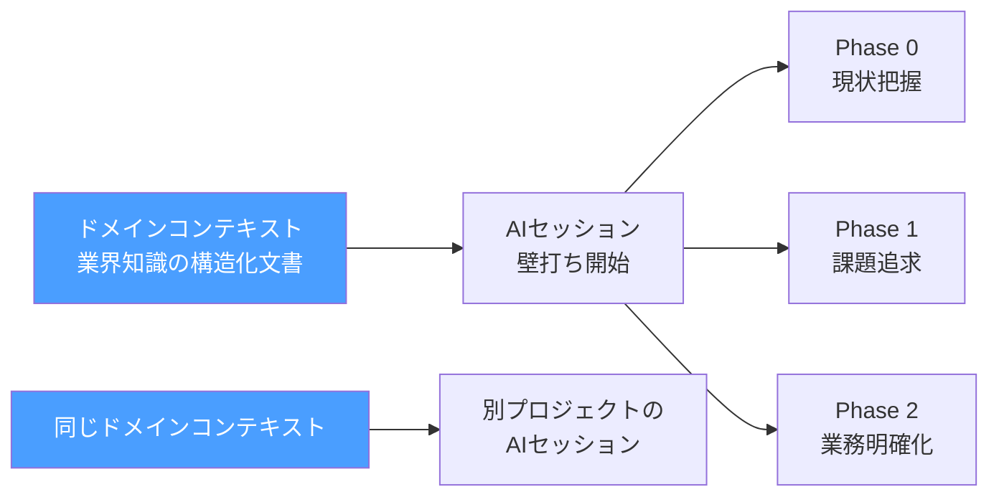
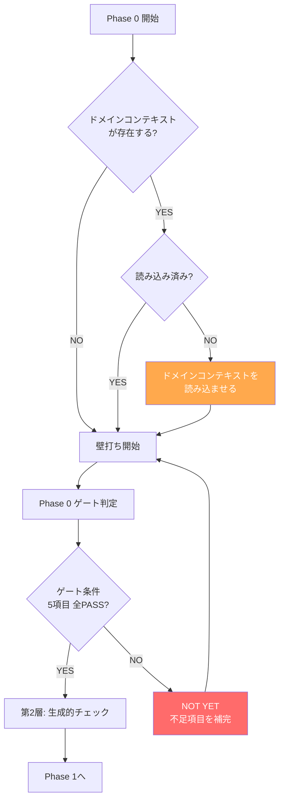
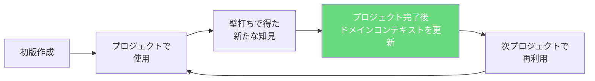

# AIの壁打ち精度を上げる — ドメインコンテキスト3分類と構造化テンプレート

## はじめに

Claude CodeやChatGPTと開発の壁打ちをしていて、こんな経験はないだろうか。

- 物流業界のシステムを作っているのに、AIが「配車」と「配送」の違いを理解しない
- 医療系SaaSの要件定義で、AIが個人情報保護法の制約を考慮しない設計を提案してくる
- 倉庫管理者向けのUIを設計しているのに、AIがデスクワーカー前提のインターフェースを提案する

**AIは業界の商慣習や規制を知らない。** Phase 0-2の壁打ちだけでドメイン知識を引き出すには限界がある。オペレーターが毎回口頭で説明するのは非効率だし、説明が漏れれば設計に反映されない。結果、Phase 5(基本設計)やPhase 6(フィードバック)で「使い物にならない」と突き返され、大規模な手戻りが発生する。

AIネイティブ開発方法論(v1.9.0)では、この問題を**ドメインコンテキスト機能**として構造化した。v1.3.0で追加された機能だ。この記事では、ドメインコンテキストの設計思想、3カテゴリの構造、実際のツール別の読み込ませ方、そしてPhase 0ゲート条件との統合を解説する。

---

## ドメインコンテキストの設計

### 基本的な考え方

ドメインコンテキストは「AIセッション開始前に読み込ませる業界知識の構造化文書」だ。プロジェクト固有の情報ではなく、**業界・業務・利用者に関する汎用的な知識**を文書化する。



ポイントは**プロジェクト横断で再利用できる**ことだ。同じ物流業界の別プロジェクトなら、業界知識のドキュメントはそのまま使い回せる。

### 3カテゴリのディレクトリ構造

```
.ai-native/domain-context/
├── README.md                          # 利用ガイド
├── industry/                          # 業界知識
│   ├── logistics-regulations.md       # 物流業界の法規制
│   ├── logistics-terminology.md       # 物流業界の専門用語
│   └── healthcare-compliance.md       # 医療業界のコンプライアンス
├── business-flow/                     # 業務フロー
│   ├── order-management-flow.md       # 受注管理の業務フロー
│   ├── inventory-check-flow.md        # 棚卸業務のフロー
│   └── shift-scheduling-flow.md       # シフト管理の業務フロー
└── persona/                           # ペルソナ(利用者像)
    ├── warehouse-manager-persona.md   # 倉庫管理者のペルソナ
    ├── field-worker-persona.md        # 現場作業者のペルソナ
    └── back-office-persona.md         # バックオフィス担当のペルソナ
```

各カテゴリの役割を詳しく見ていく。

---

## 3カテゴリの詳細

### 1. industry/ -- 業界知識

対象業界の商慣習、規制、専門用語、トレンドを記述する。AIが「業界の常識」を前提として持てるようにする。

**記述すべき内容:**
- 業界の商慣習・取引フロー
- 適用される法規制・コンプライアンス要件
- 業界固有の専門用語集
- 業界の一般的な課題・トレンド

**具体例: `logistics-regulations.md`**

```markdown
# 物流業界の法規制

## 概要
物流業界のシステム開発で考慮すべき法規制をまとめる。

## 主要な法規制

### 貨物自動車運送事業法
- 運送事業者は運行管理者を選任する義務がある
- ドライバーの拘束時間は1日13時間以内(最大16時間)
- 連続運転時間は4時間以内、30分以上の休憩が必要

### 2024年問題(時間外労働の上限規制)
- 年間960時間の上限規制が適用
- 配車計画システムではドライバーの労働時間管理が必須機能

## 設計への影響
- 配車計画画面には労働時間の残時間表示が必要
- 上限超過のアラート機能は法令遵守の観点から「あると良い」ではなく「必須」
```

このドキュメントをAIセッションに読み込ませておくと、Phase 3(要件定義)の壁打ちでAIが「配車計画機能にドライバーの労働時間管理は含まれていますか?」と自発的に確認できるようになる。

### 2. business-flow/ -- 業務フロー

ユーザーの実際の業務フローを記述する。Phase 2(業務と実運用の明確化)の壁打ちの出発点となる。

**記述すべき内容:**
- ユーザーの1日の業務フロー(時系列)
- 各業務ステップの入力・処理・出力
- 現状の業務で発生している非効率・ミス・ストレス
- 部署間・システム間のデータの流れ

**具体例: `order-management-flow.md`**

```markdown
# 受注管理の業務フロー

## 1日の業務フロー(時系列)

### 08:00-09:00 受注確認
- FAXとメールで届いた注文を確認
- 手作業でExcelの受注台帳に転記(ここが最大の非効率)
- 転記ミスが月に5-10件発生

### 09:00-11:00 在庫確認・引当
- 受注台帳を見ながら在庫管理システム(別システム)で在庫を確認
- 在庫不足の場合、仕入先に電話で発注

### 11:00-12:00 出荷指示
- 倉庫への出荷指示書をExcelで作成
- 印刷して倉庫に渡す(倉庫にPCがない)

## 現状の非効率・ペインポイント
1. FAX→Excelの手作業転記: 月5-10件の転記ミス
2. 在庫確認が別システム: 画面切り替えの往復で1件あたり3分のロス
3. 出荷指示が紙ベース: 変更があると電話+再印刷
```

### 3. persona/ -- ペルソナ

システムの利用者像を記述する。ユーザー・運用サポートロールのテストシナリオ策定にも活用される。

**記述すべき内容:**
- 利用者の役職・スキルレベル・ITリテラシー
- 利用シーン(いつ、どこで、何のために使うか)
- 現状のペインポイント
- システムに対する期待値

**具体例: `warehouse-manager-persona.md`**

```markdown
# 倉庫管理者ペルソナ

## 基本情報
- 役職: 倉庫管理者(主任クラス)
- 年齢層: 40-50代
- ITリテラシー: Excel操作は可能、Webアプリの利用経験は限定的

## 利用シーン
- 場所: 倉庫事務所(デスクトップPC)+ 倉庫内(タブレット)
- 頻度: 業務時間中は常時
- 主な操作: 入出庫管理、在庫照会、棚卸

## ペインポイント
- 在庫数の不一致が頻繁に発生し、原因追跡が困難
- 棚卸作業が紙ベースで丸2日かかる
- 繁忙期に臨時スタッフが操作方法を覚えられない

## UIへの要求
- 文字サイズは大きめ(倉庫内での視認性)
- タブレットでの片手操作を想定
- 複雑な操作は不要、主要機能は3タップ以内
```

このペルソナを読み込んだAIは、Phase 5の設計段階で「タブレットでの片手操作」や「3タップ以内」といった制約を自然に考慮する。

---

## ファイル命名規則

```
industry/:      {業界名}-{内容}.md
                例: logistics-regulations.md, healthcare-terminology.md

business-flow/: {業務名}-flow.md
                例: order-management-flow.md, inventory-check-flow.md

persona/:       {ペルソナ名}-persona.md
                例: warehouse-manager-persona.md, field-worker-persona.md
```

命名規則を統一することで、どのAIツールでも「`industry/` 配下のファイルを全て読み込め」といった指示が通りやすくなる。

---

## ツール別の読み込ませ方

### Claude Projects

Project Knowledgeにドメインコンテキストのファイルをアップロードする。プロジェクトに参加する全メンバーが同じドメインコンテキストを共有できる。

```
Project Knowledge:
  ├── core-principles.md        (方法論)
  ├── phase-definitions.md      (方法論)
  ├── navigator.md              (ロールプロンプト)
  ├── logistics-regulations.md  (ドメインコンテキスト)
  ├── order-management-flow.md  (ドメインコンテキスト)
  └── warehouse-manager-persona.md (ドメインコンテキスト)
```

### Claude Code

セッション開始時にファイルパスを指定して読み込ませる。CLAUDE.mdに記述しておけば、セッション開始時に自動で参照される。

```
以下のドメインコンテキストを読み込んでください:
- .ai-native/domain-context/industry/logistics-regulations.md
- .ai-native/domain-context/business-flow/order-management-flow.md
- .ai-native/domain-context/persona/warehouse-manager-persona.md
```

### ChatGPT / Gemini

セッション開始時にファイルの内容を貼り付ける。ファイル数が多い場合は、カテゴリごとにまとめて1つのプロンプトに含める。

```
以下は物流業界のドメインコンテキストです。
このプロジェクトの壁打ちでは、以下の業界知識を前提としてください。

---
[logistics-regulations.md の内容]
---
[order-management-flow.md の内容]
---
[warehouse-manager-persona.md の内容]
```

---

## Phase 0ゲート条件との統合

ドメインコンテキストはPhase 0のゲート条件に組み込まれている。

```
Phase 0 ゲート条件:
 [ ] 顧客の業界・事業内容が明確
 [ ] 現状の業務フローが具体的に説明可能
 [ ] 理想の姿が描けている
 [ ] 直近の目標地点が設定されている
 [*] 該当するドメインコンテキストがあれば読み込み済み  ← これ
```

壁打ちナビゲーターはPhase 0開始時に「ドメインコンテキスト(`.ai-native/domain-context/`)に該当する資料がないか確認する」という責務(D-1)を持つ。ドメインコンテキストが存在するにもかかわらず読み込まれていない場合、ゲート判定でNOT YETとなり、Phase 1に進めない。



---

## プロジェクト横断での再利用

ドメインコンテキストの最大の利点は**プロジェクト横断で再利用できる**ことだ。

同じ物流会社の案件を複数手がける場合:

```
プロジェクトA: 配車管理システム
  → logistics-regulations.md (共有)
  → order-management-flow.md (共有)
  → driver-persona.md (固有)

プロジェクトB: 倉庫管理システム
  → logistics-regulations.md (共有)
  → inventory-check-flow.md (固有)
  → warehouse-manager-persona.md (固有)
```

`logistics-regulations.md`は両プロジェクトで共有できる。業界の法規制は案件に依存しないからだ。一方、業務フローやペルソナはプロジェクト固有のものが多い。共有できるものは共有し、固有のものは追加する。

---

## 注意点

### 参考資料であり壁打ちの代替ではない

ドメインコンテキストを読み込ませたからといって、Phase 0-2の壁打ちを省略してはならない。ドメインコンテキストは「AIの前提知識を底上げする」ものであり、オペレーターとの対話を通じた理解深化の代替にはならない。

読み込ませた上で壁打ちを行うことで、AIの質問が「業界のことを教えてください」レベルから「貴社では2024年問題への対応として配車計画のロジックをどう変更しましたか?」レベルに引き上がる。

### 機密情報の取り扱い

ドメインコンテキストはリポジトリに格納される。機密情報を含む場合は、リポジトリの公開範囲に注意する。

- パブリックリポジトリ: 機密情報は一切含めない
- プライベートリポジトリ: アクセス権限を確認した上で配置
- 外部ツール(ChatGPT等)に貼り付ける場合: 情報セキュリティポリシーに従う

### 更新サイクル

ドメインコンテキストは一度作ったら終わりではない。プロジェクト完了後に最新化するサイクルを設ける。



壁打ちの中で発見された新しい業界知識、業務フローの変化、ペルソナの修正などは、プロジェクト完了後にドメインコンテキストにフィードバックする。次のプロジェクトではより精度の高い前提知識でスタートできる。

---

## 検証結果

ドメインコンテキスト機能(v1.3.0)導入後の変化:

| 指標 | 導入前 | 導入後 |
|------|--------|--------|
| Phase 5での業務理解不足による手戻り | 高頻度 | 大幅に減少 |
| Phase 0-2の壁打ち時間 | 業界説明に時間を消費 | 本質的な課題追求に集中 |
| AIの質問精度 | 「業界を教えてください」レベル | 業界前提を踏まえた具体的な質問 |
| 同一業界の2案件目の立ち上げ速度 | 1案件目と同等 | 大幅に短縮(知識の再利用) |

最も大きな効果は**壁打ちの質の向上**だ。AIが業界の基礎知識を持っている状態で壁打ちが始まるため、オペレーターの時間が「説明」ではなく「判断」に使われるようになった。

---

## 応用ポイント

### 自チームへの導入ステップ

1. **まず1プロジェクトのペルソナから始める。** 利用者像を書き出すだけで壁打ちの質が変わる
2. **業界の専門用語集を作る。** AIが用語を正しく使えるだけで、コミュニケーションコストが下がる
3. **業務フローは「現状のAs-Is」から書く。** 理想のTo-Beではなく、今どうやっているかを記述する
4. **プロジェクト完了後に更新する習慣をつける。** 最初から完璧を目指さない。使いながら育てる

### 他の方法論要素との連携

| 連携先 | 連携内容 |
|--------|---------|
| 壁打ちナビゲーター | Phase 0開始時にドメインコンテキストの存在確認・読み込み促進 |
| ユーザー・運用サポート | ペルソナ情報をテストシナリオ策定の入力として活用 |
| テクニカルライター | 業務フロー情報をナレッジベースの用語統一に活用 |
| 方法論エデュケーター | ドメインコンテキストの有効性を評価し、構造改善を提案 |

---

## 今後の展望

この記事で紹介したドメインコンテキスト機能は、AIネイティブ開発方法論v1.9.0における「AIの前提知識を構造的に管理する」アプローチの一部だ。

シリーズ全体を振り返ると、以下の構造が見えてくる。

1. **8ロールアーキテクチャ**(Episode 1): AIチームの構造設計
2. **9フェーズとゲートシステム**: 品質を構造的に担保するプロセス設計
3. **スコープ分類**(Episode 5): 作業規模に応じたフロー最適化
4. **テクニカルライター**(Episode 6): ユーザー向けナレッジの構造化
5. **ドメインコンテキスト**(本記事): AIの前提知識の構造化

今後のシリーズでは、以下のトピックを取り上げる予定だ。

- **レビュー基準の4層x7視点:** データ設計からコード品質まで、具体的なレビュー観点と判定基準の実装
- **壁打ちナビゲーションの技法:** フェーズごとの姿勢変化(引き出す/提案する/整理する)の実践パターン
- **方法論の自己改善サイクル:** エデュケーターロールによる評価・改善の回し方。v1.0からv1.9.0へ進化し続けている実践記録の詳細
- **マルチエージェント連携:** 複数のAIセッションを協調させるオーケストレーション設計

方法論自体がバージョニングされ、エデュケーターロールによって継続的に改善される仕組みを持つ以上、この先も進化は止まらない。読者の皆さんのプロジェクトでの実践と知見が、次のバージョンへのインプットになることを期待している。

---

*この記事の思考背景については、Noteの「AIチーム開発記」シリーズで詳しく語っています。*
