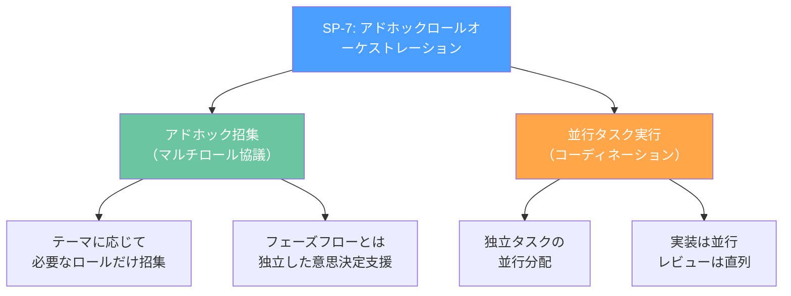
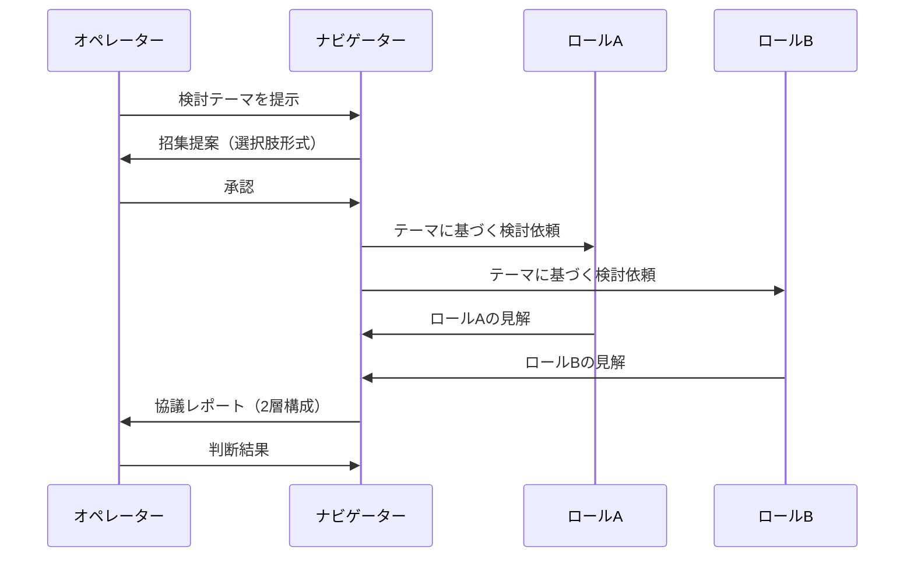
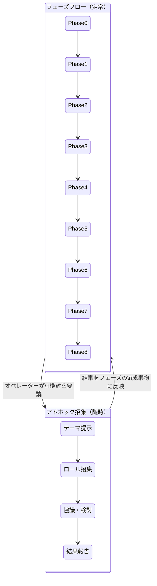
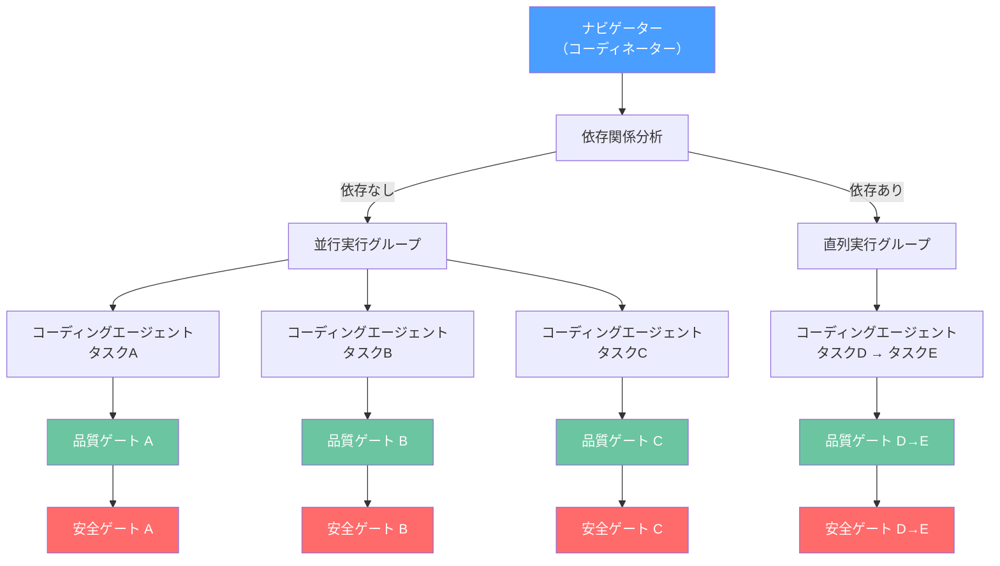
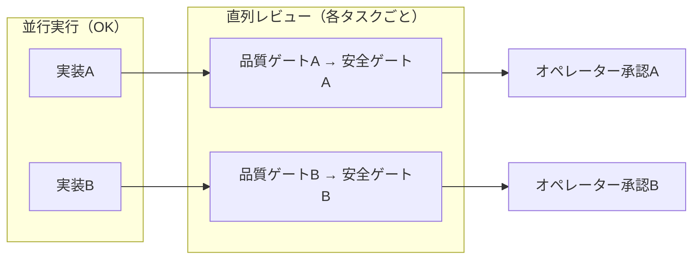
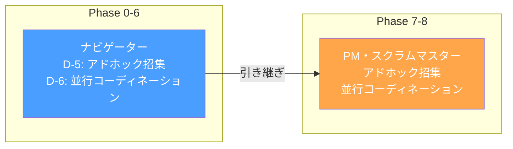
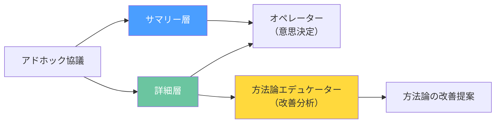

# フェーズを飛び越えて専門家を呼ぶ — アドホックロールオーケストレーションと並行タスク実行の設計

## はじめに

AIネイティブ開発の8ロールアーキテクチャ（[第1回](./001-8-role-architecture.md)参照）は、フェーズベースのロール活性化を基本とする。ナビゲーターはPhase 0-6、コーディングエージェントはPhase 5以降、レビュアーと監査官はPhase 5-8（Phase 5-6はインクリメンタルモード）、といった具合だ。

しかし、実際のプロジェクトでは**フェーズ境界を超えた意思決定支援**が必要になる場面がある。

- Phase 3（要件定義）の途中で、アーキテクチャの安全性について専門的な見解がほしい
- Phase 5（基本設計）で、エンドユーザーの運用フローとUI設計の整合性を検証したい
- Phase 7-8で、独立した実装タスクを並行に進めて開発速度を上げたい

v1.8.0で追加された**SP-7: アドホックロールオーケストレーション**は、この課題に対する構造的な解決策だ。本記事では、SP-7の設計思想、実装方法、制約条件を解説する。

---

## SP-7の2つの機能

SP-7は2つの独立した機能を提供する。



### 1. アドホック招集（マルチロール協議）

フェーズ進行とは独立に、特定テーマについて必要なロールの見解を集める仕組み。

### 2. 並行タスク実行（コーディネーション）

独立した実装タスクを複数のコーディングエージェントに分配し、並行で進める仕組み。

---

## アドホック招集の設計

### ナビゲーターの新しい責務（D-5）

v1.8.0で、ナビゲーターに**D-5: アドホックロール招集**が追加された。



招集プロセスは4ステップ:

1. **テーマ受領:** オペレーターから検討テーマを受け取る
2. **招集提案:** 必要なロールを特定し、SP-6に従い選択肢形式で提案する
3. **検討実施:** 各ロールの視点でテーマを検討する
4. **結果報告:** 2層構成（サマリー＋詳細）で報告する

### ロール選定の指針

テーマの性質に応じて招集するロールが決まる。

| テーマの性質 | 招集するロール | 検討のフォーカス |
|-------------|-------------|---------------|
| アーキテクチャ決定 | システム監査官 + コーディングエージェント | 安全性 × 実装可能性 |
| セキュリティと運用の両立 | システム監査官 + ユーザー・運用サポート | 安全性 × 運用性 |
| UXと技術的制約 | ユーザー・運用サポート + コーディングエージェント | ユーザビリティ × 実装コスト |
| ドキュメント戦略 | テクニカルライター + ユーザー・運用サポート | ユーザー視点 × 情報設計 |
| リリース可否判断 | 全ロール | 全視点からの包括的評価 |

### フェーズフローとの関係



重要な制約:

- アドホック招集はフェーズ進行とは**独立**したプロセス
- 招集結果はフェーズの成果物に反映されるが、**ゲート条件の代替にはならない**
- SP-4の直列レビューパイプラインは変更しない
- 最終判断はオペレーターが行う（SP-1）

---

## 並行タスク実行の設計

### ナビゲーターの新しい責務（D-6）

D-6では、ナビゲーターが**並行タスクのコーディネーター**として機能する。



### 並行実行の判断基準

タスクを並行実行できるかの判断は3つの基準による:

1. **データ依存性がないこと** — タスクAの出力がタスクBの入力にならない
2. **成果物の前提依存がないこと** — タスクBがタスクAの成果物を前提としない
3. **コンテキスト矛盾が発生しないこと** — 並行実行によって整合性が壊れない

### コーディングエージェントの新しい責務（D-5）

v1.8.0で、コーディングエージェントに**D-5: 並行実装の受容**が追加された。

```markdown
# コーディングエージェント D-5 のルール

- 並行実行されるタスク間のコンテキスト分離を維持する
- 各タスクの実装完了報告は独立して出力する
- 並行タスク間でコード変更が競合する場合は、ナビゲーターに報告し調整を求める
- 品質ゲート・安全ゲートは各タスクごとに直列で実施する（SP-4）
```

### 実装は並行、レビューは直列

SP-7の最も重要な設計判断:



**並行化で速くするのは実装だけ。** 各タスクの品質ゲート（コードレビュアー）→安全ゲート（システム監査官）の直列パイプラインは維持する。SP-4の原則を崩さない。

---

## Claude Codeでの実装方法

### アドホック招集の実装

Claude Codeでアドホック招集を実装する場合、サブエージェント機能を活用する。

```
# ナビゲーターのセッション内で

オペレーター: 「認証基盤のアーキテクチャ、セキュリティ的に問題ないか確認したい」

ナビゲーター:
  → テーマ分析: 「セキュリティ × 実装可能性」の検討
  → 招集提案:
    1. システム監査官 + コーディングエージェント（推奨）
    2. システム監査官のみ
    3. その他（自由記述）

  → オペレーター承認後、各ロールのプロンプトで検討を実施
  → 2層レポートで報告
```

### 並行タスク実行の実装

Claude Codeのサブエージェント並行実行機能を使い、独立したタスクを同時に処理する。

```
# Phase 7-8 での並行実装の流れ

ナビゲーター/PM:
  タスク一覧:
    - ユーザー認証モジュール
    - 商品カタログAPI
    - 通知サービス

  依存関係分析:
    - 認証 ←→ カタログ: 依存なし → 並行OK
    - 認証 ←→ 通知: 依存なし → 並行OK
    - カタログ ←→ 通知: 依存なし → 並行OK

  → 3タスク並行で分配
  → 各タスクの完了後、個別に品質ゲート→安全ゲートを実施
```

### Phase 7-8でのオーケストレーター引き継ぎ

重要な実装ポイント: Phase 7-8では、アドホック招集・並行コーディネーションの責務は**PM・スクラムマスターに引き継がれる**。



ナビゲーターはPhase 0-6が主要稼働フェーズであり、Phase 7-8ではPMが進捗管理と合わせてオーケストレーションも担う。

---

## 透明性の2層構成

### レポートフォーマット

アドホック協議の結果は、2層構成で出力する。

**サマリー層（判断に必要な情報）:**
- テーマ
- 招集ロール一覧
- 結論・推奨事項
- オペレーター判断事項

**詳細層（根拠と議論の経緯）:**
- 各ロールの見解（視点・懸念・推奨）
- ロール間の論点（合意点・分岐点）

### 詳細層の二次利用

詳細層は、方法論エデュケーター（[第4回](./004-educator-meta-role.md)参照）の改善データとしても機能する。



「このテーマではいつもセキュリティと運用性で意見が割れる」というパターンが蓄積されれば、レビュー基準やゲート条件の改善につながる。

---

## SP-7が変えるもの、変えないもの

### 変えるもの

| 項目 | Before (v1.7.0) | After (v1.8.0) |
|------|-----------------|----------------|
| フェーズ外の専門家相談 | 仕組みなし | アドホック招集で制度化 |
| 独立タスクの実行 | 直列のみ | 並行分配が可能 |
| 協議結果の記録 | 自由形式 | 2層構成（サマリー＋詳細）で標準化 |
| ナビゲーターの責務 | D-1〜D-4（4つ） | D-1〜D-6（6つ） |
| コーディングエージェントの責務 | D-1〜D-4（4つ） | D-1〜D-5（5つ） |

### 変えないもの

- **SP-2:** ロール分離の原則 — 招集されても統合しない
- **SP-3:** 2層ゲートシステム — アドホック協議でゲートを代替しない
- **SP-4:** 品質ゲート→安全ゲートの直列パイプライン — 並行タスクでも各タスクごとに直列
- **SP-1:** オペレーターが最終判断者

SP-7は既存の構造原則を**一切変更せず**、柔軟性を追加した拡張設計だ。

---

## まとめ

SP-7（アドホックロールオーケストレーション）は、v1.8.0で追加された2つの機能を提供する:

1. **アドホック招集:** フェーズ進行とは独立に、必要なロールだけを招集してマルチロール協議を実施する
2. **並行タスク実行:** 独立した実装タスクを並行で分配し、開発速度を向上させる

設計の核心は「**構造を壊さずに柔軟性を追加する**」こと。ロール分離（SP-2）、2層ゲート（SP-3）、直列レビュー（SP-4）、オペレーター主権（SP-1）はすべて維持したまま、フェーズフロー外の意思決定支援と実装の並行化を実現している。

---

次回は、v1.9.0で追加された**SP-8: インクリメンタルレビューパイプライン**を取り上げる。ゲートレビューだけでは品質問題の検出がフェーズ末期に集中する課題に対し、実装タスク完了ごとに品質チェック→安全チェックを実施する仕組みの設計と実装を解説する。

---

*この記事の思考背景については、Noteの「AIチーム開発記」シリーズで詳しく語っています。*
