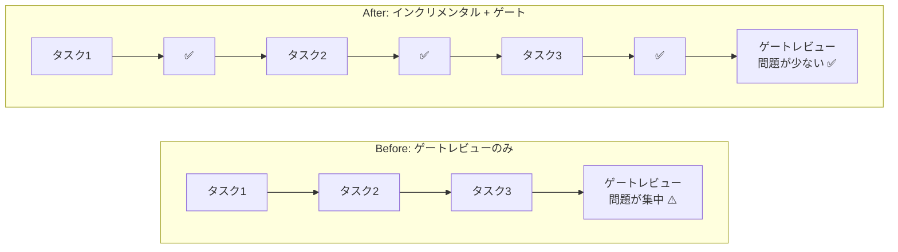
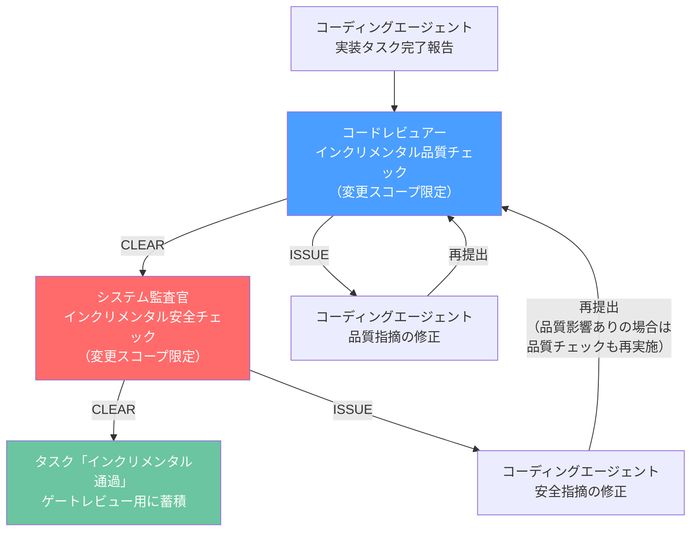
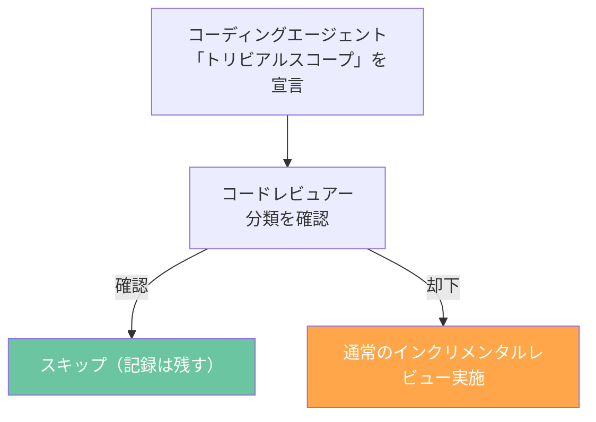
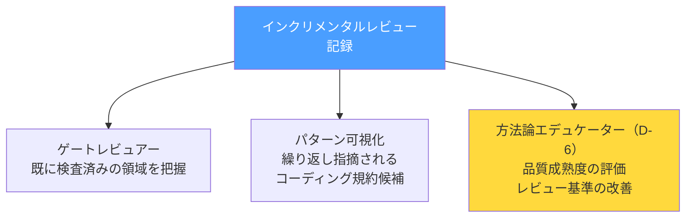

# ゲートレビューの前に品質を作り込む — SP-8 インクリメンタルレビューパイプラインの設計と実装

## はじめに

AIネイティブ開発の8ロールアーキテクチャ（[第1回](./001-8-role-architecture.md)参照）では、品質ゲート（コードレビュアー）→安全ゲート（システム監査官）の直列パイプライン（SP-4）でコードの品質と安全性を担保する。

しかし、ゲートレビューには構造的な限界がある。

- **検出の遅延:** フェーズ末期にまとめてレビューするため、問題の検出がフェーズ終了間際に集中する
- **修正コストの増大:** 実装完了から時間が経過しており、変更の文脈が失われている。修正の影響範囲も大きくなりがち
- **セルフチェックの限界:** CLAUDE.mdのPush前チェックリストは自己レビューであり、SP-2（ロール分離）の精神を実装レベルで満たさない

v1.9.0で追加された**SP-8: インクリメンタルレビューパイプライン**は、この課題に対する構造的な解決策だ。本記事では、SP-8の設計思想、スコープ定義、フェーズ別適用モード、Claude Codeでの実装方法を解説する。

---

## SP-8の設計思想

SP-8の核心は「品質の左シフト（left shift）」だ。品質問題の検出をフェーズ末期（右）から実装直後（左）に移動させる。



3つの設計原則に基づく:

1. **SP-2 準拠:** セルフチェックではなく、独立したコードレビュアー・システム監査官がレビューを実施する
2. **SP-4 維持:** 品質チェック→安全チェックの直列順序はインクリメンタルモードでも維持する
3. **ゲート補完:** インクリメンタルレビューはゲートレビューの代替ではなく、補完である

---

## インクリメンタルレビュー vs ゲートレビュー

| 観点 | インクリメンタルレビュー | ゲートレビュー |
|------|------------------------|--------------|
| **スコープ** | 変更範囲のみ | 全コードベース |
| **深度** | 適用条件に基づく選択的 | 全視点・全ドメイン |
| **承認** | なし（蓄積のみ。オペレーター関与不要） | オペレーター承認必須 |
| **判定値** | CLEAR / ISSUE | PASS / FAIL |
| **目的** | 品質の早期確保・左シフト | リリース判定 |
| **適用フェーズ** | Phase 5〜8 | Phase 7-8 ゲート条件 |
| **トリガー** | 実装タスク完了報告 | フェーズ末 |

判定値を意図的に分けている。CLEAR/ISSUEは軽量な品質確認であり、PASS/FAILはリリース判定に関わる正式な判断だ。この区別により、インクリメンタルレビューをオペレーターの関与なしにAIロール間で迅速に回せる。

---

## イテレーションループの設計



ポイント:

- **トリガーはタスク完了報告:** コミット単位ではなく、コーディングエージェントが「完了」と報告したタスク単位
- **安全チェックのISSUE修正:** 品質に影響する修正の場合は品質チェックも再実施する
- **蓄積:** CLEAR になったタスクはゲートレビュー用に記録される。ゲートレビュアーは「既にインクリメンタルでCLEAR」の領域を把握できる

---

## スコープ定義

インクリメンタルレビューの対象範囲は3層で定義する。全コードベースではなく、変更の影響範囲に絞ることで効率を確保する。

| 層 | 対象 | 説明 |
|---|------|------|
| 1. 変更ファイル | 直接変更されたコード | `git diff` で特定される変更差分 |
| 2. 直接影響I/F | 変更されたAPI/型を利用するファイル | 型定義やAPIシグネチャの変更が影響する呼び出し元 |
| 3. データモデル影響 | スキーマ変更時の依存コードパス | データモデル変更がある場合のみ適用。マイグレーション・クエリ・バリデーションへの影響 |

レビュアー/監査官はスコープ境界を出力に明示し、除外した範囲とその理由を記載する。

---

## フェーズ別の適用モード

インクリメンタルレビューの深度はフェーズに応じて変わる。

| フェーズ | モード | 品質チェック | 安全チェック |
|---------|--------|-----------|-----------|
| Phase 5（プロトタイプ） | 軽量デザインレビュー | RP-1（データ設計）, RP-2（I/F設計）を中心に。RP-3〜RP-7は重大な問題のみ | AS-4（致命的パターン）のみ |
| Phase 6（フィードバック） | フィードバック反映確認 | RP-2（I/F変更の整合性）, RP-7（可読性） | AS-1（セキュリティに影響する場合のみ） |
| Phase 7（MVP） | 全視点インクリメンタル | 適用条件マトリクスに従い全視点 | 適用条件マトリクスに従い全ドメイン |
| Phase 8（フルスケール） | 全視点インクリメンタル | 適用条件マトリクスに従い全視点 | 適用条件マトリクスに従い全ドメイン |

### Phase 7-8 品質チェック視点適用マトリクス

| 視点 | 適用条件 |
|------|----------|
| RP-1: データ設計 | データモデル/スキーマの変更がスコープに含まれる場合 |
| RP-2: I/F設計 | API/型定義の変更がスコープに含まれる場合 |
| RP-3: 冗長性排除 | **常時適用** |
| RP-4: 変更耐性 | **常時適用** |
| RP-5: エラーハンドリング | **常時適用** |
| RP-6: パフォーマンス | UI関連コードの変更がスコープに含まれる場合 |
| RP-7: 可読性 | **常時適用** |

### Phase 7-8 安全チェックドメイン適用マトリクス

| ドメイン | 適用条件 |
|----------|----------|
| AS-1: セキュリティ | 認証・入力処理・データアクセス・外部連携の変更がある場合 |
| AS-2: 安定性 | エラーハンドリング・リカバリ・データ整合性パスの変更がある場合 |
| AS-3: 可用性 | インフラ・スケーリング・リソース使用量の変更がある場合 |
| AS-4: 致命的パターン | **常時適用** |

---

## トリビアル変更の判定

ランタイム動作に影響しない変更はインクリメンタルレビューをスキップできる。



トリビアルに該当する変更:
- コメントの追加・修正
- コードフォーマットの変更
- ドキュメントのみの変更
- 設定ファイルの非ランタイム変更

判断はコーディングエージェントが宣言し、コードレビュアーが確認または却下する。コーディングエージェントが独断で決定するのではなく、**宣言→確認の2段階**にすることでSP-2の精神を維持する。

---

## 蓄積記録の活用

インクリメンタルレビューの記録は3つの用途で活用される。



### ゲートレビューへの入力

ゲートレビュー時に、各タスクのインクリメンタルレビュー結果が入力として提供される。「このタスクは既にCLEAR」と把握することで、ゲートレビュアーは未検査の領域やタスク間の統合問題に集中できる。

### エデュケーターのD-6

v1.9.0で方法論エデュケーターに追加された**D-6: インクリメンタルレビュー記録の分析**では、以下を実施する:

- **繰り返し指摘パターンの抽出:** 複数タスクで繰り返しISSUEとなるパターンを特定し、コーディング規約への反映を検討
- **視点別の指摘傾向分析:** どの視点（RP-1〜RP-7、AS-1〜AS-4）でISSUEが頻出するかを分析
- **イテレーション回数の傾向:** 1回目でCLEARになる割合を追跡し、品質成熟度を評価
- **ゲートレビューとの差分分析:** インクリメンタルで検出された問題とゲートで新たに検出された問題を比較し、有効性を評価

---

## Claude Codeでの実装方法

### コードレビュアーのインクリメンタルモード起動

```
コードレビュアーとして、以下のタスク完了報告に対するインクリメンタル品質チェックを実施してください。

対象タスク:
- [コーディングエージェントの完了報告を添付]

スコープ定義:
- 変更ファイル: [git diffの結果]
- 直接影響I/F: [型/API変更がある場合、影響する呼び出し元]
- データモデル影響: [スキーマ変更がある場合のみ]

現在のフェーズ: Phase 7
→ 全視点インクリメンタルモードで実施

review-standards.md の INCREMENTAL_REVIEW_SCOPE に従い、
review-output-template.md §4 のインクリメンタル品質チェックテンプレートで出力してください。
```

### システム監査官のインクリメンタルモード起動

```
システム監査官として、品質チェックCLEAR後のタスクに対するインクリメンタル安全チェックを実施してください。

対象タスク:
- [コーディングエージェントの完了報告を添付]
- [品質チェック結果: CLEAR を添付]

スコープ定義:
- [品質チェックと同一スコープ]

現在のフェーズ: Phase 7
→ 全ドメインインクリメンタルモードで実施

review-output-template.md §4 のインクリメンタル安全チェックテンプレートで出力してください。
```

### サブエージェントを活用したパイプライン自動化

Claude Codeのサブエージェント機能を使い、コーディングエージェントの完了報告をトリガーにインクリメンタルレビューを自動実行できる:

```
# ナビゲーターまたはPMのセッション内で

コーディングエージェントのタスク完了報告を受領しました。
SP-8に従い、インクリメンタルレビューパイプラインを実行します。

1. コードレビュアーをサブエージェントとして起動 → 品質チェック実施
2. CLEAR の場合 → システム監査官をサブエージェントとして起動 → 安全チェック実施
3. ISSUE の場合 → コーディングエージェントに差し戻し、修正後に再度パイプラインを実行
```

---

## SP-8が変えるもの、変えないもの

### 変えるもの

| 項目 | Before (v1.8.0) | After (v1.9.0) |
|------|-----------------|----------------|
| コードレビュアーの稼働開始 | Phase 7 | Phase 5（インクリメンタルモード） |
| システム監査官の稼働開始 | Phase 7 | Phase 5（インクリメンタルモード） |
| タスク完了後の品質確認 | なし（ゲートまで待機） | インクリメンタルレビュー実施 |
| 品質問題の検出タイミング | フェーズ末期に集中 | 実装直後に検出 |
| エデュケーターの責務 | D-1〜D-5（5つ） | D-1〜D-6（6つ、D-6追加） |
| コーディングエージェントの出力 | 完了報告のみ | 完了報告 + トリビアルスコープ宣言（該当時） |

### 変えないもの

- **SP-2:** ロール分離の原則 — セルフチェックではなく独立したレビュアーが実施
- **SP-3:** 2層ゲートシステム — インクリメンタルレビューでゲートを代替しない
- **SP-4:** 品質ゲート→安全ゲートの直列パイプライン — インクリメンタルでも直列順序を維持
- **SP-1:** オペレーターが最終判断者 — インクリメンタルは蓄積のみ、ゲートで承認
- **SP-7:** アドホック招集と並行タスク実行 — 並行タスクの各完了物もSP-8の対象

---

## まとめ

SP-8（インクリメンタルレビューパイプライン）は、v1.9.0で追加された品質の左シフトを実現する仕組みだ:

1. **タスク単位の品質確認:** 実装タスク完了ごとに、独立したコードレビュアーとシステム監査官がCLEAR/ISSUEで品質・安全を確認する
2. **フェーズ適応型の深度:** Phase 5-6は軽量デザインレビュー、Phase 7-8は全視点インクリメンタル
3. **蓄積と改善:** レビュー記録はゲートレビューの入力と方法論改善のデータとして活用される

設計の核心は「**既存の構造原則を一切変更せずに、品質確保のタイミングを前倒しする**」こと。SP-2（ロール分離）、SP-3（2層ゲート）、SP-4（直列パイプライン）はすべて維持したまま、ゲートレビュー前に品質を作り込む仕組みを追加している。

---

*この記事の思考背景については、Noteの「AIチーム開発記」シリーズで詳しく語っています。*
